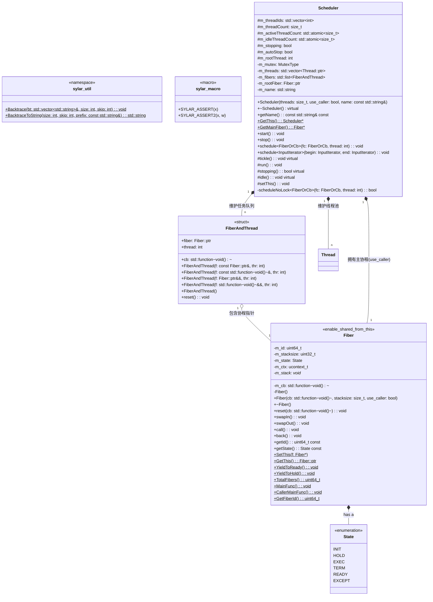

# 高性能服务器
## 配置
### 库安装
~~~bash
## 放在include目录下面
# yaml-cpp
sudo apt update
sudo apt install -y libyaml-cpp-dev
https://github.com/jbeder/yaml-cpp

# boost
https://www.boost.org/releases/latest/
~~~

### 项目构建
~~~bash
cd build
cmake ..
make
cd ../bin
./test_config
~~~

### git操作
~~~bash
## 给两个空目录创建占位文件
touch include/boost/.gitkeep
touch include/yaml-cpp/.gitkeep

## 普通提交
git add .
git commit -m "xxx"
git push -f origin main

## 从上次conmmit取消并重新上传文件
git reset --mixed HEAD^
git rm -r --cached .
git add .
git commit -m "xxx"
git push -f origin main
~~~

---

## 协程模块 (Fiber) 与 调度器模块 (Scheduler) (Version 4)

随着框架向纯异步、高性能演进，Version 4 引入了**非对称协程 (Asymmetric Coroutine)** 机制，并实现了 **M:N 协程调度模型**（M 个协程在 N 个线程上动态调度），彻底改变了传统的基于回调的异步编程模式。

### 协程与调度模块核心类图

以下是严格包含所有方法签名、变量、访问修饰符和嵌套结构的 UML 类图：



---

### 断言与工具链 (Macro & Util) 实现细节

为了保障协程框架在复杂上下文切换中的稳定性，引入了系统级调用栈追踪机制：
* **`Backtrace` 与 `BacktraceToString`**：
  * 底层调用 Linux/glibc 的 `<execinfo.h>` 库函数 `backtrace()` 抓取当前线程的调用栈指针数组。
  * 使用 `backtrace_symbols()` 将内存地址翻译为可读的函数名和偏移量字符串。
* **`SYLAR_ASSERT`**：
  * 通过宏定义实现严格的运行时检查。当条件不满足时，自动触发 `BacktraceToString` 获取堆栈信息，利用 Log 系统打印 `FATAL` 级错误后调用 `assert` 中止程序，极大提升了疑难 Bug 的排查效率。

---

### 协程模块 (Fiber) 详细实现细节

采用**非对称协程（Asymmetric Coroutines）**设计，子协程只能和创建它的父协程（或线程主协程）进行切换，职责清晰。

#### 核心组件设计
* **上下文切换 (`ucontext_t`)**：
  * 利用 `<ucontext.h>` 实现用户态的上下文保存与恢复。
  * `getcontext()` 保存当前 CPU 寄存器状态；`makecontext()` 绑定协程入口函数（如 `MainFunc`）和预先分配的独立内存栈；`swapcontext()` 实现原子级的“保存当前状态并加载新状态”。
* **双构造函数架构**：
  1. **私有无参构造 `Fiber()`**：仅用于将**当前线程的原始执行流**包装成第一个主协程。它不分配独立内存栈，直接接管当前执行流。
  2. **带参构造 `Fiber(cb, stacksize, use_caller)`**：用于创建真正的业务协程。通过 `MallocStackAllocator` 分配独立栈空间。
* **状态机设计**：
  * 维护了严格的状态流转：`INIT` -> `EXEC` -> `HOLD` / `READY` -> `TERM` / `EXCEPT`。
  * **协程重用 (`reset`)**：当协程处于 `TERM` 或 `INIT` 状态时，为了避免频繁的 `malloc/free` 栈内存带来的性能开销，允许直接传入新的回调函数 `cb`，重新调用 `makecontext` 复用已有的栈空间。
* **精妙的内存泄漏规避 (引用计数难题)**：
  * 在 `MainFunc` 协程入口函数中，业务执行完毕后协程需要切换回主协程。
  * **难点**：在 `MainFunc` 的栈中存在一个局部的 `Fiber::ptr cur = GetThis();`。如果在 `cur->swapOut()` 时直接切走，这个局部智能指针将永远无法析构（因为执行流再也不会回到这里），导致引用计数永远为 1，栈内存泄漏。
  * **破局方案**：提取裸指针 `auto raw_ptr = cur.get();`，显式调用 `cur.reset();` 将智能指针引用计数归零，最后通过 `raw_ptr->swapOut();` 安全切出。

---

### 调度器模块 (Scheduler) 详细实现细节

调度器实现了 **M:N 协程调度**，将 N 个协程任务均匀地分配给 M 个物理线程池执行。

#### 核心组件设计
* **`use_caller` (借用调用线程) 机制**：
  * 创建调度器时，如果 `use_caller` 为 `true`，调度器会将**创建调度器的那个主线程**也纳入线程池中（而不是纯粹只在后台新开线程）。
  * 为实现这点，调度器给主线程分配了一个特殊的 `m_rootFiber`。这个协程的入口是 `Scheduler::run`，但通过 `call()/back()` 机制与主线程的原始执行流进行切换，设计极其巧妙。
* **`FiberAndThread` (任务包装器)**：
  * 支持接收 `Fiber::ptr` 协程对象，或者原始的 `std::function<void()>` 回调。
  * 实现了**右值引用 (Rvalue Reference)** 的构造函数，支持 `std::move` 窃取资源，避免了将任务投入队列时产生不必要的拷贝开销。
  * 支持指定执行线程 `thread`（如果为 -1 则由任意线程抢占）。
* **核心调度循环 (`run()`)**：
  调度线程的核心就是一个 `while(true)` 死循环，内部逻辑如下：
  1. 加锁，从 `m_fibers` 队列中取出一个可执行的任务（匹配当前线程 ID 的，或未指定线程 ID 的）。
  2. 如果取到任务：
     * 若任务是协程对象：直接 `swapIn()` 切换过去执行。
     * 若任务是回调函数：为其分配一个协程对象，然后 `swapIn()`。
  3. 当协程 `Yield` 放弃 CPU 后（返回到 `run()`）：检查协程状态。如果是 `READY`，则重新放回任务队列尾部；如果是其他状态则保持 `HOLD` 挂起，等待其他地方唤醒。
  4. 如果队列中没有任务：线程切入 `idle()` 空闲协程，默认实现为不断地 `YieldToHold`（后续将在定时器和 IO 调度器中使用 `epoll_wait` 挂起，实现真正的睡眠休眠，降低 CPU 空转率）。
* **优雅退出机制 (`stop()`)**：
  * 置位 `m_autoStop` 标志，并向所有后台线程发送 `tickle()` 唤醒信号。
  * 如果启用了 `use_caller`，主线程会在这里陷入 `m_rootFiber->call()`，亲自动手帮忙处理剩下的任务，直到所有协程状态归位，最后逐一 `join()` 回收所有线程，实现无内存泄漏的优雅退出。

---

### 测试用例说明 (Tests)

* **`test_assert.cc`**：
  * 模拟异常条件，触发 `SYLAR_ASSERT2`。
  * 控制台将自动打印类似 `[FATAL] ASSERTION: 0 == 1 ... backtrace: ...` 的多级函数调用栈，验证了追踪系统的稳定性。
* **`test_fiber.cc`**：
  * 演示了最原始的单线程协程用法。
  * 主执行流通过 `swapIn()` 切入 `run_in_fiber`，子协程打印后通过 `YieldToHold()` 交还控制权，往复穿插执行。证明了协程在不涉及多线程条件下的状态保存能力。
* **`test_scheduler.cc`**：
  * 实例化 `sylar::Scheduler`（参数：3个工作线程，不使用调用者线程）。
  * 通过 `scheduler.schedule(&test_fiber)` 将回调任务投入调度池。
  * 在被调度的协程函数内部，利用静态变量 `s_count` 实现递归自我调度（倒数 5 次）。
  * 日志将清晰展示：同一个协程任务，在其挂起后被重新调度时，可能会在不同的底层 `thread_id` 上被执行，完美验证了 M:N 调度器的跨线程工作能力。

---

## 核心解读：协程 (Fiber) 模块深度剖析笔记 (Version 4)

本章节将深入剖析 `sylar` 框架的基石——协程模块。不同于简单的功能罗列，本章旨在揭示其**设计哲学、底层技术原理、关键实现细节以及针对复杂问题的解决方案**。

### 设计哲学：为何选择并如何实现协程

传统的网络编程模型（如多线程、异步回调）存在固有弊端：
*   **多线程模型**：线程是内核级资源，创建和上下文切换开销巨大。当并发量达到数万甚至更高时，系统资源消耗和调度开销将成为瓶颈。
*   **异步回调模型**：虽然性能高，但会导致“回调地狱 (Callback Hell)”，业务逻辑被拆分得支离破碎，代码可读性和可维护性极差。

`sylar` 框架的协程机制旨在结合两者的优点，规避其缺点，实现：
1.  **用户态调度**：协程是用户态的“轻量级线程”，创建和切换成本极低（仅涉及寄存器和栈指针的交换），可以轻松创建数百万个。
2.  **同步风格的异步编程**：允许开发者用看似同步的、顺序执行的代码，来编写本质上是异步的、非阻塞的逻辑。

本项目实现的是**非对称协程 (Asymmetric Coroutines)**，即协程的控制权只能在子协程和其调用者（通常是调度器主协程）之间转移，这使得调度关系清晰、易于管理。

---

### 底层基石：`ucontext.h` 与上下文切换原理

本协程库的核心是 POSIX 提供的 `ucontext.h` API，它允许程序在用户态保存和恢复完整的执行上下文。

*   **`ucontext_t` 结构体**：这是一个黑盒结构体，但其内部关键性地存储了：
    *   **CPU 寄存器**：包括指令指针 `rip`、栈顶指针 `rsp`、栈基址指针 `rbp` 以及所有通用寄存器。
    *   **`uc_stack`**：指向为该上下文分配的独立内存栈。
    *   **`uc_link`**：一个指向后继上下文的指针，当本上下文的入口函数执行完毕后，会自动切换到 `uc_link` 指向的上下文。
*   **核心函数三元组**：
    1.  **`getcontext(&ctx)`**：**“快照”**。将当前执行点的所有寄存器状态保存到 `ctx` 结构体中。
    2.  **`makecontext(&ctx, func, ...)`**：**“改装”**。修改一个已保存的 `ctx`，将其指令指针 `rip` 指向一个新的函数 `func`，并为其关联一个新分配的栈。**注意：它只能修改通过 `getcontext` 获取的上下文**。
    3.  **`swapcontext(&old_ctx, &new_ctx)`**：**“切换”**。这是原子操作，它将当前上下文保存到 `old_ctx`，然后立即从 `new_ctx` 中恢复上下文。这是协程 `Yield` 和 `Resume` 的直接实现。

---

### 全局与线程局部(TLS)状态：协程的“神经系统”

为了在不传递指针的情况下让代码感知当前所在的协程，框架巧妙地使用了全局和线程局部存储变量(TLS)：

*   **`static std::atomic<uint64_t> s_fiber_id / s_fiber_count`**：
    *   **原子性**：使用 `std::atomic` 是因为调度器可能在多个线程中创建协程，保证了 ID 分配和计数的线程安全。
*   **`static thread_local Fiber* t_fiber`**：
    *   **核心中的核心**。这是一个线程局部变量，它永远指向**当前线程上正在执行的那个协程**。`Fiber::GetThis()` 的高效实现完全依赖于此。
*   **`static thread_local Fiber::ptr t_threadFiber`**：
    *   **“锚点”**。它指向每个线程的**主协程**（即代表原始线程执行流的那个协程）。当一个子协程需要将控制权交还给“线程本身”而不是调度器时（例如 `back()` 操作），`t_threadFiber` 就是回归的目标。

---

### 内存管理：协程栈的创建与复用

*   **独立栈空间**：每个子协程都拥有独立的栈内存，通过 `MallocStackAllocator` (本质是 `malloc`) 分配。栈的大小由配置项 `fiber.stack_size` 决定，实现了灵活性。
*   **主协程的特殊性**：`Fiber::GetThis()` 在一个新线程上首次被调用时，会创建一个特殊的“主协程”。这个协程**不分配新栈**，而是直接“接管”当前线程的调用栈。这是协程系统启动的“第一推动力”。
*   **`reset(cb)` - 性能优化的关键**：
    *   **问题**：如果每次任务都 `new Fiber(...)`，在高并发下频繁 `malloc/free` 大块栈内存（通常是 1MB 或 2MB）会导致严重的性能抖动和内存碎片。
    *   **解决方案**：当一个协程执行完毕（状态变为 `TERM` 或 `EXCEPT`），调度器不会立即销毁它。而是通过 `reset(cb)` 方法，传入一个新的任务函数 `cb`，并重新调用 `makecontext` 来**复用这块已经分配好的栈内存**，实现了协程对象的池化，是高性能设计的体现。

---

### 方法剖析：解读关键函数的内部逻辑

#### `Fiber::GetThis()` - 智能的引导程序
此静态方法是用户与协程交互的主要入口之一，其内部逻辑极为精妙：
1.  检查 `t_fiber` (当前线程的当前协程)。
2.  若 `t_fiber` 非空，直接返回其 `shared_from_this()`。
3.  若 `t_fiber` 为空（**代表这是此线程第一次调用该函数**）：
    a.  创建一个新的协程实例 `main_fiber`，但调用的是**私有的无参构造函数 `Fiber()`**。
    b.  在此私有构造函数内，状态被置为 `EXEC`，并调用 `SetThis(this)` 将 `t_fiber` 指向自己。
    c.  `main_fiber` 不会分配新栈，它代表的就是当前线程的执行流。
    d.  将这个 `main_fiber` 赋值给 `t_threadFiber`，作为本线程的“锚点”。
    e.  断言 `t_fiber == main_fiber.get()` 确保初始化成功。
    f.  返回 `main_fiber`。

#### `swapIn()` vs `swapOut()` 与 `call()` vs `back()`
*   `swapIn()` / `swapOut()`：**为调度器服务**。`swapIn()` 是从调度器的主循环协程切换到业务协程；`swapOut()` 是从业务协程切回调度器的主循环协程。切换目标是固定的 `Scheduler::GetMainFiber()`。
*   `call()` / `back()`：**为非调度器场景服务**。例如在 `use_caller` 模式下，主线程的原始执行流需要和某个协程切换。`call()` 从主线程协程切入子协程，`back()` 从子协程切回主线程协程。切换目标是 `t_threadFiber`。

#### `MainFunc()` - 规避 `shared_ptr` 引用计数陷阱
这是整个协程模块**最精巧、最关键**的设计之一，完美解决了C++协程库中一个经典的内存泄漏问题。
*   **问题场景**：
    ```cpp
    void Fiber::MainFunc() {
        Fiber::ptr cur = GetThis(); // cur的引用计数至少为1
        // ... 执行业务代码 cur->m_cb() ...
        cur->swapOut(); // <--- 问题点！
        // 此后的代码永远不会被执行
    }
    ```
    当 `cur->swapOut()` 执行后，CPU 的执行流已经跳转到了调度器协程，`MainFunc` 的栈帧被“冻结”。`cur` 这个栈上的 `shared_ptr` 对象永远没有机会被析构，导致它持有的引用计数永远无法释放，最终整个 `Fiber` 对象（包括其百万字节的栈）**永久泄漏**。

*   **sylar 的解决方案**：
    ```cpp
    void Fiber::MainFunc() {
        // ... try-catch ...
        
        auto raw_ptr = cur.get();  // 1. 获取裸指针，不增加引用计数
        cur.reset();               // 2. 强制析构栈上的智能指针，引用计数-1
        raw_ptr->swapOut();        // 3. 使用裸指针进行上下文切换
    
        SYLAR_ASSERT2(false, "never reach here");
    }
    ```
    通过在切换前手动 `reset()` 智能指针，解除了当前栈帧对协程对象的引用，将生命周期管理完全交给了外部（如调度器的任务队列）。这是保障协程资源被正确回收的核心所在。

---
## 线程模块 (Thread System) 与并发安全设计 (Version 3)

随着框架向高并发演进，Version 3 引入了全面的线程管理和多维度锁机制。同时对之前的 **配置系统 (Config)** 和 **日志系统 (Log)** 进行了全面的线程安全升级。

### 线程模块核心类图

以下是线程模块独立的全量 UML 类图，严格包含了所有的方法签名、重载、静态方法、访问修饰符以及模板定义：


### 线程模块 (Thread) 详细实现细节

#### 1. 线程封装与 TLS (Thread Local Storage) 技术
* **核心类 `Thread`**：基于 POSIX pthread 库封装，弃用了 C++11 的 `std::thread`，原因是为了更底层地绑定系统内核级线程机制并设置名称。
* **TLS (线程局部存储)**：
  * 使用 `thread_local Thread* t_thread` 存储当前线程实例指针。
  * 使用 `thread_local std::string t_thread_name` 存储当前线程名称。
  * **作用**：让任何在这个线程上执行的代码，都可以通过静态方法 `Thread::GetName()` 和 `Thread::GetThis()` 以极低的代价获取当前线程上下文，这也是日志系统中 `%t` (线程ID) 快速打印的核心依赖。
* **同步启动机制 (`Semaphore`)**：
  * **痛点**：`pthread_create` 是异步的，创建线程后，如果主线程立刻去获取子线程的状态，子线程可能还没有执行到 `run` 函数的初始化逻辑，导致获取到错误信息。
  * **实现机制**：在 `Thread` 内部包含一个 `Semaphore`。`pthread_create` 之后主线程立刻调用 `m_semaphore.wait()` 阻塞。在新线程的 `run` 函数内部，完成 `pid` 抓取和名称设置后，调用 `m_semaphore.notify()` 唤醒主线程。这**绝对保证了**线程对象构造完成时，底层的内核线程已经完全初始化就绪。
* **系统级命名**：利用 `pthread_setname_np(pthread_self(), name)` 为底层线程设置名称（受 POSIX 限制最多 15 字符），使得在 Linux 下使用 `top -H` 或 `gdb` 时能直接看到有意义的线程名，极大方便调试。

#### 2. 多维度锁机制与 RAII 管理
本框架为了应对不同并发场景，提供了 6 种锁原语和 3 种 RAII 模板。

* **RAII 模板 (Resource Acquisition Is Initialization)**
  * 设计了 `ScopedLockImpl`, `ReadScopedLockImpl`, `WriteScopedLockImpl` 三个模板类。
  * **优点**：在构造函数中加锁，析构函数中解锁。即使业务代码中发生抛出异常、或者提前 `return`，也能利用 C++ 局部对象生命周期结束自动析构的特性保证锁一定被释放，**杜绝死锁**。
* **六种底层锁**：
  1. **`Mutex` (互斥锁)**：基于 `pthread_mutex_t`，最常规的锁，无论读写都阻塞，上下文切换开销较大。
  2. **`RWMutex` (读写锁)**：基于 `pthread_rwlock_t`。读锁共享，写锁独占。极其适合**读多写少**的场景。
  3. **`Spinlock` (自旋锁)**：基于 `pthread_spinlock_t`。在等待锁时不让出 CPU 时间片，而是死循环检测（忙等）。适合锁定范围极小、持有时间极短的场景。
  4. **`CASLock` (原子锁/乐观锁)**：基于 C++11 `std::atomic_flag` 的硬件级 CAS (Compare-And-Swap) 实现。比自旋锁更轻量，性能最高。
  5. **`NullMutex` & `NullRWMutex` (空锁)**：接口与普通锁一致但方法内为空。用于模板编程中，当使用者不需要线程安全时传入该类型，实现**零开销**。

### 跨模块集成：日志与配置的线程安全升级

在 Version 3 中，之前的模块被注入了并发安全能力：

#### 1. 配置系统 (Config) 的高并发改造
* **应用场景特点**：配置系统属于典型的**极度“读多写少”**场景（99.9%的业务在读取配置，极偶尔通过 YAML 热加载更新）。
* **改造细节**：
  * **注入锁类型**：为 `ConfigVar<T>` 注入了 `RWMutex` 读写锁。
  * **细粒度控制**：在 `ConfigVar::setValue()` 中，**对比新旧值以及触发回调函数的过程**被放入读锁作用域，只有真正执行 `m_val = v` 修改数据时，才切换为写锁作用域。
  * **全局配置字典锁**：全局 `s_datas` 映射表也加了 `RWMutex`。为防止跨编译单元锁的初始化顺序灾难，框架用 `GetMutex()` 返回局部静态锁 `static RWMutexType s_mutex`，保证安全。

#### 2. 日志系统 (Log) 的高性能改造
* **应用场景特点**：日志系统在服务运行期间会频繁写入，且多线程会争抢向同一个终端或文件输出字符。如果用 `Mutex` 会导致频繁的线程挂起和系统调用，严重拖慢业务。
* **改造细节**：
  * **注入锁类型**：为 `Logger`, `LogAppender`, `LoggerManager` 全部注入了 `Spinlock` (自旋锁)。
  * **锁范围优化**：写日志的过程通常只是字符串流转移或短时间的文件 I/O（有缓冲），非常迅速，用自旋锁替代互斥锁，避免了内核态陷入，极大提升了日志系统的吞吐率。
  * 解决了多线程并发写入日志时产生的“日志内容交错/乱码”问题。


## Sylar C++ 高性能服务器框架 (Version 2)

本项目是一个基于 C++11 开发的高性能服务器框架，目前 Version 2 已完成**日志系统 (Log System)** 和**配置系统 (Configuration System)** 的开发，并实现了两者的深度整合。

### 核心架构类图

以下是当前系统核心模块的 UML 类图，展示了日志系统与配置系统的整体架构和类的依赖关系：


---

### 日志系统 (Log System) 详细实现

日志系统支持多级别、多输出地、自定义格式化，并通过宏和流式输出提供极佳的开发者体验。

#### 核心组件设计
* **`LogLevel` (日志级别)**：定义了 `DEBUG`, `INFO`, `WARN`, `ERROR`, `FATAL` 五个级别，提供级别与字符串的相互转换功能。
* **`LogEvent` (日志事件)**：承载单次日志触发时的所有上下文信息，包括：文件名(`__FILE__`)、行号(`__LINE__`)、时间戳、线程ID、协程ID（预留）、所属日志器指针以及一个 `std::stringstream` 用于接收流式日志内容。
* **`LogEventWrap` (日志包装器 - RAII机制)**：
  * **实现细节**：通过宏（如 `SYLAR_LOG_INFO`）创建临时的 `LogEventWrap` 对象。其构造函数接收 `LogEvent`。
  * **巧妙之处**：宏展开后返回 `event->getSS()`，允许用户像使用 `std::cout` 一样使用 `<<` 拼接日志。当该行代码执行完毕，临时对象析构，在 `~LogEventWrap()` 中自动调用 `m_event->getLogger()->log()` 将这行拼接好的日志输出。
* **`LogFormatter` (日志格式器)**：
  * **实现细节**：负责将预设的字符串模板（如 `%d%T%p%T%m%n`）解析为具体的格式化项。
  * **解析模式 (Pattern)**：在 `init()` 函数中，通过状态机解析字符串，提取出普通字符和 `%` 开头的模式字符，并将其映射为内部类 `FormatItem` 的具体子类（例如解析 `%d` 生成 `DateTimeFormatItem`，解析 `%m` 生成 `MessageFormatItem`）。
* **`LogAppender` (日志输出地)**：
  * 抽象基类，自带独立的 `LogLevel` 和 `LogFormatter`。如果 Appender 未设置 Formatter，则默认使用父 `Logger` 的。
  * **`StdoutLogAppender`**：重写 `log()` 方法，将日志输出到 `std::cout`。
  * **`FileLogAppender`**：维护一个 `std::ofstream`，`reopen()` 负责打开文件，`log()` 方法将内容写入磁盘。
* **`Logger` (日志器)**：
  * 核心处理单元，拥有一个名称（默认为 "root"）。
  * **实现细节**：`log()` 方法首先检查传入事件的级别是否满足 `m_level`。满足则遍历内部所有的 `m_appenders`，依次调用它们的 `log()` 方法输出。如果没有配置 Appender，则会将日志转发给默认的 Root Logger。
* **`LoggerManager` (日志管理器)**：
  * **实现细节**：全局统一管理所有的 Logger。使用 `std::map<std::string, Logger::ptr>` 通过名称存储。如果通过 `getLogger("xxx")` 查找不存在，则自动创建并返回，确保随处可用。

---

### 配置系统 (Configuration System) 详细实现

配置系统基于 `YAML` 构建，采用**约定优于配置**的理念，所有配置项在代码中强类型声明。

#### 核心组件设计
* **`ConfigVarBase` (配置项基类)**：
  * 采用**类型擦除**的设计模式，屏蔽了派生类的模板类型 `T`。
  * 包含配置项的名称（统一转小写，不区分大小写）和描述。提供纯虚函数 `toString()` 和 `fromString()`，供管理类在不知道具体类型的情况下进行统一的序列化/反序列化。
* **`LexicalCast` (词法转换模板类)**：
  * **实现细节**：基础类型通过 `boost::lexical_cast` 实现字符串与类型的互转。
  * **偏特化 (Partial Specialization)**：针对 STL 容器（`vector`, `list`, `set`, `unordered_set`, `map`, `unordered_map`）进行了大量模板偏特化。利用 `yaml-cpp` 将 YAML Node 与这些容器进行深度解析转换。
  * **自定义类型支持**：用户可以像代码中的 `Person` 类一样，实现全特化的 `LexicalCast`，即可让配置系统无缝支持业务层复杂对象的 YAML 注入。
* **`ConfigVar<T>` (模板配置项)**：
  * 继承自基类，真正存储配置项的值 `m_val`。
  * **事件回调机制**：维护了一个 `std::map<uint64_t, on_change_cb>` 监听器列表。在调用 `setValue(const T& v)` 时，如果发现新值与旧值不同，会遍历触发所有回调函数。这对于实现**配置热更新**（如端口号修改后自动重启监听）极其关键。
* **`Config` (全局配置管理)**：
  * **实现细节**：提供静态方法 `Lookup` 注册/获取配置。
  * **静态局部变量规避初始化顺序问题**：内部不使用普通的静态成员变量存储 map，而是使用 `GetDatas()` 函数返回局部静态变量的引用，完美避免了 C++ 跨编译单元的 Static Initialization Order Fiasco（全局变量初始化顺序灾难）问题。
  * **`LoadFromYaml`**：核心解析函数。先通过 `ListAllMember` 递归函数，将树形的 YAML 结构展平为带前缀的点号分割字符串（如将 YAML 中的 `system: { port: 80 }` 展平为键值对 `"system.port" -> 80`）。然后遍历注册的配置，通过基类接口 `fromString` 注入数据。

---

### 工具库与编译说明

#### 基础模块
* **`Singleton` (单例模式)**：提供 `Singleton` (返回指针) 和 `SingletonPtr` (返回智能指针) 模板类。通过额外的模板参数 `X` 和 `N`，允许为同一个类实例化出多个相互隔离的单例对象。
* **`util.cc` (系统级工具)**：封装了 `syscall(SYS_gettid)` 用于获取精准的真实线程 ID（相较于 `pthread_self` 更底层且便于日志排查）。

#### CMake 构建细节
在 `CMakeLists.txt` 中：
* 引入了自定义的 `cmake/utils.cmake` 中的 `force_redefine_file_macro_for_sources` 宏，强制重定义代码中的 `__FILE__` 宏，使得日志中输出的文件路径变为相对路径，避免了绝对路径泄露编译机信息且占用日志空间的缺点。
* 链接了第三方库 `-lyaml-cpp` 解析配置。

---

### 测试用例说明 (Tests)
* **`test.cc`**：测试了日志的流式输出宏、格式化宏（`FMT`）、多输出地（控制台+文件过滤）以及单例日志管理器的获取。
* **`test_config.cc`**：
  * 演示了如何静态注册基本类型、各类 STL 容器类型的全局配置项。
  * 演示了如何实现 `Person` 自定义类的 YAML 序列化特化。
  * 测试了配置项监听器 `addListener`，在调用 `LoadFromYaml` 覆盖配置时，触发了旧值到新值变更的日志打印。
  * 演示了日志系统与配置系统的初步结合（利用 YAML 解析结果生成内部状态日志）。

