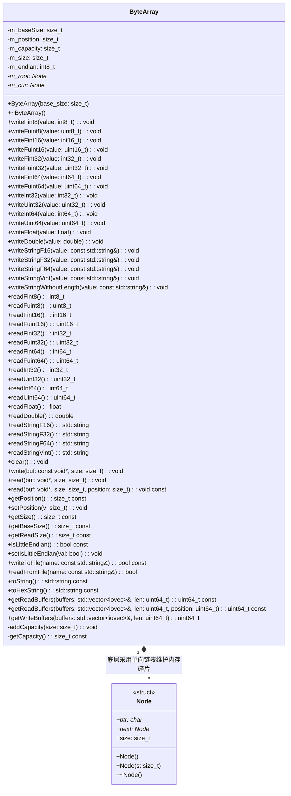
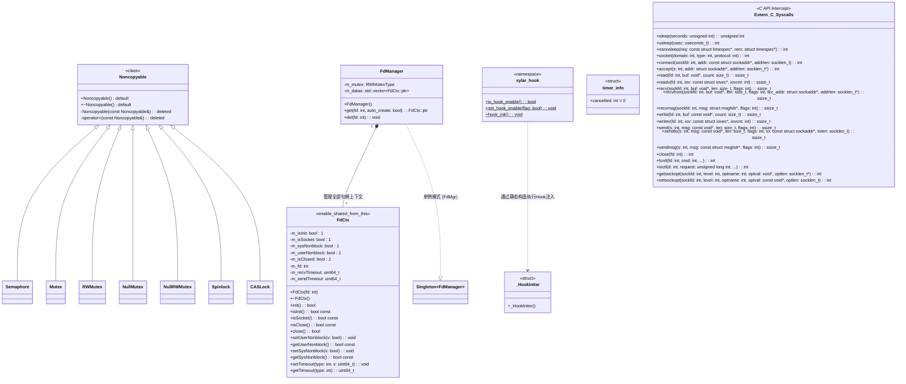
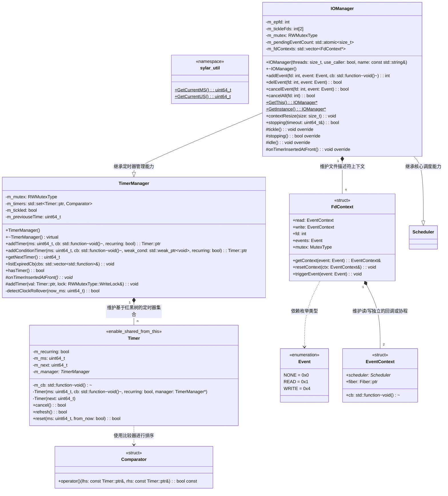
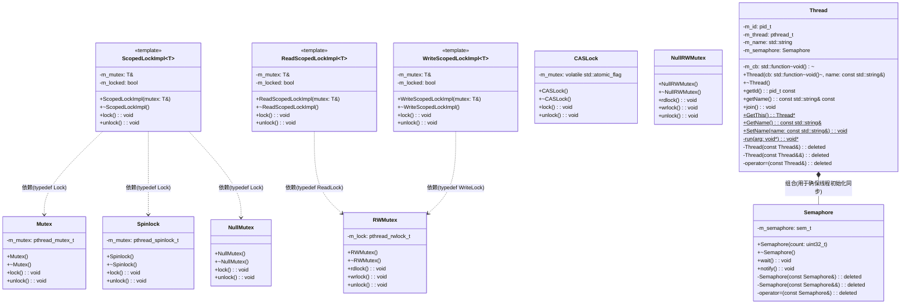

# 高性能服务器
## 配置
### 库安装
~~~bash
## 放在include目录下面
# yaml-cpp
sudo apt update
sudo apt install -y libyaml-cpp-dev
https://github.com/jbeder/yaml-cpp

# boost
https://www.boost.org/releases/latest/
~~~

### http编译测试
~~~bash
# 1. 把http11_common.h http11_parser.h  httpclient_parser.h  httpclient_parser.rl  http11_parser.rl 放在sylar/http目录下

# 2. 安装ragel
sudo apt update
sudo apt install ragel
ragel -v

# 3. 编译
cd sylar/http
ragel -G2 -C http11_parser.rl -o http11_parser.rl.cc
ragel -G2 -C httpclient_parser.rl -o httpclient_parser.rl.cc

# HTTP请求测试
sudo apt install telnet
telnet www.baidu.com 80
GET / HTTP/1.0  # 两次回车

~~~

### 项目构建
~~~bash
cd build
cmake ..
make
cd ../bin
./test_config
~~~

### git操作
~~~bash
## 给两个空目录创建占位文件
touch include/boost/.gitkeep
touch include/yaml-cpp/.gitkeep

## 普通提交
git add .
git commit -m "xxx"
git push -f origin main

## 从上次conmmit取消并重新上传文件
git reset --mixed HEAD^
git rm -r --cached .
git add .
git commit -m "xxx"
git push -f origin main
~~~

---

## HTTP 协议封装与极速解析 (Ragel) (Version 9)

### 版本差异与核心演进亮点

如果想要在我们的协程框架之上搭建高吞吐量的 Web 框架，就必须具备极速解析 HTTP 报文的能力。

**Version 9 的核心升级如下：**
1. **全面且强类型的 HTTP 协议封装**：通过宏自动生成了全量 HTTP Method 和 Status Code 的枚举与字符串映射，彻底消除了魔法数字 (Magic Number)。封装了 `HttpRequest` 和 `HttpResponse` 面向对象体系。
2. **基于 Ragel 状态机的解析引擎**：抛弃了低效的正则和字符串切分。引入了 Ragel 语法文件 (`.rl`)，通过编译生成 C/C++ 代码级别的高效状态机 (`.rl.cc`)，实现了逐字节级别的状态跳转解析，性能达到了 Nginx / Node.js 的同等级别。
3. **零拷贝设计与原地截断**：解析器在提取 URI、Header 等字段时，通过指针 `at` 和长度 `length` 进行标记，并在解析完成后通过 `memmove` 将未处理的 Body 数据原地前移，最大程度降低了内存申请和拷贝开销。
4. **无缝集成全局配置系统**：利用之前开发的 `Config` 模块，将请求/响应的最大缓冲区大小、最大 Body 长度全部实现了热更新配置管理。

---

### 模块全量核心类图 (UML)

以下是严格包含所有枚举、结构体、类模板、虚函数、回调函数及成员变量的详尽 UML 类图：

```mermaid
classDiagram
    %% ================= HTTP 宏与枚举 =================
    class HttpMethod {
        <<enumeration>>
        DELETE, GET, HEAD, POST, PUT, CONNECT...
        INVALID_METHOD
    }

    class HttpStatus {
        <<enumeration>>
        CONTINUE, OK, BAD_REQUEST, NOT_FOUND, INTERNAL_SERVER_ERROR...
    }

    class HttpUtil {
        <<namespace>>
        +StringToHttpMethod(m: const std::string&): HttpMethod $
        +CharsToHttpMethod(m: const char*): HttpMethod $
        +HttpMethodToString(m: const HttpMethod&): const char* $
        +HttpStatusToString(s: const HttpStatus&): const char* $
    }

    class CaseInsensitiveLess {
        <<struct>>
        +operator()(lhs: const std::string&, rhs: const std::string&): bool const
    }

    %% ================= 模板方法 =================
    class MapHelper {
        <<namespace>>
        +checkGetAs~MapType, T~(m: const MapType&, key: const std::string&, val: T&, def: const T&): bool $
        +getAs~MapType, T~(m: const MapType&, key: const std::string&, def: const T&): T $
    }

    %% ================= HTTP 实体对象 =================
    class HttpRequest {
        -m_method: HttpMethod
        -m_version: uint8_t
        -m_close: bool
        -m_path: std::string
        -m_query: std::string
        -m_fragment: std::string
        -m_body: std::string
        -m_headers: MapType
        -m_params: MapType
        -m_cookies: MapType
        
        +HttpRequest(version: uint8_t, close: bool)
        +getMethod(): HttpMethod const
        +getVersion(): uint8_t const
        +getPath(): const std::string& const
        +getQuery(): const std::string& const
        +getBody(): const std::string& const
        +getHeaders(): const MapType& const
        +getParams(): const MapType& const
        +getCookies(): const MapType& const
        +setMethod(v: HttpMethod): void
        +setVersion(v: uint8_t): void
        +setPath(v: const std::string&): void
        +setQuery(v: const std::string&): void
        +setFragment(v: const std::string&): void
        +setBody(v: const std::string&): void
        +isClose(): bool const
        +setClose(v: bool): void
        +setHeaders(v: const MapType&): void
        +setParams(v: const MapType&): void
        +setCookies(v: const MapType&): void
        +getHeader(key: const std::string&, def: const std::string&): std::string const
        +getParam(key: const std::string&, def: const std::string&): std::string const
        +getCookie(key: const std::string&, def: const std::string&): std::string const
        +setHeader(key: const std::string&, val: const std::string&): void
        +setParam(key: const std::string&, val: const std::string&): void
        +setCookie(key: const std::string&, val: const std::string&): void
        +delHeader(key: const std::string&): void
        +delParam(key: const std::string&): void
        +delCookie(key: const std::string&): void
        +hasHeader(key: const std::string&, val: std::string*): bool
        +hasParam(key: const std::string&, val: std::string*): bool
        +hasCookie(key: const std::string&, val: std::string*): bool
        +checkGetHeaderAs~T~(key: const std::string&, val: T&, def: const T&): bool
        +getHeaderAs~T~(key: const std::string&, def: const T&): T
        +checkGetParamAs~T~(key: const std::string&, val: T&, def: const T&): bool
        +getParamAs~T~(key: const std::string&, def: const T&): T
        +checkGetCookieAs~T~(key: const std::string&, val: T&, def: const T&): bool
        +getCookieAs~T~(key: const std::string&, def: const T&): T
        +dump(os: std::ostream&): std::ostream& const
        +toString(): std::string const
    }

    class HttpResponse {
        -m_status: HttpStatus
        -m_version: uint8_t
        -m_close: bool
        -m_body: std::string
        -m_reason: std::string
        -m_headers: MapType

        +HttpResponse(version: uint8_t, close: bool)
        +getStatus(): HttpStatus const
        +getVersion(): uint8_t const
        +getBody(): const std::string& const
        +getReason(): const std::string& const
        +getHeaders(): const MapType& const
        +setStatus(v: HttpStatus): void
        +setVersion(v: uint8_t): void
        +setBody(v: const std::string&): void
        +setReason(v: const std::string&): void
        +setHeaders(v: const MapType&): void
        +isClose(): bool const
        +setClose(v: bool): void
        +getHeader(key: const std::string&, def: const std::string&): std::string const
        +setHeader(key: const std::string&, val: const std::string&): void
        +delHeader(key: const std::string&): void
        +checkGetHeaderAs~T~(key: const std::string&, val: T&, def: const T&): bool
        +getHeaderAs~T~(key: const std::string&, def: const T&): T
        +dump(os: std::ostream&): std::ostream& const
        +toString(): std::string const
    }

    %% ================= C语言风格回调 =================
    class ParserCallbacks {
        <<C Functions>>
        +on_request_method(data: void*, at: const char*, length: size_t): void $
        +on_request_uri(data: void*, at: const char*, length: size_t): void $
        +on_request_fragment(data: void*, at: const char*, length: size_t): void $
        +on_request_path(data: void*, at: const char*, length: size_t): void $
        +on_request_query(data: void*, at: const char*, length: size_t): void $
        +on_request_version(data: void*, at: const char*, length: size_t): void $
        +on_request_header_done(data: void*, at: const char*, length: size_t): void $
        +on_request_http_field(data: void*, field: const char*, flen: size_t, value: const char*, vlen: size_t): void $
        
        +on_response_reason(data: void*, at: const char*, length: size_t): void $
        +on_response_status(data: void*, at: const char*, length: size_t): void $
        +on_response_chunk(data: void*, at: const char*, length: size_t): void $
        +on_response_version(data: void*, at: const char*, length: size_t): void $
        +on_response_header_done(data: void*, at: const char*, length: size_t): void $
        +on_response_last_chunk(data: void*, at: const char*, length: size_t): void $
        +on_response_http_field(data: void*, field: const char*, flen: size_t, value: const char*, vlen: size_t): void $
    }

    %% ================= HTTP 解析器 =================
    class HttpRequestParser {
        -m_parser: http_parser
        -m_data: HttpRequest::ptr
        -m_error: int

        +HttpRequestParser()
        +execute(data: char*, len: size_t): size_t
        +isFinished(): int
        +hasError(): int
        +getData(): HttpRequest::ptr const
        +setError(v: int): void
        +getContentLength(): uint64_t
        +getParser(): const http_parser& const
        +GetHttpRequestBufferSize(): uint64_t $
        +GetHttpRequestMaxBodySize(): uint64_t $
    }

    class HttpResponseParser {
        -m_parser: httpclient_parser
        -m_data: HttpResponse::ptr
        -m_error: int

        +HttpResponseParser()
        +execute(data: char*, len: size_t, chunk: bool): size_t
        +isFinished(): int
        +hasError(): int
        +getData(): HttpResponse::ptr const
        +setError(v: int): void
        +getContentLength(): uint64_t
        +getParser(): const httpclient_parser& const
        +GetHttpResponseBufferSize(): uint64_t $
        +GetHttpResponseMaxBodySize(): uint64_t $
    }

    HttpRequest "1" o-- "n" CaseInsensitiveLess : 使用其作为 Header 字典比较器
    HttpResponse "1" o-- "n" CaseInsensitiveLess : 使用其作为 Header 字典比较器
    HttpRequestParser "1" *-- "1" HttpRequest : 包含被解析的数据对象
    HttpResponseParser "1" *-- "1" HttpResponse : 包含被解析的数据对象
```



---

### 核心实现细节与底层原理深度剖析

#### 1. 宏驱动的枚举系统 (`HTTP_METHOD_MAP` / `HTTP_STATUS_MAP`)
* **设计痛点**：HTTP 有 30 多种方法和 60 多种状态码，手写 `switch-case` 进行字符串映射不仅极易出错，而且后期维护极其痛苦。
* **宏的艺术 (`#define XX`)**：
  * 在 `http.h` 中统一定义了一份宏列表。
  * **玩法 1：生成枚举**。`#define XX(num, name, string) name = num,`，展开后自动生成类似 `GET = 1, POST = 3` 的 `enum class HttpMethod`。
  * **玩法 2：生成解析逻辑**。在 `http.cc` 中：
    ```cpp
    #define XX(num, name, string) if(strcmp(#string, m.c_str()) == 0) return HttpMethod::name;
    ```
    这里极其巧妙地利用了预处理器操作符 `#`（字符串化），瞬间生成了 34 个 `if` 语句，零错误率实现了字符串到枚举的极速转换。
  * **玩法 3：生成数组映射**。通过 `const char* s_method_string[]` 数组索引，实现了从枚举到字符串 $O(1)$ 时间复杂度的反射。

#### 2. 大小写不敏感的字典树 (`CaseInsensitiveLess`)
* **网络规范要求**：RFC 规定，HTTP 的 Header 字段（如 `Content-Length` 和 `content-length`）**必须忽略大小写**。但是 C++ 标准库的 `std::map` 默认是大小写敏感的。
* **自定义比较器**：
  * 定义了 `CaseInsensitiveLess` 仿函数，重载 `operator()`。
  * 内部调用 C 标准库的高效函数 `strcasecmp` 进行比较。
  * 在 `HttpRequest` 中将 `MapType` 声明为 `std::map<std::string, std::string, CaseInsensitiveLess>`。这样无论业务层用什么大小写调用 `getHeader()` 或是解析器压入数据，底层都能准确命中，极其优雅。

#### 3. 泛型类型转换 (`getAs` / `checkGetAs`)
* HTTP 请求传来的参数全部是字符串（例如 `"1024"`），业务层经常需要将其转为 `int`, `float`, `uint64_t` 等。
* **实现细节**：借助 `boost::lexical_cast<T>` 强大的泛型能力，封装了异常安全的提取函数。当转换失败（如把字母转为数字）时，自动捕获 `catch (...)` 并返回调用方指定的默认值 `def`，彻底避免了因畸形网络包导致服务端崩溃的风险。

#### 4. Ragel 状态机解析引擎与 C 回调粘合
这是本模块最核心的性能引擎。
* **Ragel 简介**：Ragel 能够将自定义的正则语法（`.rl` 文件）编译成极其紧凑的纯 C 语言 goto/状态矩阵代码。它的运行速度极快，无需在运行时构建语法树。
* **底层解析原理 (`execute`)**：
  * 调用 Ragel 生成的 `http_parser_execute` (或 `httpclient_parser_execute`)。该函数内部是一个巨大的状态机矩阵。它逐个读取 `char* data` 中的字符。
  * 一旦状态机成功识别出一个 Token（比如识别出遇到了空格，前面的单词就是 `GET` Method），就会**立即触发注册的 C 语言回调函数**（如 `on_request_method`）。
* **回调与上下文绑定 (`static_cast`)**：
  * 因为 Ragel 生成的解析器是纯 C 代码，不支持面向对象。
  * **破局之法**：在 `HttpRequestParser` 构造时，将 `this` 指针赋给了 `m_parser.data`。当触发全局 C 回调（如 `on_request_method(void *data, ...)`）时，强制将其 `static_cast<HttpRequestParser*>(data)` 转换回来。这样就在纯 C 的回调流中拿到了 C++ 的类实例，进而愉快地调用 `parser->getData()->setMethod(m)` 修改对象属性。
* **零拷贝与指针游标 (`at`, `length`)**：
  * 注意回调函数的签名：它只传给了你字符串的起始地址 `at` 和长度 `length`。**它并没有把字符串拷贝出来给你**！这是极致性能的体现。
  * 在回调内部，只有在最终存入 `m_data` 字典时，才会构造 `std::string`。如果不需要保存（例如 `on_request_uri` 暂时留空），则发生零拷贝。

#### 5. 缓冲区处理与截断 (`memmove`)
网络包可能会发生 TCP 粘包（一次收到 1.5 个 HTTP 请求）。
* **截断机制 (`memmove`)**：
  * `execute` 跑完后，会返回它成功解析的**总字节数** `offset`。
  * `memmove(data, data + offset, (len - offset));`
  * 此时，`data` 中已解析完毕的 Headers 会被覆盖丢弃，剩下的只有 Body（如果存在）或者是下一个 HTTP 报文的头部。这种原地平移技术极其高效，彻底避免了重新 `malloc` 新缓冲区。

#### 6. 联动热更新配置系统 (`_RequestSizeIniter`)
* 为了防范诸如 **HTTP Header 恶意超长攻击 (Slowloris / 缓冲区溢出)**，我们在 `http_parser.cc` 中通过匿名命名空间定义了 `_RequestSizeIniter`。
* 它利用 Version 2 中的 `Config::Lookup` 创建了全局变量 `http.request.buffer_size` 等配置项，并直接**注册了 `addListener` 监听器**。
* 只要配置文件发生变动，静态缓存 `s_http_request_buffer_size` 就会被实时修改，整个过程无锁化，热更新即刻生效。

---

### 单元测试核心分析 (Tests)

#### `test_http.cc`
* **基础对象测试**：
  * 手动装配了一个 `HttpRequest` 和 `HttpResponse` 对象，设置了诸如 `Host`, `Content-Length` 和 Body 等属性。
  * 调用 `dump` 进行序列化，输出标准的 HTTP 报文。验证了底层换行符 `\r\n` 的正确拼接以及 `CaseInsensitiveLess` 字典树的行为。

#### `test_http_parser.cc`
* **状态机解析压测**：
  * 定义了一段包含完整 Request 行、Headers 和 Body 的合法网络字节流：`const char test_request_data[]`。
  * 通过 `parser.execute(&tmp[0], tmp.size());` 一口吞入整个字符串。
  * 测试结果将显示：`isFinished() == 1` (代表 Header 解析完美结束)，且返回了正确的 `offset` 偏移量。
  * 最精彩的是打印截断后的 `tmp`，会发现此时 Header 已经被完全抹去，只剩下了 `"1234567890"`（这是原本的 Body），完美验证了 `memmove` 的原地截断逻辑。同理验证了 Response 返回包的解析正确性。

---

## 序列化与字节流缓冲区 (ByteArray) (Version 8)

### 版本差异与核心演进亮点

在之前的版本中，我们通过 `Socket` 和 `IOManager` 实现了异步的网络收发。但是，直接发送和接收原始的 `char*` 缓冲存在极大的缺陷：一旦发生数据量突增，传统的连续内存（如 `std::vector<char>` 或 `std::string`）会频繁触发 `realloc`，导致巨量的内存拷贝，引起服务器性能骤降（CPU 抖动）。

**Version 8 彻底解决了内存与序列化问题，核心升级如下：**
1. **链表式内存池架构**：摒弃了连续内存。底层采用 `Node` 链表串联起一个个固定大小的内存块。按需扩容，**永远不会发生内存搬迁和拷贝**。
2. **Varint / ZigZag 极致压缩算法**：针对网络传输中常见的小整数，引入了 Google Protocol Buffers (Protobuf) 核心的 Varint 变长整型编码和 ZigZag 负数映射算法。可以将 64 位的整数极限压缩到 1~10 字节，大幅节省网络带宽。
3. **网络/主机字节序自动转换**：内置大小端转换机制（对接 Version 7 的 `endian.h`），确保序列化的数据在跨平台网络传输时完全一致。
4. **原生支持 `iovec` (Scatter/Gather I/O)**：提供 `getReadBuffers` 和 `getWriteBuffers`，直接提取链表底层碎片的真实物理地址。配合 `readv`/`writev` 系统调用，实现**零拷贝**级别的高效网络吞吐。

---

### 模块全量核心类图 (UML)

以下是严格包含所有内部结构、属性、数十个序列化重载方法的详尽 UML 类图：



---

### 核心算法与底层原理深度剖析

#### 1. 底层存储架构：固定大小的内存块链表
* **痛点**：由于网络数据流是源源不断的，传统的 `std::vector` 在容量不足时会申请一块原来 2 倍大的新内存，然后把老数据全部 `memcpy` 过去。这种**全量内存搬迁**是高并发服务器的性能杀手。
* **Sylar 解决方案 (`Node`)**：
  * 初始化时，分配一个容量为 `m_baseSize`（默认 4096 字节，刚好等于内存一页）的 `Node` 节点。
  * `m_root` 永远指向链表头部，`m_cur` 指向当前正在操作的节点。
  * **绝不搬迁**：当调用 `write()` 且当前节点容量不足时，`addCapacity()` 会计算需要的新节点数量，并在链表尾部挂载全新的 `Node`。新老数据物理上不连续，但在逻辑上通过偏移量 `m_position` 被完美抹平。

#### 2. 黑魔法一：Base128 Varint 变长整型压缩
* **现象**：业务中经常发送类似 ID=`15` 这样的整型。如果用 64 位整数发送，会产生 7 个字节的纯零（`00 00 00 00 00 00 00 0F`），白白浪费了 87% 的网络带宽。
* **Varint 实现原理 (`writeUint32` / `writeUint64`)**：
  * 将数字按 **7 位** 进行拆分。
  * 每个字节的 **最高位（MSB，第 8 位）** 作为标志位：`1` 表示“后面还有数据”，`0` 表示“这是最后一个字节”。
  * 代码实现中：`while(value >= 0x80) { tmp[i++] = (value & 0x7F) | 0x80; value >>= 7; }`。不断剥离后 7 位，给最高位补 1 压入缓冲区，直到数字本身小于 128。
  * **收益**：数字 `15` 仅需 1 个字节；极大地压缩了业务通讯的数据包体积。

#### 3. 黑魔法二：ZigZag 负数映射算法
* **现象**：Varint 虽然好，但是对**负数**极其致命。在计算机的补码表示中，负数（如 `-1`）的二进制全是 1（`FF FF FF FF FF FF FF FF`）。如果用 Varint 压缩负数，不仅无法压缩，反而会膨胀到 10 个字节！
* **ZigZag 算法原理 (`EncodeZigzag32` / `DecodeZigzag32`)**：
  * 将有符号整数映射为无符号整数，使得绝对值小的数字（无论正负）映射后依然是一个极小的值。
  * **映射表**：`0 -> 0`, `-1 -> 1`, `1 -> 2`, `-2 -> 3`, `2 -> 4`。
  * **Sylar 的巧妙编码**：
    * `if(v < 0) return (uint32_t)(-v) * 2 - 1; else return v * 2;`
    * **解码公式**：`return (v >> 1) ^ -(v & 1);`。利用了 C++ 的算术右移和负数补码特性，仅用一行极其优雅的位运算便完美还原了原始正负号。
  * **流程**：`writeInt32` 会先对数字进行 ZigZag 编码转成无符号数，然后再用 Varint 进行极致压缩。

#### 4. 浮点数的二进制剥离
* 浮点数 `float` 和 `double` 无法直接进行位运算（不能移位）。
* **Sylar 实现 (`writeFloat` / `writeDouble`)**：
  * 极其硬核地使用 `memcpy(&v, &value, sizeof(value));`，直接剥离内存底层的 IEEE 754 标准二进制序列，将其强行转化为无符号整数，然后调用底层的写函数。完美绕过了编译器的类型安全检查，实现了极速序列化。

#### 5. 跨越内存碎片的读写逻辑 (`write` / `read`)
由于内存被分割成了一个个 4096 字节的 `Node` 碎片，当我们想写入一段长达 10000 字节的数据时，必然会跨越多个节点。
* **算法实现**：
  * `npos = m_position % m_baseSize;` 计算出在当前小碎块内的偏移量。
  * `ncap = m_cur->size - npos;` 计算出当前小碎块还剩多少容量。
  * 利用 `while(size > 0)` 循环。如果剩余容量 `ncap` 够用，直接 `memcpy` 并更新指针；如果不够，先把当前碎块填满（`memcpy(..., ncap)`），然后触发 `m_cur = m_cur->next;`，切到下一个节点继续填，直到全部写完。

#### 6. 零拷贝核心：`iovec` 的神级集成
* 当 `Socket` 要发送 `ByteArray` 里的数据时，如果把链表里的碎片拼接成一块完整的内存再发送，就又产生了内存拷贝。
* **`getReadBuffers` 实现细节**：
  * 根据当前 `m_position`，遍历链表节点。
  * 对于每一个带有有效数据的 `Node`，将其内存的首地址 `cur->ptr + npos` 赋给系统结构体 `iovec.iov_base`，数据长度赋给 `iovec.iov_len`。
  * 最终返回一个 `vector<iovec>`。此时只需调用一次系统 API `writev`（聚集写），Linux 内核网卡驱动会自动去这多个物理不连续的内存地址里抓取数据发送。**全程 0 次用户态内存拷贝**！

#### 7. 游标控制 (`setPosition`) 边界坑点
* 当通过 `setPosition` 强行重置读写游标时，需要将 `m_cur` 指针挪到对应的链表节点。
* **代码高亮**：
  * 循环递减 `v -= m_cur->size; m_cur = m_cur->next;`。
  * **临界判断**：如果重置后 `v` 刚好等于 `m_cur->size`，说明游标恰好落在当前块的绝对末尾。如果不额外处理，下一次写入就会越界崩溃。代码中通过 `if(v == m_cur->size) m_cur = m_cur->next;` 完美处理了这一隐蔽的边界灾难。

---

### 单元测试核心分析 (Tests)

#### `test_bytearray.cc`
* **随机数据鲁棒性测试**：
  * 测试代码通过宏 `XX(type, len, write_fun, read_fun, base_len)` 生成大批量的 `rand()` 随机正负数、不同类型的整数。
  * 将 `m_baseSize` 刻意设置为极限的 `1` 字节。这意味着，就算写入一个 `uint64_t` 的 8 字节整数，也会**被迫跨越 8 个链表节点**，对 `write` 和 `read` 跨块处理逻辑进行了最严苛的极限压力测试。
  * 测试结果：写入后再 `setPosition(0)` 重新读取，并配合 `SYLAR_ASSERT`，保证了百万次跨内存碎片读写的零误差。
* **持久化能力测试**：
  * 调用 `writeToFile` 将极其零碎的链表数据连续地写入物理磁盘的 `.dat` 文件。
  * 创建一个崭新的 `ByteArray` 调用 `readFromFile` 加载数据，通过对比两者的 `toString()` 判断完全一致，验证了文件流导出/导入的绝对可靠性。

---

## 网络地址 (Address) 与 Socket 极致封装 (Version 7)

### 版本差异与核心演进亮点

在前面的版本中，我们已经打通了底层协程调度与 IO 劫持，使底层具备了高性能并发能力。但对于上层业务开发而言，直接操作 Linux 原生的 `sockaddr` 结构体、处理大端小端字节序、调用繁琐的 `socket/bind/listen/connect` C 语言 API 依然非常痛苦且容易引发内存泄漏。

**Version 7 进行了全面的面向对象（OOP）抽象，核心升级如下：**
1. **CPU 分支预测优化 (`macro.h`)**：新增 `SYLAR_LIKELY` 和 `SYLAR_UNLIKELY` 宏。利用 GCC/LLVM 的 `__builtin_expect` 机制，在断言和网络异常判断中主动告诉 CPU 哪些是小概率事件，从而优化指令流水线，提升极限性能。
2. **字节序转换模块 (`endian.h`)**：引入统一的跨平台字节序转换模板，完美抹平 Host 字节序（通常是小端）与 Network 字节序（大端）的差异。
3. **强大的地址解析系统 (`Address`)**：将 `sockaddr_in`, `sockaddr_in6`, `sockaddr_un` 完美抽象。内置了强悍的 `getaddrinfo` 域名解析和 `getifaddrs` 本机网卡遍历功能。
4. **全功能 `Socket` 封装**：继承自 `Noncopyable` 和 `enable_shared_from_this`。通过 RAII 机制彻底杜绝了 FD 泄漏。完美融入了上一版本的 IO Hook 机制，提供了支持超时控制的异步 TCP/UDP 读写接口。

---

### 模块全量核心类图 (UML)

以下是严格包含所有模块、类、枚举、多态虚函数、重载方法及模板方法的详尽 UML 类图：

```mermaid
classDiagram
    %% =================宏与工具模块=================
    class sylar_macro {
        <<macro>>
        +SYLAR_LIKELY(x)
        +SYLAR_UNLIKELY(x)
        +SYLAR_ASSERT(x)
        +SYLAR_ASSERT2(x, w)
    }

    class sylar_endian {
        <<namespace>>
        +byteswap~T~(value: T): T $
        +byteswapOnLittleEndian~T~(t: T): T $
        +byteswapOnBigEndian~T~(t: T): T $
    }

    %% =================网络地址模块 (Address)=================
    class Address {
        <<abstract>>
        +~Address() virtual
        +Create(addr: const sockaddr*, addrlen: socklen_t): Address::ptr $
        +Lookup(result: std::vector~Address::ptr~&, host: const std::string&, family: int, type: int, protocol: int): bool $
        +LookupAny(host: const std::string&, family: int, type: int, protocol: int): Address::ptr $
        +LookupAnyIPAddress(host: const std::string&, family: int, type: int, protocol: int): IPAddress::ptr $
        +GetInterfaceAddresses(result: std::multimap~std::string, std::pair~Address::ptr, uint32_t~~&, family: int): bool $
        +GetInterfaceAddresses(result: std::vector~std::pair~Address::ptr, uint32_t~~&, iface: const std::string&, family: int): bool $
        +getFamily(): int const
        +getAddr(): const sockaddr* const *
        +getAddr(): sockaddr* *
        +getAddrLen(): socklen_t const *
        +insert(os: std::ostream&): std::ostream& const *
        +toString(): std::string
        +operator<(rhs: const Address&): bool const
        +operator==(rhs: const Address&): bool const
        +operator!=(rhs: const Address&): bool const
    }

    class IPAddress {
        <<abstract>>
        +Create(address: const char*, port: uint16_t): IPAddress::ptr $
        +broadcastAddress(prefix_len: uint32_t): IPAddress::ptr *
        +networdAddress(prefix_len: uint32_t): IPAddress::ptr *
        +subnetMask(prefix_len: uint32_t): IPAddress::ptr *
        +getPort(): uint32_t const *
        +setPort(v: uint16_t): void *
    }

    class IPv4Address {
        -m_addr: sockaddr_in
        +Create(address: const char*, port: uint16_t): IPv4Address::ptr $
        +IPv4Address(address: const sockaddr_in&)
        +IPv4Address(address: uint32_t, port: uint16_t)
        +getAddr(): const sockaddr* const override
        +getAddr(): sockaddr* override
        +getAddrLen(): socklen_t const override
        +insert(os: std::ostream&): std::ostream& const override
        +broadcastAddress(prefix_len: uint32_t): IPAddress::ptr override
        +networdAddress(prefix_len: uint32_t): IPAddress::ptr override
        +subnetMask(prefix_len: uint32_t): IPAddress::ptr override
        +getPort(): uint32_t const override
        +setPort(v: uint16_t): void override
    }

    class IPv6Address {
        -m_addr: sockaddr_in6
        +Create(address: const char*, port: uint16_t): IPv6Address::ptr $
        +IPv6Address()
        +IPv6Address(address: const sockaddr_in6&)
        +IPv6Address(address: const uint8_t[16], port: uint16_t)
        +getAddr(): const sockaddr* const override
        +getAddr(): sockaddr* override
        +getAddrLen(): socklen_t const override
        +insert(os: std::ostream&): std::ostream& const override
        +broadcastAddress(prefix_len: uint32_t): IPAddress::ptr override
        +networdAddress(prefix_len: uint32_t): IPAddress::ptr override
        +subnetMask(prefix_len: uint32_t): IPAddress::ptr override
        +getPort(): uint32_t const override
        +setPort(v: uint16_t): void override
    }

    class UnixAddress {
        -m_addr: sockaddr_un
        -m_length: socklen_t
        +UnixAddress()
        +UnixAddress(path: const std::string&)
        +getAddr(): const sockaddr* const override
        +getAddr(): sockaddr* override
        +getAddrLen(): socklen_t const override
        +setAddrLen(v: uint32_t): void
        +insert(os: std::ostream&): std::ostream& const override
    }

    class UnknownAddress {
        -m_addr: sockaddr
        +UnknownAddress(family: int)
        +UnknownAddress(addr: const sockaddr&)
        +getAddr(): const sockaddr* const override
        +getAddr(): sockaddr* override
        +getAddrLen(): socklen_t const override
        +insert(os: std::ostream&): std::ostream& const override
    }

    Address <|-- IPAddress
    Address <|-- UnixAddress
    Address <|-- UnknownAddress
    IPAddress <|-- IPv4Address
    IPAddress <|-- IPv6Address

    %% =================Socket 枚举提取=================
    class Type {
        <<enumeration>>
        TCP = SOCK_STREAM
        UDP = SOCK_DGRAM
    }

    class Family {
        <<enumeration>>
        IPv4 = AF_INET
        IPv6 = AF_INET6
        UNIX = AF_UNIX
    }

    %% =================Socket模块=================
    class Socket {
        <<Noncopyable, enable_shared_from_this>>
        
        -m_sock: int
        -m_family: int
        -m_type: int
        -m_protocol: int
        -m_isConnected: bool
        -m_localAddress: Address::ptr
        -m_remoteAddress: Address::ptr

        +CreateTCP(address: Address::ptr): Socket::ptr $
        +CreateUDP(address: Address::ptr): Socket::ptr $
        +CreateTCPSocket(): Socket::ptr $
        +CreateUDPSocket(): Socket::ptr $
        +CreateTCPSocket6(): Socket::ptr $
        +CreateUDPSocket6(): Socket::ptr $
        +CreateUnixTCPSocket(): Socket::ptr $
        +CreateUnixUDPSocket(): Socket::ptr $

        +Socket(family: int, type: int, protocol: int)
        +~Socket()
        +getSendTimeout(): int64_t
        +setSendTimeout(v: int64_t): void
        +getRecvTimeout(): int64_t
        +setRecvTimeout(v: int64_t): void
        +getOption(level: int, option: int, result: void*, len: size_t*): bool
        +getOption~T~(level: int, option: int, result: T&): bool
        +setOption(level: int, option: int, result: const void*, len: size_t): bool
        +setOption~T~(level: int, option: int, value: const T&): bool

        +accept(): Socket::ptr
        +bind(addr: const Address::ptr): bool
        +connect(addr: const Address::ptr, timeout_ms: uint64_t): bool
        +listen(backlog: int): bool
        +close(): bool

        +send(buffer: const void*, length: size_t, flags: int): int
        +send(buffers: const iovec*, length: size_t, flags: int): int
        +sendTo(buffer: const void*, length: size_t, to: const Address::ptr, flags: int): int
        +sendTo(buffers: const iovec*, length: size_t, to: const Address::ptr, flags: int): int
        +recv(buffer: void*, length: size_t, flags: int): int
        +recv(buffers: iovec*, length: size_t, flags: int): int
        +recvFrom(buffer: void*, length: size_t, from: Address::ptr, flags: int): int
        +recvFrom(buffers: iovec*, length: size_t, from: Address::ptr, flags: int): int

        +getRemoteAddress(): Address::ptr
        +getLocalAddress(): Address::ptr
        +getFamily(): int const
        +getType(): int const
        +getProtocol(): int const
        +isConnected(): bool const
        +isValid(): bool const
        +getError(): int
        +dump(os: std::ostream&): std::ostream& const
        +getSocket(): int const
        +cancelRead(): bool
        +cancelWrite(): bool
        +cancelAccept(): bool
        +cancelAll(): bool

        -initSock(): void
        -newSock(): void
        -init(sock: int): bool
    }

    Socket "1" o-- "2" Address : 缓存 Local/Remote Address
    Socket ..> Type : 依赖枚举
    Socket ..> Family : 依赖枚举
```



---

### 核心实现细节与底层原理深度剖析

#### 1. 分支预测黑魔法 (`SYLAR_LIKELY` / `SYLAR_UNLIKELY`)
* **原理**：现代 CPU 采用高度流水线化执行，遇到 `if-else` 会进行分支预测并提前将指令读入流水线。如果预测失败，CPU 必须清空整条流水线重新加载，性能惩罚极高（约消耗数十个时钟周期）。
* **实现**：引入 `__builtin_expect(!!(x), 0)` 包装断言 `SYLAR_ASSERT`。因为程序发生断言失败（宕机）的概率极小，告诉 CPU `!(x)` 大概率为 `false`，从而让 CPU 放心大胆地优先预取 `if` 外的正常逻辑指令。在 `Socket::newSock()` 等高频方法中也使用了该宏，榨干 CPU 极限性能。

#### 2. 大小端字节序转换 (`endian.h`)
* **网络编程痛点**：网络传输协议严格规定必须使用**大端序（Big-Endian）**。而我们常用的 x86 架构 CPU 几乎全是**小端序（Little-Endian）**。
* **实现细节**：利用 `<byteswap.h>` 中的 `bswap_16/32/64`。通过模板 `std::enable_if` 结合 `sizeof(T)` 实现了 `byteswap` 对所有整型的安全泛型重载。配合宏 `#if BYTE_ORDER == BIG_ENDIAN`，如果是本机是大端，`byteswapOnLittleEndian` 直接返回；若是本机是小端，则调用底层汇编指令级别的高效逆序互换。

#### 3. 地址抽象体系 (`Address` 模块)
该模块将错综复杂的底层的 `sockaddr` 系列结构体统一收口到了面向对象的继承体系中。

* **智能工厂 (`Address::Create`)**：通过读取传入的底层 C 结构体中的 `sa_family` 字段，配合 `switch` 语句，自动 `dynamic_cast` 实例化出对应的 `IPv4Address`, `IPv6Address` 或是 `UnixAddress` 智能指针对象。
* **超强域名解析 (`Address::Lookup`)**：
  * 基于 POSIX 强大的 `getaddrinfo` 函数实现。
  * **难点攻克**：不仅能解析 `www.baidu.com`，还能精准拆解带端口的复合字符串。通过扫描 `[` 和 `]`，完美兼容了解析 IPv6 特殊格式 `[2001:db8::1]:80`；通过扫描 `:` 处理了普通的 IPv4 `127.0.0.1:8080` 格式。将解析出的一组地址转换为 `Address::ptr` 列表返回。
* **本机网卡抓取 (`Address::GetInterfaceAddresses`)**：
  * 利用底层 `getifaddrs` 抓取本机所有的物理/虚拟网卡（如 `eth0`, `lo`）。
  * **位运算艺术 (`CountBytes`)**：如何根据底层的 netmask（如 `255.255.255.0`）推算出前缀长度（24）？利用了 Brian Kernighan 的经典位运算算法 `value &= value - 1`，该操作可以在 $O(N)$（N为二进制中1的个数）内极速统计出子网掩码中 1 的数量。
* **子网/广播地址计算**：
  * `networdAddress`（网络地址）：IP 与 掩码做 `&` 操作。
  * `broadcastAddress`（广播地址）：IP 与 反码做 `|` 操作。
* **IPv6 的字符串压缩打印 (`IPv6Address::insert`)**：
  * IPv6 地址极长，规范允许将连续的 `0` 压缩为 `::`（且只能压缩一次）。该方法内部维护了一个 `used_zeros` 状态机，遍历 8 个 16 位整数段，完美实现了遵循 RFC 规范的优雅打印。

#### 4. 极致封装的网络套接字 (`Socket` 模块)
`Socket` 将繁杂的句柄操作变为了极简的方法调用，且 **100% 融入了底层的 IO 协程调度框架**。

* **生命周期管理 (RAII)**：构造时初始化或绑定已有 fd，**析构函数 `~Socket()` 强制调用 `close()`**，彻底根治服务器开发最容易犯的 File Descriptor 泄漏问题。并且继承自 `Noncopyable`，防范误拷贝导致的多次 `close()`。
* **超时时间联动 (`getSendTimeout` / `setRecvTimeout`)**：
  * 这里不是直接修改底层 socket，而是拦截后与 Version 6 中的 `FdMgr` 句柄管理器联动，将超时状态保存在用户态上下文中。
* **连接与阻塞控制 (`connect`)**：
  * 当调用 `sock->connect(addr)` 时，内部会自动判断：如果指定了超时时间，将直接使用 `hook.cc` 中劫持包装好的 `connect_with_timeout`。这使得业务层用同步调用的写法，在底层却实现了 **协程 Yield 挂起等待 + Epoll 异步唤醒**，绝不阻塞当前线程。
* **Scatter/Gather IO（分散/聚集读写）支持**：
  * 除了提供普通的 `send/recv` 接收 `void* buffer`，还深度支持传入 `iovec*` 结构。这允许将内存中不连续的多块数据一次性抛给内核去发送（通过 `sendmsg`/`recvmsg`），减少系统调用次数，极大优化零拷贝网络传输性能。
* **懒加载地址缓存 (`getLocalAddress` / `getRemoteAddress`)**：
  * 当应用频繁调用获取对端 IP 时，没必要每次都下沉到内核去调 `getpeername`。
  * **优化细节**：只有在第一次调用时才会执行真实的系统调用，结果被智能工厂转化为 `Address::ptr` 后缓存在 `m_localAddress` 和 `m_remoteAddress` 成员变量中，后续调用 $O(1)$ 极速返回。
* **优雅的协程取消操作 (`cancelRead/Write`)**：
  * 当外部强行终止 Socket 时，调用此方法会直接打通到底层的 `IOManager::GetThis()->cancelEvent()`，强制触发 epoll 回调，让沉睡在当前 Socket 上的协程苏醒过来，妥善处理资源回收。

---

### 单元测试核心分析 (Tests)

#### `test_address.cc`
* **功能验证**：
  * 测试了基于 `Lookup` 的 DNS 域名解析，能够将 `"www.baidu.com:ftp"` 等字符串准确解析出真实的 IP 列表。
  * 测试了 `GetInterfaceAddresses`，成功遍历输出当前 Linux 系统上的所有网卡设备名及其关联的 IPv4 / IPv6 地址与子网前缀。
  * 测试了 `IPv4Address::Create` 的字符串反序列化创建。

#### `test_socket.cc`
* **功能验证 (The Ultimate Test)**：这是将前面的“协程调度”、“IO劫持”、“地址解析”、“Socket封装”融会贯通的终极测试。
* **代码流转图**：
  1. 创建 `IOManager` 启动协程 Reactor 模型。
  2. 调度业务协程 `test_socket`。
  3. `Address::LookupAnyIPAddress("www.baidu.com")` 自动发起 DNS 查询获取百度 IP。
  4. `Socket::CreateTCP` 创建面向对象的 TCP 句柄。
  5. `sock->connect()` 发起连接。此时由于底层开启了 Hook，当前协程会在 TCP 握手期间**非阻塞自动挂起**，绝不卡死线程。
  6. 握手成功协程苏醒，直接调用 `sock->send` 发送原生 HTTP GET 报文。
  7. `sock->recv` 等待响应（同样，若数据未到，协程自动挂起）。
  8. 收到响应，打印百度首页 HTML 源码，协程完美结束。

---

## IO_Hook (系统调用劫持) 与 句柄管理 (FdManager) (Version 6)

### 版本差异与核心演进亮点

在上一个版本 (Version 5) 中，我们虽然实现了 `IOManager` 协程调度器，但业务代码依然面临一个**致命缺陷**：如果协程中调用了标准的 `read()`、`write()` 或 `sleep()` 等阻塞型系统 API，**整个底层物理线程将被操作系统挂起阻塞**。这导致该线程上的其他所有协程都无法被调度，协程的高并发优势荡然无存。

**Version 6 完美解决了这个问题，核心升级如下：**
1.  **动态链接库劫持 (IO Hook)**：利用 `dlsym` 劫持了 Glibc 的底层 Socket I/O 及睡眠相关的系统调用。让开发者**可以按照完全同步的思维写代码**，但在底层，框架会自动将阻塞调用转换为“非阻塞 I/O + `epoll` 监听 + 协程 `Yield` 挂起”。这是现代 C++ 协程库（如微信 libco、Sylar）的终极黑魔法。
2.  **句柄上下文管理 (FdManager)**：统一接管全站的文件描述符 (FD) 状态，记录其是否是非阻塞、是否是 Socket、以及单独的读写超时时间。
3.  **内存与拷贝控制规范 (`Noncopyable`)**：系统中的锁对象（如 `Mutex`、`Spinlock` 等）绝对不能被拷贝，否则会导致不可预期的死锁或崩溃。本版本剥离出了面向对象设计中经典的 `Noncopyable` 基类，大幅度净化了所有锁模块的基础代码。

---

### 模块全量核心类图 (UML)

以下是严格包含所有模块、枚举、方法签名、成员变量以及 Extern C 接口的详尽 UML 类图：



---

### 核心实现细节与底层原理深度剖析

#### 1. `Noncopyable` 的引入与 C++ 资源管理哲学
* **设计初衷**：在多线程框架中，所有的同步原语（互斥锁、读写锁、自旋锁、信号量）都是独占性/状态敏感的系统资源。如果发生锁对象的拷贝或赋值，将导致严重的未定义行为（如解锁未加锁的内存、导致死锁等）。
* **实现细节**：新增 `Noncopyable` 基类，明确使用 C++11 的 `= delete` 语法禁用了**拷贝构造函数**和**赋值运算符**。随后，将 `Semaphore`、`Mutex` 等全部同步组件继承自该类。这不仅消除了每个类中重复编写 `= delete` 的冗余代码，更在编译期间杜绝了资源被意外拷贝的可能，提升了框架的工程级健壮性。

#### 2. `FdManager` 与 `FdCtx`：句柄状态的守护者
要实现 IO 协程化，框架必须知道每一个操作的 FD 是什么类型的：
* **`FdCtx` (文件描述符上下文)**：
  * **位域优化 (Bit-fields)**：巧妙使用了 `bool m_isInit: 1;` 位域语法，将 5 个布尔状态极致压缩到了同一个字节内，极大节省了高并发下的内存占用。
  * **非阻塞状态隔离**：分为 `m_sysNonblock`（系统层面是否非阻塞）和 `m_userNonblock`（用户层面是否希望非阻塞）。因为框架为了实现异步，会**强制将所有 Socket 在系统层面设置为 `O_NONBLOCK`**；但为了对用户保持透明，必须单独记录用户原本的设置（如果用户自己设置了非阻塞，框架将不再干预，直接原样返回 `EAGAIN` 让用户自己处理）。
* **`FdManager` (全局管理器)**：
  * 使用 `std::vector<FdCtx::ptr>` 以 FD 自身的值作为索引，实现了 $O(1)$ 的极限查询速度。利用读写锁保障多线程下的扩容安全。

#### 3. 动态劫持魔法：`_HookIniter` 与 `dlsym`
* **如何偷梁换柱？** 框架通过定义与标准 C 库同名的函数（例如 `extern "C" unsigned int sleep(unsigned int seconds)`）来覆盖系统调用。
* **找回真实函数**：利用宏 `HOOK_FUN(XX)` 结合 `dlsym(RTLD_NEXT, "sleep")` 动态查找符号表。`RTLD_NEXT` 告诉链接器：“不要找我当前重写的这个 `sleep`，去动态库加载链的下一个环节去找真实的 `glibc` 里的 `sleep`”。并将真实地址保存在 `sleep_f` 函数指针中。
* **时机控制**：定义了结构体 `_HookIniter` 并声明了全局静态变量 `static _HookIniter s_hook_initer;`。这确保了在 C++ 的 `main` 函数执行之前，动态链接劫持就已经初始化完毕。

#### 4. 终极奥义：`do_io` 异步转换模板函数
`do_io` 是本模块乃至整个框架最核心的黑魔法引擎。几乎所有的读写操作（`read`, `recv`, `send`, `write`）都被这个万能模板重写：
1. **拦截检查**：检查当前线程是否开启了 Hook（通过 `thread_local bool t_hook_enable` 判断）。如果没有开启，或者 FD 不是 Socket，或者用户自己设置了非阻塞，**直接调用真实系统函数后返回**。
2. **首次尝试**：调用真实的系统函数尝试读写。如果成功，或者被信号中断（`EINTR`，立刻重试），则直接返回结果。
3. **异步挂起 (`EAGAIN`)**：如果真实函数返回 `EAGAIN`，代表缓冲区空了（或满了），常规线程会在此死锁。**我们的魔法开始**：
   * 向 `IOManager` 的 `epoll` 树中注册该事件（例如等待 `EPOLLIN`）。
   * 获取指定的超时时间，若存在，则创建一个条件定时器。
   * 调用 `Fiber::YieldToHold()` **将当前协程挂起，让出 CPU 执行权**！
4. **被动唤醒与重试**：
   * 当未来某时刻网络数据到达，`IOManager` 的 `idle` 协程中的 `epoll_wait` 会苏醒。
   * 调度器会将本协程重新放入执行队列。
   * 本协程在 `Fiber::YieldToHold()` 之后恢复执行：首先检查是否因为超时被唤醒（通过判定 `timer_info->cancelled`）。
   * 若非超时，利用 `goto retry;` 重新发起真实系统调用。此时数据必然已经就绪，成功读取数据并返回给用户。
   * **结果**：对于上层业务开发者而言，这就是一行普通的 `recv` 代码，但底层已经完成了一次极其高效的 CPU 让渡与网络事件驱动切换。

#### 5. 特殊的 `connect_with_timeout` 实现
* `connect` 无法直接复用 `do_io`。因为非阻塞的 `connect` 会立即返回 `EINPROGRESS`（正在建立连接中），而不是 `EAGAIN`。
* **实现逻辑**：
  * 发起非阻塞 `connect` 后立刻返回。
  * 将 Socket 的 `WRITE` 可写事件注册到 `epoll`，并让出协程 `YieldToHold`。
  * 当 TCP 三次握手成功或失败时，Socket 会变得可写，触发 `epoll` 唤醒协程。
  * 协程苏醒后，使用 `getsockopt(fd, SOL_SOCKET, SO_ERROR, ...)` 读取内核底层的真实错误码。如果 `error == 0`，代表连接完美建立；否则连接失败。从而实现了带精准超时控制的 TCP 异步直连。

#### 6. 调度器全局联动 (`Scheduler::run`)
在 `scheduler.cc` 中，我们为 `Scheduler::run` 入口函数增加了 `set_hook_enable(true);`。
* **深刻意义**：这意味着，**只要是交由 `Scheduler` (及 `IOManager`) 调度执行的任何协程任务，都会自动享受 IO 劫持带来的非阻塞加成**。而独立于调度器之外的普通原生线程，则继续保持传统的阻塞 I/O 行为，互不干扰，极大提升了框架的侵入式兼容性。

---

### 单元测试核心分析 (test_hook.cc)
* **`test_sleep()`**：同时向调度器抛入两个协程任务，分别 `sleep(2)` 和 `sleep(3)`。由于系统 `sleep` 被劫持变为了底层定时器 + 协程 Yield，主线程不会被卡住。实际运行耗时为 3 秒（而非 2+3=5秒），完美验证了同步代码的异步并发执行。
* **`test_sock()`**：通过原始的 `socket` -> `connect` -> `send` -> `recv` 请求外部服务器（如百度或 Cloudflare）。代码看起来完全是**同步阻塞式**的经典网络编程，但底层已经全部被 `sylar` 转化为非阻塞状态机，顺利跑完了完整的 HTTP 请求流程，验证了网络 IO 劫持的绝佳稳定性。

---

## IO 协程调度器 (IOManager) 与 定时器 (Timer) (Version 5)

纯粹的协程调度器 (`Scheduler`) 只能解决 CPU 密集型任务的切换，但服务端开发面临的最大瓶颈是 **网络 IO 的阻塞**。
Version 5 通过引入 `epoll` 和 `pipe` 管道机制，将异步 IO、定时器与协程调度器完美融合，实现了一个真正的 **高性能 Reactor 协程模型**。当网络数据未就绪时，协程挂起并让出 CPU；当 `epoll` 检测到数据就绪时，自动唤醒对应的协程继续执行。

### IO与定时器模块核心类图

以下是严格包含所有结构体、枚举、方法签名、成员变量的详尽 UML 类图：



---

### 定时器模块 (Timer) 实现深度剖析

定时器模块不依赖单独的线程循环，而是极其巧妙地融入到了 `IOManager` 的 `epoll_wait` 阻塞超时机制中。

#### 1. 数据结构的选择：红黑树 (`std::set`)
* **痛点**：高并发服务器中随时可能有成千上万个定时任务（如超时剔除、心跳检测），我们需要一种能**极其快速地找出最近一个要过期的定时器**的数据结构。
* **实现方案**：使用了 `std::set<Timer::ptr, Timer::Comparator>`。`std::set` 底层是红黑树，始终保持有序。
* **精妙的 `Comparator`**：比较器首先按照定时器的**绝对到期时间 (`m_next`)** 升序排列。最巧妙的是，如果两个定时器恰好在同一毫秒到期，比较器会回退到比较**内存地址 (`lhs.get() < rhs.get()`)**。这严格保证了 `set` 认为它们是两个不同的对象，避免了相同时间的定时器被非法覆盖剔除。

#### 2. 定时器核心机制
* **获取最近超时时间 (`getNextTimer`)**：O(1) 复杂度。由于红黑树有序，只需要取 `m_timers.begin()` 的时间戳减去当前时间，这就是 `epoll_wait` 下一次应该睡眠的时间。
* **获取已超时的任务 (`listExpiredCb`)**：
  * 当 `epoll_wait` 醒来时，调用此方法。
  * **设计亮点**：创建一个临时的“当前时间” dummy Timer 对象，利用 `std::set::lower_bound` 极其高效地进行二分查找，一刀将整棵红黑树切开：前面的全都是超时的，直接批量切割并提取 `cb` 回调函数塞入调度器，后面的继续保留。

#### 3. 解决服务器时间跳变 (Clock Rollover)
* 服务器运维时可能会遇到 NTP 时间同步或手动修改系统时间的情况。如果时间被强行往回调了一个月，基于绝对时间的定时器将全部失效卡死。
* **解决方案 (`detectClockRollover`)**：每次检查定时器时，对比上一次记录的时间。如果发现当前系统时间比上一次记录的时间**倒退了超过 1 小时**，则认为发生了时间重置。此时会无视到期时间，强行触发全部当前已有的定时器，防止死锁。

#### 4. 条件定时器 (`addConditionTimer`)
* 解决异步回调中对象生命周期的终极痛点：定时器触发时，对应的业务对象可能已经被销毁。
* **实现原理**：通过封装 `std::weak_ptr`。在真正执行 `cb` 之前，调用 `weak_cond.lock()` 尝试提升为强指针 `shared_ptr`。如果提升失败，说明对象已死，直接丢弃该任务；如果提升成功，说明对象依然存活，正常执行业务。

---

### IO协程调度器 (IOManager) 实现深度剖析

`IOManager` 是继承自 `Scheduler` 和 `TimerManager` 的集大成者，也是 `sylar` 框架进行网络编程的心脏。

#### 1. Reactor 架构的协程化改造
* **基础骨架**：初始化时创建了 `m_epfd`（epoll 句柄）和一对 `pipe` 管道（`m_tickleFds`）。
* **FdContext (句柄上下文)**：
  * 框架维护了一个一维数组 `m_fdContexts`，索引就是文件描述符 `fd`。这比使用 `map` 查询速度快几十倍，是典型的空间换时间。
  * 每个 `fd` 挂载两个 `EventContext`：分别对应读(`READ`)和写(`WRITE`)。里面保存着等待这个事件的 `Scheduler` 和被挂起的 `Fiber` 或 `Callback`。

#### 2. 最核心的方法：被重写的 `idle()`
* 父类 `Scheduler` 在没有任务时会不断让出 CPU，这会导致空转。`IOManager` 重写了 `idle()`，它是 `IOManager` 真正工作的核心循环：
* **运作流程**：
  1. 调用 `stopping(next_timeout)` 判断是否要停止，并顺便获取**离现在最近的一个定时器的超时时间**。
  2. 调用 `epoll_wait(m_epfd, events, 64, next_timeout)` 进入休眠。线程在这里挂起，不会消耗任何 CPU。
  3. **唤醒契机**有三个：① 定时器到期了；② 监听的网络 `fd` 来了数据；③ 有人往调度器里添加了新任务，调用了 `tickle()` 往管道 `m_tickleFds[1]` 里写了一个字节 `"T"`。
  4. 醒来后，先调用 `listExpiredCb` 将到期的定时器任务全部加入调度队列。
  5. 然后遍历 `epoll` 触发的事件列表：
     * 如果是管道读端可读，说明是 `tickle` 唤醒信号，采用 **ET (边缘触发) 模式** 利用 `while(read(...))` 将管道内积压的唤醒字节一次性全部抽干。
     * 如果是业务 `fd` 触发了可读或可写，则从 `FdContext` 中摘下对应被挂起的 `Fiber` 或 `Callback`。
     * 调用 `triggerEvent()` 强行将其塞入调度器的任务队列。
  6. **精妙的收尾**：`idle` 协程完成一轮事件分发后，立刻显式 `Yield` 切出。此时主调度 `run()` 函数会接管 CPU，开始飞速执行刚才被塞入队列的定时器任务和 IO 业务协程任务。

#### 3. 事件控制：`addEvent` vs `delEvent` vs `cancelEvent`
* **`addEvent`**：向 `epoll` 注册监听，并绑定当前正在执行的协程。随后用户代码就可以安心地去 `YieldToHold` 休眠了。
* **`delEvent`**：纯粹从 `epoll` 中删除监听。如果该事件关联的协程还在休眠，**它将永远不会被唤醒**（产生死协程）。
* **`cancelEvent`**：从 `epoll` 中删除监听，**同时强制触发一次回调/协程恢复**。这在实际业务中极其重要，例如在关闭 Socket 前，必须强制唤醒因等待读取而挂起的协程，让它执行收尾并正常退出，否则会造成严重的内存泄漏。

---

### 测试用例核心说明 (Tests)

#### `test_iomanager.cc`
* 揭示了在协程下发起非阻塞 TCP 连接的标准范式。
* **代码流转图**：
  1. 将 Socket 设置为非阻塞 (`O_NONBLOCK`)。
  2. 调用 `connect`，此时必定返回 `EINPROGRESS` (正在连接中)。
  3. 通过 `addEvent` 向 `IOManager` 注册 `WRITE` 可写事件监听。
  4. **重点注意**：在真实业务中，此时协程应调用 `YieldToHold()` 挂起自己。
  5. 当 TCP 三次握手成功（内核层面完成），该 socket 变为可写，`IOManager` 的 `idle` 会从 `epoll_wait` 醒来。
  6. `IOManager` 摘下挂起的任务投入队列，业务协程恢复执行，得知连接已建立。
  7. **避坑指南**：在执行 `close(sock)` 之前，务必调用 `cancelEvent` 注销尚未触发的事件，防止内核态句柄状态与用户态对象状态脱节。

#### `test_timer.cc`
* 演示了循环定时器的用法以及 **智能指针引发的深层悬空陷阱**。
* **避坑指南**：如果业务逻辑写在 lambda 表达式中，并且该 lambda 作为回调传给了脱离当前生命周期的后台定时器：
  * **绝不可按引用捕获** (`[&]`) 局部变量智能指针（如 `s_timer`）。因为触发时外层函数早已结束，局部指针已销毁，访问必报 `Segmentation fault`。
  * **正解**：将需要跨周期管理的智能指针提升为全局/类成员变量（如代码中提取为外部的 `s_timer`），确保其生命周期大于定时器的运行周期。

---
## 协程模块 (Fiber) 与 调度器模块 (Scheduler) (Version 4)

随着框架向纯异步、高性能演进，Version 4 引入了**非对称协程 (Asymmetric Coroutine)** 机制，并实现了 **M:N 协程调度模型**（M 个协程在 N 个线程上动态调度），彻底改变了传统的基于回调的异步编程模式。

### 协程与调度模块核心类图

以下是严格包含所有方法签名、变量、访问修饰符和嵌套结构的 UML 类图：


---

### 断言与工具链 (Macro & Util) 实现细节

为了保障协程框架在复杂上下文切换中的稳定性，引入了系统级调用栈追踪机制：
* **`Backtrace` 与 `BacktraceToString`**：
  * 底层调用 Linux/glibc 的 `<execinfo.h>` 库函数 `backtrace()` 抓取当前线程的调用栈指针数组。
  * 使用 `backtrace_symbols()` 将内存地址翻译为可读的函数名和偏移量字符串。
* **`SYLAR_ASSERT`**：
  * 通过宏定义实现严格的运行时检查。当条件不满足时，自动触发 `BacktraceToString` 获取堆栈信息，利用 Log 系统打印 `FATAL` 级错误后调用 `assert` 中止程序，极大提升了疑难 Bug 的排查效率。

---

### 协程模块 (Fiber) 详细实现细节

采用**非对称协程（Asymmetric Coroutines）**设计，子协程只能和创建它的父协程（或线程主协程）进行切换，职责清晰。

#### 核心组件设计
* **上下文切换 (`ucontext_t`)**：
  * 利用 `<ucontext.h>` 实现用户态的上下文保存与恢复。
  * `getcontext()` 保存当前 CPU 寄存器状态；`makecontext()` 绑定协程入口函数（如 `MainFunc`）和预先分配的独立内存栈；`swapcontext()` 实现原子级的“保存当前状态并加载新状态”。
* **双构造函数架构**：
  1. **私有无参构造 `Fiber()`**：仅用于将**当前线程的原始执行流**包装成第一个主协程。它不分配独立内存栈，直接接管当前执行流。
  2. **带参构造 `Fiber(cb, stacksize, use_caller)`**：用于创建真正的业务协程。通过 `MallocStackAllocator` 分配独立栈空间。
* **状态机设计**：
  * 维护了严格的状态流转：`INIT` -> `EXEC` -> `HOLD` / `READY` -> `TERM` / `EXCEPT`。
  * **协程重用 (`reset`)**：当协程处于 `TERM` 或 `INIT` 状态时，为了避免频繁的 `malloc/free` 栈内存带来的性能开销，允许直接传入新的回调函数 `cb`，重新调用 `makecontext` 复用已有的栈空间。
* **精妙的内存泄漏规避 (引用计数难题)**：
  * 在 `MainFunc` 协程入口函数中，业务执行完毕后协程需要切换回主协程。
  * **难点**：在 `MainFunc` 的栈中存在一个局部的 `Fiber::ptr cur = GetThis();`。如果在 `cur->swapOut()` 时直接切走，这个局部智能指针将永远无法析构（因为执行流再也不会回到这里），导致引用计数永远为 1，栈内存泄漏。
  * **破局方案**：提取裸指针 `auto raw_ptr = cur.get();`，显式调用 `cur.reset();` 将智能指针引用计数归零，最后通过 `raw_ptr->swapOut();` 安全切出。

---

### 调度器模块 (Scheduler) 详细实现细节

调度器实现了 **M:N 协程调度**，将 N 个协程任务均匀地分配给 M 个物理线程池执行。

#### 核心组件设计
* **`use_caller` (借用调用线程) 机制**：
  * 创建调度器时，如果 `use_caller` 为 `true`，调度器会将**创建调度器的那个主线程**也纳入线程池中（而不是纯粹只在后台新开线程）。
  * 为实现这点，调度器给主线程分配了一个特殊的 `m_rootFiber`。这个协程的入口是 `Scheduler::run`，但通过 `call()/back()` 机制与主线程的原始执行流进行切换，设计极其巧妙。
* **`FiberAndThread` (任务包装器)**：
  * 支持接收 `Fiber::ptr` 协程对象，或者原始的 `std::function<void()>` 回调。
  * 实现了**右值引用 (Rvalue Reference)** 的构造函数，支持 `std::move` 窃取资源，避免了将任务投入队列时产生不必要的拷贝开销。
  * 支持指定执行线程 `thread`（如果为 -1 则由任意线程抢占）。
* **核心调度循环 (`run()`)**：
  调度线程的核心就是一个 `while(true)` 死循环，内部逻辑如下：
  1. 加锁，从 `m_fibers` 队列中取出一个可执行的任务（匹配当前线程 ID 的，或未指定线程 ID 的）。
  2. 如果取到任务：
     * 若任务是协程对象：直接 `swapIn()` 切换过去执行。
     * 若任务是回调函数：为其分配一个协程对象，然后 `swapIn()`。
  3. 当协程 `Yield` 放弃 CPU 后（返回到 `run()`）：检查协程状态。如果是 `READY`，则重新放回任务队列尾部；如果是其他状态则保持 `HOLD` 挂起，等待其他地方唤醒。
  4. 如果队列中没有任务：线程切入 `idle()` 空闲协程，默认实现为不断地 `YieldToHold`（后续将在定时器和 IO 调度器中使用 `epoll_wait` 挂起，实现真正的睡眠休眠，降低 CPU 空转率）。
* **优雅退出机制 (`stop()`)**：
  * 置位 `m_autoStop` 标志，并向所有后台线程发送 `tickle()` 唤醒信号。
  * 如果启用了 `use_caller`，主线程会在这里陷入 `m_rootFiber->call()`，亲自动手帮忙处理剩下的任务，直到所有协程状态归位，最后逐一 `join()` 回收所有线程，实现无内存泄漏的优雅退出。

---

### 测试用例说明 (Tests)

* **`test_assert.cc`**：
  * 模拟异常条件，触发 `SYLAR_ASSERT2`。
  * 控制台将自动打印类似 `[FATAL] ASSERTION: 0 == 1 ... backtrace: ...` 的多级函数调用栈，验证了追踪系统的稳定性。
* **`test_fiber.cc`**：
  * 演示了最原始的单线程协程用法。
  * 主执行流通过 `swapIn()` 切入 `run_in_fiber`，子协程打印后通过 `YieldToHold()` 交还控制权，往复穿插执行。证明了协程在不涉及多线程条件下的状态保存能力。
* **`test_scheduler.cc`**：
  * 实例化 `sylar::Scheduler`（参数：3个工作线程，不使用调用者线程）。
  * 通过 `scheduler.schedule(&test_fiber)` 将回调任务投入调度池。
  * 在被调度的协程函数内部，利用静态变量 `s_count` 实现递归自我调度（倒数 5 次）。
  * 日志将清晰展示：同一个协程任务，在其挂起后被重新调度时，可能会在不同的底层 `thread_id` 上被执行，完美验证了 M:N 调度器的跨线程工作能力。

---

## 核心解读：协程 (Fiber) 模块深度剖析笔记 (Version 4)

本章节将深入剖析 `sylar` 框架的基石——协程模块。不同于简单的功能罗列，本章旨在揭示其**设计哲学、底层技术原理、关键实现细节以及针对复杂问题的解决方案**。

### 设计哲学：为何选择并如何实现协程

传统的网络编程模型（如多线程、异步回调）存在固有弊端：
*   **多线程模型**：线程是内核级资源，创建和上下文切换开销巨大。当并发量达到数万甚至更高时，系统资源消耗和调度开销将成为瓶颈。
*   **异步回调模型**：虽然性能高，但会导致“回调地狱 (Callback Hell)”，业务逻辑被拆分得支离破碎，代码可读性和可维护性极差。

`sylar` 框架的协程机制旨在结合两者的优点，规避其缺点，实现：
1.  **用户态调度**：协程是用户态的“轻量级线程”，创建和切换成本极低（仅涉及寄存器和栈指针的交换），可以轻松创建数百万个。
2.  **同步风格的异步编程**：允许开发者用看似同步的、顺序执行的代码，来编写本质上是异步的、非阻塞的逻辑。

本项目实现的是**非对称协程 (Asymmetric Coroutines)**，即协程的控制权只能在子协程和其调用者（通常是调度器主协程）之间转移，这使得调度关系清晰、易于管理。

---

### 底层基石：`ucontext.h` 与上下文切换原理

本协程库的核心是 POSIX 提供的 `ucontext.h` API，它允许程序在用户态保存和恢复完整的执行上下文。

*   **`ucontext_t` 结构体**：这是一个黑盒结构体，但其内部关键性地存储了：
    *   **CPU 寄存器**：包括指令指针 `rip`、栈顶指针 `rsp`、栈基址指针 `rbp` 以及所有通用寄存器。
    *   **`uc_stack`**：指向为该上下文分配的独立内存栈。
    *   **`uc_link`**：一个指向后继上下文的指针，当本上下文的入口函数执行完毕后，会自动切换到 `uc_link` 指向的上下文。
*   **核心函数三元组**：
    1.  **`getcontext(&ctx)`**：**“快照”**。将当前执行点的所有寄存器状态保存到 `ctx` 结构体中。
    2.  **`makecontext(&ctx, func, ...)`**：**“改装”**。修改一个已保存的 `ctx`，将其指令指针 `rip` 指向一个新的函数 `func`，并为其关联一个新分配的栈。**注意：它只能修改通过 `getcontext` 获取的上下文**。
    3.  **`swapcontext(&old_ctx, &new_ctx)`**：**“切换”**。这是原子操作，它将当前上下文保存到 `old_ctx`，然后立即从 `new_ctx` 中恢复上下文。这是协程 `Yield` 和 `Resume` 的直接实现。

---

### 全局与线程局部(TLS)状态：协程的“神经系统”

为了在不传递指针的情况下让代码感知当前所在的协程，框架巧妙地使用了全局和线程局部存储变量(TLS)：

*   **`static std::atomic<uint64_t> s_fiber_id / s_fiber_count`**：
    *   **原子性**：使用 `std::atomic` 是因为调度器可能在多个线程中创建协程，保证了 ID 分配和计数的线程安全。
*   **`static thread_local Fiber* t_fiber`**：
    *   **核心中的核心**。这是一个线程局部变量，它永远指向**当前线程上正在执行的那个协程**。`Fiber::GetThis()` 的高效实现完全依赖于此。
*   **`static thread_local Fiber::ptr t_threadFiber`**：
    *   **“锚点”**。它指向每个线程的**主协程**（即代表原始线程执行流的那个协程）。当一个子协程需要将控制权交还给“线程本身”而不是调度器时（例如 `back()` 操作），`t_threadFiber` 就是回归的目标。

---

### 内存管理：协程栈的创建与复用

*   **独立栈空间**：每个子协程都拥有独立的栈内存，通过 `MallocStackAllocator` (本质是 `malloc`) 分配。栈的大小由配置项 `fiber.stack_size` 决定，实现了灵活性。
*   **主协程的特殊性**：`Fiber::GetThis()` 在一个新线程上首次被调用时，会创建一个特殊的“主协程”。这个协程**不分配新栈**，而是直接“接管”当前线程的调用栈。这是协程系统启动的“第一推动力”。
*   **`reset(cb)` - 性能优化的关键**：
    *   **问题**：如果每次任务都 `new Fiber(...)`，在高并发下频繁 `malloc/free` 大块栈内存（通常是 1MB 或 2MB）会导致严重的性能抖动和内存碎片。
    *   **解决方案**：当一个协程执行完毕（状态变为 `TERM` 或 `EXCEPT`），调度器不会立即销毁它。而是通过 `reset(cb)` 方法，传入一个新的任务函数 `cb`，并重新调用 `makecontext` 来**复用这块已经分配好的栈内存**，实现了协程对象的池化，是高性能设计的体现。

---

### 方法剖析：解读关键函数的内部逻辑

#### `Fiber::GetThis()` - 智能的引导程序
此静态方法是用户与协程交互的主要入口之一，其内部逻辑极为精妙：
1.  检查 `t_fiber` (当前线程的当前协程)。
2.  若 `t_fiber` 非空，直接返回其 `shared_from_this()`。
3.  若 `t_fiber` 为空（**代表这是此线程第一次调用该函数**）：
    a.  创建一个新的协程实例 `main_fiber`，但调用的是**私有的无参构造函数 `Fiber()`**。
    b.  在此私有构造函数内，状态被置为 `EXEC`，并调用 `SetThis(this)` 将 `t_fiber` 指向自己。
    c.  `main_fiber` 不会分配新栈，它代表的就是当前线程的执行流。
    d.  将这个 `main_fiber` 赋值给 `t_threadFiber`，作为本线程的“锚点”。
    e.  断言 `t_fiber == main_fiber.get()` 确保初始化成功。
    f.  返回 `main_fiber`。

#### `swapIn()` vs `swapOut()` 与 `call()` vs `back()`
*   `swapIn()` / `swapOut()`：**为调度器服务**。`swapIn()` 是从调度器的主循环协程切换到业务协程；`swapOut()` 是从业务协程切回调度器的主循环协程。切换目标是固定的 `Scheduler::GetMainFiber()`。
*   `call()` / `back()`：**为非调度器场景服务**。例如在 `use_caller` 模式下，主线程的原始执行流需要和某个协程切换。`call()` 从主线程协程切入子协程，`back()` 从子协程切回主线程协程。切换目标是 `t_threadFiber`。

#### `MainFunc()` - 规避 `shared_ptr` 引用计数陷阱
这是整个协程模块**最精巧、最关键**的设计之一，完美解决了C++协程库中一个经典的内存泄漏问题。
*   **问题场景**：
    ```cpp
    void Fiber::MainFunc() {
        Fiber::ptr cur = GetThis(); // cur的引用计数至少为1
        // ... 执行业务代码 cur->m_cb() ...
        cur->swapOut(); // <--- 问题点！
        // 此后的代码永远不会被执行
    }
    ```
    当 `cur->swapOut()` 执行后，CPU 的执行流已经跳转到了调度器协程，`MainFunc` 的栈帧被“冻结”。`cur` 这个栈上的 `shared_ptr` 对象永远没有机会被析构，导致它持有的引用计数永远无法释放，最终整个 `Fiber` 对象（包括其百万字节的栈）**永久泄漏**。

*   **sylar 的解决方案**：
    ```cpp
    void Fiber::MainFunc() {
        // ... try-catch ...
        
        auto raw_ptr = cur.get();  // 1. 获取裸指针，不增加引用计数
        cur.reset();               // 2. 强制析构栈上的智能指针，引用计数-1
        raw_ptr->swapOut();        // 3. 使用裸指针进行上下文切换
    
        SYLAR_ASSERT2(false, "never reach here");
    }
    ```
    通过在切换前手动 `reset()` 智能指针，解除了当前栈帧对协程对象的引用，将生命周期管理完全交给了外部（如调度器的任务队列）。这是保障协程资源被正确回收的核心所在。

---
## 线程模块 (Thread System) 与并发安全设计 (Version 3)

随着框架向高并发演进，Version 3 引入了全面的线程管理和多维度锁机制。同时对之前的 **配置系统 (Config)** 和 **日志系统 (Log)** 进行了全面的线程安全升级。

### 线程模块核心类图

以下是线程模块独立的全量 UML 类图，严格包含了所有的方法签名、重载、静态方法、访问修饰符以及模板定义：



### 线程模块 (Thread) 详细实现细节

#### 1. 线程封装与 TLS (Thread Local Storage) 技术
* **核心类 `Thread`**：基于 POSIX pthread 库封装，弃用了 C++11 的 `std::thread`，原因是为了更底层地绑定系统内核级线程机制并设置名称。
* **TLS (线程局部存储)**：
  * 使用 `thread_local Thread* t_thread` 存储当前线程实例指针。
  * 使用 `thread_local std::string t_thread_name` 存储当前线程名称。
  * **作用**：让任何在这个线程上执行的代码，都可以通过静态方法 `Thread::GetName()` 和 `Thread::GetThis()` 以极低的代价获取当前线程上下文，这也是日志系统中 `%t` (线程ID) 快速打印的核心依赖。
* **同步启动机制 (`Semaphore`)**：
  * **痛点**：`pthread_create` 是异步的，创建线程后，如果主线程立刻去获取子线程的状态，子线程可能还没有执行到 `run` 函数的初始化逻辑，导致获取到错误信息。
  * **实现机制**：在 `Thread` 内部包含一个 `Semaphore`。`pthread_create` 之后主线程立刻调用 `m_semaphore.wait()` 阻塞。在新线程的 `run` 函数内部，完成 `pid` 抓取和名称设置后，调用 `m_semaphore.notify()` 唤醒主线程。这**绝对保证了**线程对象构造完成时，底层的内核线程已经完全初始化就绪。
* **系统级命名**：利用 `pthread_setname_np(pthread_self(), name)` 为底层线程设置名称（受 POSIX 限制最多 15 字符），使得在 Linux 下使用 `top -H` 或 `gdb` 时能直接看到有意义的线程名，极大方便调试。

#### 2. 多维度锁机制与 RAII 管理
本框架为了应对不同并发场景，提供了 6 种锁原语和 3 种 RAII 模板。

* **RAII 模板 (Resource Acquisition Is Initialization)**
  * 设计了 `ScopedLockImpl`, `ReadScopedLockImpl`, `WriteScopedLockImpl` 三个模板类。
  * **优点**：在构造函数中加锁，析构函数中解锁。即使业务代码中发生抛出异常、或者提前 `return`，也能利用 C++ 局部对象生命周期结束自动析构的特性保证锁一定被释放，**杜绝死锁**。
* **六种底层锁**：
  1. **`Mutex` (互斥锁)**：基于 `pthread_mutex_t`，最常规的锁，无论读写都阻塞，上下文切换开销较大。
  2. **`RWMutex` (读写锁)**：基于 `pthread_rwlock_t`。读锁共享，写锁独占。极其适合**读多写少**的场景。
  3. **`Spinlock` (自旋锁)**：基于 `pthread_spinlock_t`。在等待锁时不让出 CPU 时间片，而是死循环检测（忙等）。适合锁定范围极小、持有时间极短的场景。
  4. **`CASLock` (原子锁/乐观锁)**：基于 C++11 `std::atomic_flag` 的硬件级 CAS (Compare-And-Swap) 实现。比自旋锁更轻量，性能最高。
  5. **`NullMutex` & `NullRWMutex` (空锁)**：接口与普通锁一致但方法内为空。用于模板编程中，当使用者不需要线程安全时传入该类型，实现**零开销**。

### 跨模块集成：日志与配置的线程安全升级

在 Version 3 中，之前的模块被注入了并发安全能力：

#### 1. 配置系统 (Config) 的高并发改造
* **应用场景特点**：配置系统属于典型的**极度“读多写少”**场景（99.9%的业务在读取配置，极偶尔通过 YAML 热加载更新）。
* **改造细节**：
  * **注入锁类型**：为 `ConfigVar<T>` 注入了 `RWMutex` 读写锁。
  * **细粒度控制**：在 `ConfigVar::setValue()` 中，**对比新旧值以及触发回调函数的过程**被放入读锁作用域，只有真正执行 `m_val = v` 修改数据时，才切换为写锁作用域。
  * **全局配置字典锁**：全局 `s_datas` 映射表也加了 `RWMutex`。为防止跨编译单元锁的初始化顺序灾难，框架用 `GetMutex()` 返回局部静态锁 `static RWMutexType s_mutex`，保证安全。

#### 2. 日志系统 (Log) 的高性能改造
* **应用场景特点**：日志系统在服务运行期间会频繁写入，且多线程会争抢向同一个终端或文件输出字符。如果用 `Mutex` 会导致频繁的线程挂起和系统调用，严重拖慢业务。
* **改造细节**：
  * **注入锁类型**：为 `Logger`, `LogAppender`, `LoggerManager` 全部注入了 `Spinlock` (自旋锁)。
  * **锁范围优化**：写日志的过程通常只是字符串流转移或短时间的文件 I/O（有缓冲），非常迅速，用自旋锁替代互斥锁，避免了内核态陷入，极大提升了日志系统的吞吐率。
  * 解决了多线程并发写入日志时产生的“日志内容交错/乱码”问题。


## Sylar C++ 高性能服务器框架 (Version 2)

本项目是一个基于 C++11 开发的高性能服务器框架，目前 Version 2 已完成**日志系统 (Log System)** 和**配置系统 (Configuration System)** 的开发，并实现了两者的深度整合。

### 核心架构类图

以下是当前系统核心模块的 UML 类图，展示了日志系统与配置系统的整体架构和类的依赖关系：


---

### 日志系统 (Log System) 详细实现

日志系统支持多级别、多输出地、自定义格式化，并通过宏和流式输出提供极佳的开发者体验。

#### 核心组件设计
* **`LogLevel` (日志级别)**：定义了 `DEBUG`, `INFO`, `WARN`, `ERROR`, `FATAL` 五个级别，提供级别与字符串的相互转换功能。
* **`LogEvent` (日志事件)**：承载单次日志触发时的所有上下文信息，包括：文件名(`__FILE__`)、行号(`__LINE__`)、时间戳、线程ID、协程ID（预留）、所属日志器指针以及一个 `std::stringstream` 用于接收流式日志内容。
* **`LogEventWrap` (日志包装器 - RAII机制)**：
  * **实现细节**：通过宏（如 `SYLAR_LOG_INFO`）创建临时的 `LogEventWrap` 对象。其构造函数接收 `LogEvent`。
  * **巧妙之处**：宏展开后返回 `event->getSS()`，允许用户像使用 `std::cout` 一样使用 `<<` 拼接日志。当该行代码执行完毕，临时对象析构，在 `~LogEventWrap()` 中自动调用 `m_event->getLogger()->log()` 将这行拼接好的日志输出。
* **`LogFormatter` (日志格式器)**：
  * **实现细节**：负责将预设的字符串模板（如 `%d%T%p%T%m%n`）解析为具体的格式化项。
  * **解析模式 (Pattern)**：在 `init()` 函数中，通过状态机解析字符串，提取出普通字符和 `%` 开头的模式字符，并将其映射为内部类 `FormatItem` 的具体子类（例如解析 `%d` 生成 `DateTimeFormatItem`，解析 `%m` 生成 `MessageFormatItem`）。
* **`LogAppender` (日志输出地)**：
  * 抽象基类，自带独立的 `LogLevel` 和 `LogFormatter`。如果 Appender 未设置 Formatter，则默认使用父 `Logger` 的。
  * **`StdoutLogAppender`**：重写 `log()` 方法，将日志输出到 `std::cout`。
  * **`FileLogAppender`**：维护一个 `std::ofstream`，`reopen()` 负责打开文件，`log()` 方法将内容写入磁盘。
* **`Logger` (日志器)**：
  * 核心处理单元，拥有一个名称（默认为 "root"）。
  * **实现细节**：`log()` 方法首先检查传入事件的级别是否满足 `m_level`。满足则遍历内部所有的 `m_appenders`，依次调用它们的 `log()` 方法输出。如果没有配置 Appender，则会将日志转发给默认的 Root Logger。
* **`LoggerManager` (日志管理器)**：
  * **实现细节**：全局统一管理所有的 Logger。使用 `std::map<std::string, Logger::ptr>` 通过名称存储。如果通过 `getLogger("xxx")` 查找不存在，则自动创建并返回，确保随处可用。

---

### 配置系统 (Configuration System) 详细实现

配置系统基于 `YAML` 构建，采用**约定优于配置**的理念，所有配置项在代码中强类型声明。

#### 核心组件设计
* **`ConfigVarBase` (配置项基类)**：
  * 采用**类型擦除**的设计模式，屏蔽了派生类的模板类型 `T`。
  * 包含配置项的名称（统一转小写，不区分大小写）和描述。提供纯虚函数 `toString()` 和 `fromString()`，供管理类在不知道具体类型的情况下进行统一的序列化/反序列化。
* **`LexicalCast` (词法转换模板类)**：
  * **实现细节**：基础类型通过 `boost::lexical_cast` 实现字符串与类型的互转。
  * **偏特化 (Partial Specialization)**：针对 STL 容器（`vector`, `list`, `set`, `unordered_set`, `map`, `unordered_map`）进行了大量模板偏特化。利用 `yaml-cpp` 将 YAML Node 与这些容器进行深度解析转换。
  * **自定义类型支持**：用户可以像代码中的 `Person` 类一样，实现全特化的 `LexicalCast`，即可让配置系统无缝支持业务层复杂对象的 YAML 注入。
* **`ConfigVar<T>` (模板配置项)**：
  * 继承自基类，真正存储配置项的值 `m_val`。
  * **事件回调机制**：维护了一个 `std::map<uint64_t, on_change_cb>` 监听器列表。在调用 `setValue(const T& v)` 时，如果发现新值与旧值不同，会遍历触发所有回调函数。这对于实现**配置热更新**（如端口号修改后自动重启监听）极其关键。
* **`Config` (全局配置管理)**：
  * **实现细节**：提供静态方法 `Lookup` 注册/获取配置。
  * **静态局部变量规避初始化顺序问题**：内部不使用普通的静态成员变量存储 map，而是使用 `GetDatas()` 函数返回局部静态变量的引用，完美避免了 C++ 跨编译单元的 Static Initialization Order Fiasco（全局变量初始化顺序灾难）问题。
  * **`LoadFromYaml`**：核心解析函数。先通过 `ListAllMember` 递归函数，将树形的 YAML 结构展平为带前缀的点号分割字符串（如将 YAML 中的 `system: { port: 80 }` 展平为键值对 `"system.port" -> 80`）。然后遍历注册的配置，通过基类接口 `fromString` 注入数据。

---

### 工具库与编译说明

#### 基础模块
* **`Singleton` (单例模式)**：提供 `Singleton` (返回指针) 和 `SingletonPtr` (返回智能指针) 模板类。通过额外的模板参数 `X` 和 `N`，允许为同一个类实例化出多个相互隔离的单例对象。
* **`util.cc` (系统级工具)**：封装了 `syscall(SYS_gettid)` 用于获取精准的真实线程 ID（相较于 `pthread_self` 更底层且便于日志排查）。

#### CMake 构建细节
在 `CMakeLists.txt` 中：
* 引入了自定义的 `cmake/utils.cmake` 中的 `force_redefine_file_macro_for_sources` 宏，强制重定义代码中的 `__FILE__` 宏，使得日志中输出的文件路径变为相对路径，避免了绝对路径泄露编译机信息且占用日志空间的缺点。
* 链接了第三方库 `-lyaml-cpp` 解析配置。

---

### 测试用例说明 (Tests)
* **`test.cc`**：测试了日志的流式输出宏、格式化宏（`FMT`）、多输出地（控制台+文件过滤）以及单例日志管理器的获取。
* **`test_config.cc`**：
  * 演示了如何静态注册基本类型、各类 STL 容器类型的全局配置项。
  * 演示了如何实现 `Person` 自定义类的 YAML 序列化特化。
  * 测试了配置项监听器 `addListener`，在调用 `LoadFromYaml` 覆盖配置时，触发了旧值到新值变更的日志打印。
  * 演示了日志系统与配置系统的初步结合（利用 YAML 解析结果生成内部状态日志）。

