# 高性能服务器
## 配置
### 库安装
~~~bash
## 放在include目录下面
# yaml-cpp
sudo apt update
sudo apt install -y libyaml-cpp-dev
https://github.com/jbeder/yaml-cpp

# boost
https://www.boost.org/releases/latest/
~~~

### 项目构建
~~~bash
cd build
cmake ..
make
cd ../bin
./test_config
~~~

### git操作
~~~bash
## 给两个空目录创建占位文件
touch include/boost/.gitkeep
touch include/yaml-cpp/.gitkeep

## 从上次conmmit取消并重新上传文件
git reset --mixed HEAD^
git rm -r --cached .
git add .
git commit -m "xxx"
git push -f origin main
~~~

---

# Sylar C++ 高性能服务器框架 (Version 2)

本项目是一个基于 C++11 开发的高性能服务器框架，目前 Version 2 已完成**日志系统 (Log System)** 和**配置系统 (Configuration System)** 的开发，并实现了两者的深度整合。

## 1. 核心架构类图

以下是当前系统核心模块的 UML 类图，展示了日志系统与配置系统的整体架构和类的依赖关系：

```mermaid
classDiagram
    %% =================全局工具函数 (命名空间封装)=================
    class sylar_util {
        <<namespace>>
        +GetThreadId(): pid_t $
        +GetFiberId(): uint32_t $
    }

    %% =================单例模式模块=================
    class Singleton~T,X,N~ {
        +GetInstance(): T* $
    }
    
    class SingletonPtr~T,X,N~ {
        +GetInstance(): std::shared_ptr~T~ $
    }

    %% =================日志系统模块 (Log System)=================
    class LogLevel {
        +enum Level
        +toString(level: LogLevel::Level): const char* $
        +fromString(str: const std::string&): LogLevel::Level $
    }

    class LogEvent {
        -m_file: const char*
        -m_line: int32_t
        -m_elapse: uint32_t
        -m_threadId: uint32_t
        -m_fiberId: uint32_t
        -m_time: uint64_t
        -m_ss: std::stringstream
        -m_logger: std::shared_ptr~Logger~
        -m_level: LogLevel::Level
        +LogEvent(logger: shared_ptr~Logger~, level: LogLevel::Level, file: const char*, line: int32_t, elapse: uint32_t, thread_id: uint32_t, fiber_id: uint32_t, time: uint64_t)
        +getFile(): const char* const
        +getLine(): int32_t const
        +getElapse(): uint32_t const
        +getThreadId(): uint32_t const
        +getFiberId(): uint32_t const
        +getTime(): uint64_t const
        +getContent(): std::string const
        +getLogger(): std::shared_ptr~Logger~ const
        +getLevel(): LogLevel::Level const
        +getSS(): std::stringstream&
        +format(fmt: const char*, ...): void
        +format(fmt: const char*, al: va_list): void
    }

    class LogEventWrap {
        -m_event: LogEvent::ptr
        +LogEventWrap(e: LogEvent::ptr)
        +~LogEventWrap()
        +getSS(): std::stringstream&
        +getEvent(): LogEvent::ptr
    }

    class FormatItem {
        <<interface>>
        +~FormatItem() virtual
        +format(os: std::ostream&, logger: std::shared_ptr~Logger~, level: LogLevel::Level, event: LogEvent::ptr): void *
    }

    class LogFormatter {
        -m_pattern: std::string
        -m_items: std::vector~FormatItem::ptr~
        -m_error: bool
        +LogFormatter(pattern: const std::string&)
        +init(): void
        +isError(): bool const
        +getPattern(): const std::string const
        +format(logger: std::shared_ptr~Logger~, level: LogLevel::Level, event: LogEvent::ptr): std::string
    }

    class LogAppender {
        <<interface>>
        #m_level: LogLevel::Level
        #m_formatter: LogFormatter::ptr
        #m_hasFormatter: bool
        +~LogAppender() virtual
        +log(logger: std::shared_ptr~Logger~, level: LogLevel::Level, event: LogEvent::ptr): void *
        +toYamlString(): std::string *
        +setFormatter(formatter: LogFormatter::ptr): void
        +getFormatter(): LogFormatter::ptr const
        +getLevel(): LogLevel::Level const
        +setLevel(level: LogLevel::Level): void
    }

    class StdoutLogAppender {
        +log(logger: Logger::ptr, level: LogLevel::Level, event: LogEvent::ptr): void
        +toYamlString(): std::string
    }

    class FileLogAppender {
        -m_filename: std::string
        -m_filestream: std::ofstream
        +FileLogAppender(filename: const std::string&)
        +log(logger: Logger::ptr, level: LogLevel::Level, event: LogEvent::ptr): void
        +toYamlString(): std::string
        +reopen(): bool
    }

    class Logger {
        -m_name: std::string
        -m_level: LogLevel::Level
        -m_appenders: std::list~LogAppender::ptr~
        -m_formatter: LogFormatter::ptr
        -m_root: Logger::ptr
        +Logger(name: const std::string&)
        +log(level: LogLevel::Level, event: LogEvent::ptr): void
        +debug(event: LogEvent::ptr): void
        +info(event: LogEvent::ptr): void
        +warn(event: LogEvent::ptr): void
        +error(event: LogEvent::ptr): void
        +fatal(event: LogEvent::ptr): void
        +addAppender(appender: LogAppender::ptr): void
        +delAppender(appender: LogAppender::ptr): void
        +clearAppenders(): void
        +getLevel(): LogLevel::Level const
        +setLevel(level: LogLevel::Level): void
        +getName(): const std::string& const
        +setFormatter(val: LogFormatter::ptr): void
        +setFormatter(val: const std::string&): void
        +getFormatter(): LogFormatter::ptr const
        +toYamlString(): std::string
    }

    class LoggerManager {
        -m_loggers: std::map~std::string, Logger::ptr~
        -m_root: Logger::ptr
        +LoggerManager()
        +init(): void
        +getLogger(name: const std::string&): Logger::ptr
        +getRoot(): Logger::ptr const
        +toYamlString(): std::string
    }

    %% 日志系统关系连线
    LogEventWrap ..> LogEvent : RAII封装管理
    LogFormatter "1" *-- "n" FormatItem : 解析为多项组合
    Logger "1" *-- "n" LogAppender : 派发日志
    Logger "1" *-- "1" LogFormatter : 拥有格式
    LogAppender <|-- StdoutLogAppender : 继承实现
    LogAppender <|-- FileLogAppender : 继承实现
    LogAppender "1" o-- "1" LogFormatter : 可选独立格式
    LoggerManager "1" *-- "n" Logger : 集中管理
    LoggerManager ..|> Singleton~LoggerManager~ : 单例实现类(LoggerMgr)

    %% =================配置系统模块 (Config System)=================
    class ConfigVarBase {
        <<interface>>
        #m_name: std::string
        #m_description: std::string
        +ConfigVarBase(name: const std::string&, description: const std::string&)
        +~ConfigVarBase() virtual
        +getName(): const std::string& const
        +getDescription(): const std::string& const
        +toString(): std::string *
        +fromString(val: const std::string&): bool *
        +getTypeName(): std::string *
    }

    class LexicalCast~F,T~ {
        <<template/functor>>
        +operator()(v: const F&): T
    }

    class ConfigVar~T~ {
        -m_val: T
        -m_cbs: std::map~uint64_t, on_change_cb~
        +ConfigVar(name: const std::string&, default_value: const T&, description: const std::string&)
        +toString(): std::string override
        +fromString(val: const std::string&): bool override
        +getValue(): const T& const
        +setValue(v: const T&): void
        +getTypeName(): std::string override
        +addListener(key: uint64_t, cb: on_change_cb): void
        +delListener(key: uint64_t): void
        +getListener(key: uint64_t): on_change_cb
        +clearListener(): void
    }

    class Config {
        -GetDatas(): ConfigVarMap& $ 
        +Lookup(name: const std::string&, default_value: const T&, description: const std::string&): ConfigVar~T~::ptr $
        +Lookup(name: const std::string&): ConfigVar~T~::ptr $
        +LoadFromYaml(root: const YAML::Node&): void $
        +LookupBase(name: const std::string&): ConfigVarBase::ptr $
    }

    %% 配置系统关系连线
    ConfigVarBase <|-- ConfigVar~T~ : 继承多态机制
    ConfigVar~T~ ..> LexicalCast~F,T~ : 依赖转换仿函数(支持特化)
    Config "1" *-- "n" ConfigVarBase : 通过静态局部字典管理
```

---

## 2. 日志系统 (Log System) 详细实现

日志系统支持多级别、多输出地、自定义格式化，并通过宏和流式输出提供极佳的开发者体验。

### 2.1 核心组件设计
* **`LogLevel` (日志级别)**：定义了 `DEBUG`, `INFO`, `WARN`, `ERROR`, `FATAL` 五个级别，提供级别与字符串的相互转换功能。
* **`LogEvent` (日志事件)**：承载单次日志触发时的所有上下文信息，包括：文件名(`__FILE__`)、行号(`__LINE__`)、时间戳、线程ID、协程ID（预留）、所属日志器指针以及一个 `std::stringstream` 用于接收流式日志内容。
* **`LogEventWrap` (日志包装器 - RAII机制)**：
  * **实现细节**：通过宏（如 `SYLAR_LOG_INFO`）创建临时的 `LogEventWrap` 对象。其构造函数接收 `LogEvent`。
  * **巧妙之处**：宏展开后返回 `event->getSS()`，允许用户像使用 `std::cout` 一样使用 `<<` 拼接日志。当该行代码执行完毕，临时对象析构，在 `~LogEventWrap()` 中自动调用 `m_event->getLogger()->log()` 将这行拼接好的日志输出。
* **`LogFormatter` (日志格式器)**：
  * **实现细节**：负责将预设的字符串模板（如 `%d%T%p%T%m%n`）解析为具体的格式化项。
  * **解析模式 (Pattern)**：在 `init()` 函数中，通过状态机解析字符串，提取出普通字符和 `%` 开头的模式字符，并将其映射为内部类 `FormatItem` 的具体子类（例如解析 `%d` 生成 `DateTimeFormatItem`，解析 `%m` 生成 `MessageFormatItem`）。
* **`LogAppender` (日志输出地)**：
  * 抽象基类，自带独立的 `LogLevel` 和 `LogFormatter`。如果 Appender 未设置 Formatter，则默认使用父 `Logger` 的。
  * **`StdoutLogAppender`**：重写 `log()` 方法，将日志输出到 `std::cout`。
  * **`FileLogAppender`**：维护一个 `std::ofstream`，`reopen()` 负责打开文件，`log()` 方法将内容写入磁盘。
* **`Logger` (日志器)**：
  * 核心处理单元，拥有一个名称（默认为 "root"）。
  * **实现细节**：`log()` 方法首先检查传入事件的级别是否满足 `m_level`。满足则遍历内部所有的 `m_appenders`，依次调用它们的 `log()` 方法输出。如果没有配置 Appender，则会将日志转发给默认的 Root Logger。
* **`LoggerManager` (日志管理器)**：
  * **实现细节**：全局统一管理所有的 Logger。使用 `std::map<std::string, Logger::ptr>` 通过名称存储。如果通过 `getLogger("xxx")` 查找不存在，则自动创建并返回，确保随处可用。

---

## 3. 配置系统 (Configuration System) 详细实现

配置系统基于 `YAML` 构建，采用**约定优于配置**的理念，所有配置项在代码中强类型声明。

### 3.1 核心组件设计
* **`ConfigVarBase` (配置项基类)**：
  * 采用**类型擦除**的设计模式，屏蔽了派生类的模板类型 `T`。
  * 包含配置项的名称（统一转小写，不区分大小写）和描述。提供纯虚函数 `toString()` 和 `fromString()`，供管理类在不知道具体类型的情况下进行统一的序列化/反序列化。
* **`LexicalCast` (词法转换模板类)**：
  * **实现细节**：基础类型通过 `boost::lexical_cast` 实现字符串与类型的互转。
  * **偏特化 (Partial Specialization)**：针对 STL 容器（`vector`, `list`, `set`, `unordered_set`, `map`, `unordered_map`）进行了大量模板偏特化。利用 `yaml-cpp` 将 YAML Node 与这些容器进行深度解析转换。
  * **自定义类型支持**：用户可以像代码中的 `Person` 类一样，实现全特化的 `LexicalCast`，即可让配置系统无缝支持业务层复杂对象的 YAML 注入。
* **`ConfigVar<T>` (模板配置项)**：
  * 继承自基类，真正存储配置项的值 `m_val`。
  * **事件回调机制**：维护了一个 `std::map<uint64_t, on_change_cb>` 监听器列表。在调用 `setValue(const T& v)` 时，如果发现新值与旧值不同，会遍历触发所有回调函数。这对于实现**配置热更新**（如端口号修改后自动重启监听）极其关键。
* **`Config` (全局配置管理)**：
  * **实现细节**：提供静态方法 `Lookup` 注册/获取配置。
  * **静态局部变量规避初始化顺序问题**：内部不使用普通的静态成员变量存储 map，而是使用 `GetDatas()` 函数返回局部静态变量的引用，完美避免了 C++ 跨编译单元的 Static Initialization Order Fiasco（全局变量初始化顺序灾难）问题。
  * **`LoadFromYaml`**：核心解析函数。先通过 `ListAllMember` 递归函数，将树形的 YAML 结构展平为带前缀的点号分割字符串（如将 YAML 中的 `system: { port: 80 }` 展平为键值对 `"system.port" -> 80`）。然后遍历注册的配置，通过基类接口 `fromString` 注入数据。

---

## 4. 工具库与编译说明

### 4.1 基础模块
* **`Singleton` (单例模式)**：提供 `Singleton` (返回指针) 和 `SingletonPtr` (返回智能指针) 模板类。通过额外的模板参数 `X` 和 `N`，允许为同一个类实例化出多个相互隔离的单例对象。
* **`util.cc` (系统级工具)**：封装了 `syscall(SYS_gettid)` 用于获取精准的真实线程 ID（相较于 `pthread_self` 更底层且便于日志排查）。

### 4.2 CMake 构建细节
在 `CMakeLists.txt` 中：
* 引入了自定义的 `cmake/utils.cmake` 中的 `force_redefine_file_macro_for_sources` 宏，强制重定义代码中的 `__FILE__` 宏，使得日志中输出的文件路径变为相对路径，避免了绝对路径泄露编译机信息且占用日志空间的缺点。
* 链接了第三方库 `-lyaml-cpp` 解析配置。

---

## 5. 测试用例说明 (Tests)
* **`test.cc`**：测试了日志的流式输出宏、格式化宏（`FMT`）、多输出地（控制台+文件过滤）以及单例日志管理器的获取。
* **`test_config.cc`**：
  * 演示了如何静态注册基本类型、各类 STL 容器类型的全局配置项。
  * 演示了如何实现 `Person` 自定义类的 YAML 序列化特化。
  * 测试了配置项监听器 `addListener`，在调用 `LoadFromYaml` 覆盖配置时，触发了旧值到新值变更的日志打印。
  * 演示了日志系统与配置系统的初步结合（利用 YAML 解析结果生成内部状态日志）。