# TinyDDT — 协程微服务架构的多人实时弹道射击游戏

## 项目概述

TinyDDT（仿弹弹堂）是一款基于 C/S 架构的实时多人回合制弹道射击游戏。玩家在同一张地形图上轮流发射炮弹，考虑风向和角度，击中对手以减少其 HP，率先将对方 HP 降为零者获胜。

项目服务端基于 sylar C++ 协程框架构建，采用微服务架构拆分为 gate / login / lobby / battle / data 五个独立服务，通过 etcd 做服务注册与发现、Protobuf 定义 RPC 接口；客户端使用 Unity (C#) 实现，通过 TCP 长连接接入网关。整体分为服务端（微服务 + 共享物理引擎）和客户端（战斗/网络/UI 模块）两大模块，附带一套基于 Protobuf + etcd 的 RPC 框架。

## 核心功能

**客户端（Unity / C#）**
- 回合制弹道射击：采用服务端权威物理引擎，客户端本地复算弹道做视觉回放，逻辑以服务端为准
- 二维体素地形：地形以 bitset 二维网格表达，爆炸只挖圆内格子（平台保留），彻底解决穿地形/误判掉落
- 房间系统：支持创建/加入/离开/准备/切换队伍/切换武器，对局结束后自动返回大厅
- 聊天系统：实现综合/世界/房间/队伍/私聊频道通信
- 账号系统：HTTP 登录拿 token，登录服校验后长连接接入，基于 MySQL 持久化 + Redis 会话管理
- 通信协议：自定义帧格式 [4B length][2B msg_id][Protobuf payload]，客户端/服务端共享物理公式与地形位图
- 自动重连：断线后指数退避自动重连，重连后用缓存 token 自动登录恢复状态
- 主线程无阻塞：网络收发在独立线程，发送队列化，杜绝 TCP 反压导致画面冻结

**服务端（sylar C++ 协程框架）**
- 基于 IOManager 协程调度器，协程化处理大量并发 TCP 连接
- Gate/Login/Lobby/Battle/Data 五服务微服务架构，etcd 注册发现 + Protobuf RPC 互联
- 战斗房间状态用 Mutex 串行化（每房一锁），回合制天然串行，临界区极短
- SessionManager 统一管理连接生命周期，封装踢人、心跳超时、断线清理
- 权威物理引擎 + 二维体素地形：服务端计算弹道碰撞（isSolid 精确到格子）、爆炸挖坑（removeCircle）、AOE 伤害
- MySQL 连接池 + Redis 缓存：账号/对局持久化，会话 token 与在线状态管理

## 展示
|  |  |
| ---- | ---- |
| 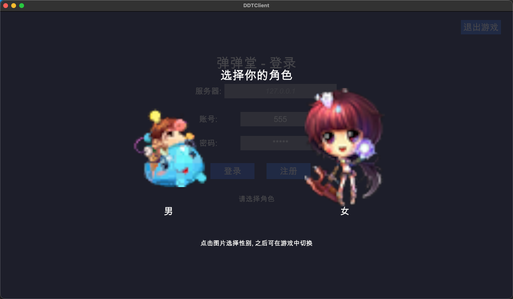 | 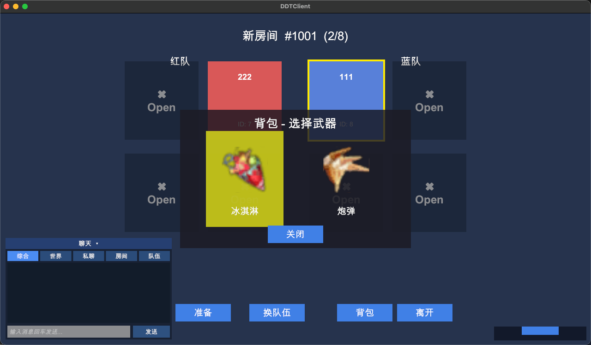 |
| 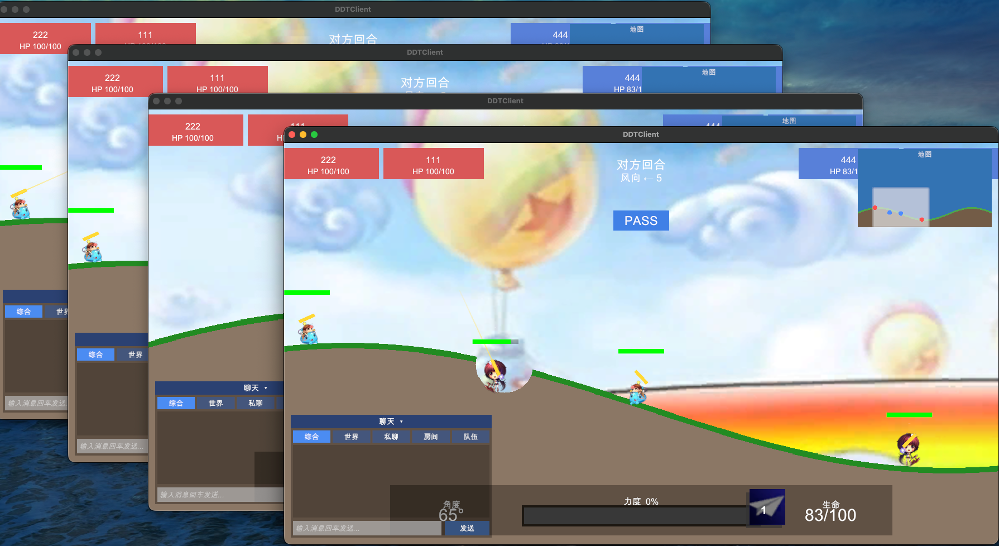 | 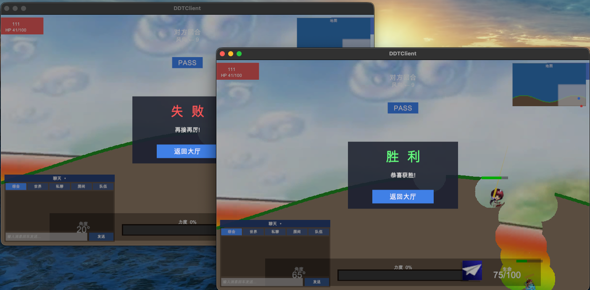 |

### v1.2 20260726 更新

v1.2 为 **长连接多路复用 + DB 双通道解耦 + 客户端动作队列** 版本：服务端全链路 RPC 改长连接多路复用（AsyncSocketStream + RpcStream + request_id 匹配），data 服务 DB 操作经双通道 DbWorkerPool 解耦，etcd PImpl 去除 + 全局 C++17 统一；客户端引入 BattleActionQueue 串行动作队列替代零散布尔标志系统，修复了一系列协程 busy-loop 导致的 CPU 打满和卡死问题。

#### 框架层（sylar/）

- **AsyncSocketStream + FiberSemaphore**：新增 `async_socket_stream.{h,cc}`，基于协程级信号量的异步 Socket 流，多协程 enqueue + 单 doWrite 协程串行消费。GateSendStream 继承它替代手搓 sendQueue
- **RpcStream 长连接多路复用**：新增 `rpc_stream.{h,cc}`，继承 AsyncSocketStream，实现 `[4B size][4B request_id][body]` 帧格式 + request_id 匹配唤醒等待协程。rpcheader.proto 加 `request_id` 字段
- **RpcChannel 双路径**：`rpc_channel.cc` 重写为 `callMethodMultiplexed`（有 pool，长连接多路复用）+ `callMethodShort`（无 pool，短连接兼容）。RpcProvider 改循环处理 + sendResponse 不关连接
- **RpcChannelPool 流管理**：`acquireStream/releaseStream` 管理 RpcStream 实例池
- **etcd PImpl 去除 + C++17 统一**：`etcd_client.{h,cc}` 去掉 3 个 Impl 结构体（~230 行），直接 include etcd 头文件；CMakeLists `-std=c++11` → `-std=c++17`
- **PreparedStmt 修复**：`orm/stmt.cc` `queryRows()` 补上 `mysql_stmt_bind_param`（原来漏了导致 `WHERE name=?` 占位符恒 NULL → 查询永远 0 行 → 登录报 account not found）
- **doRead busy-loop 根因修复**：`async_socket_stream.cc` `doRead` 在 `doRecv` 返回 nullptr 时 break（原来不 break → 非抢占式协程下独占线程 → 4 线程打满 → 所有协程饿死 → 客户端卡死）

#### 服务端业务层（src/server/）

- **DbWorkerPool 双通道**：新增 `db_worker.{h,cc}`，`execute`（异步 fire-and-forget）+ `query`（同步等结果 onComplete 回调）双通道。data 的 19 个 RPC 方法改双通道 + 16 处 esc() 裸 SQL 改 PreparedStmt
- **Redis 操作移出 DB 线程**：SaveToken/LoadToken/SetOnline 等移回 RPC 协程同步（DB 线程下 sylar hook 使 hiredis 非阻塞 fd 的 read 返回 EAGAIN）
- **聊天持久化重设计**：WORLD → Redis List（LPUSH/LTRIM/LRANGE），ROOM/TEAM → 不落盘，PRIVATE → MySQL
- **gate 全服务 RPC 池化**：4 个服务（gate→login/lobby/battle/data）全改 RpcChannelPool 长连接
- **gate KICK 同步发送**：`kickExistingSession` 改用 `sock->send` 同步发 KICK_NOTIFY + 延迟 200ms close（原来异步入队列后立即 close → KICK 没发出去 → 自动重连死循环）
- **battle urgent broadcast**：ShootResult/TurnStart/GameOver 同步推送（不走 schedule），避免 MoveNotify 积压延迟
- **battle 友军伤害**：自己/同队受 AOE 但 HP 最低保 1（不致死），坠落照死（不分敌友）；同归于尽判出手方胜

#### 客户端（src/client/）

- **BattleActionQueue**：新增 `BattleActionQueue.cs`（BattleAction 基类 + ShootAction/TurnStartAction/GameOverAction + 串行调度器），替代 `resolvingShoot_`/`camFrozenAfterShoot_`/`pendingTurnStart_` 三个布尔 + 5 个协调协程。消息到达转 Action 入队，队列串行执行，每个 Action 自己控制 IsDone
- **PlayerEntity 位置插值**：远程玩家 lerp 平滑（消除 15px RPC 跳变），本机直接定位；新增 ForcePosition（降落动画用）
- **开场序列简化**：PlayLanding+PlayIntro 多阶段 → 固定时长降落+巡视+收尾，不依赖 WaitUntilCamReachedOrTimeout
- **爆炸动画重写**：Simple 模式 + localScale 缩放 + 贴图 4 帧逐帧播放
- **高角度落点修正**：PlayTrajectory 最后轨迹点对齐服务端 hit_x/hit_y
- **shotLocked_ 超时 + KICK 战斗订阅 + 重连状态清除**：多项健壮性修复

#### 运维

- **fleet.sh**：`kill_all_ddt` 改 SIGKILL 优先（busy-loop 进程无法响应 SIGTERM）

详见 👉 **[docs/v1.2.md](docs/v1.2.md)**

### v1.1 20260720 更新

v1.1 为 **生产化与可观测性** 版本：补全了可观测性（traceId + 客户端诊断日志）、生产化能力（DB 密码环境变量化、Redis 连接池、多人战绩落库）、以及两项基于 Redis 的新功能（在线状态、世界聊天 Pub/Sub），并完成全项目代码风格统一。

#### 服务端

- **traceId 端到端透传**：gate 生成可读 traceId（`g<gateId>-a<accountId>-m<msgId>-<seq>`），经 RpcHeader 字段透传到 login/lobby/battle/data，关键 RPC 入口日志可关联调用链
- **DB 密码环境变量化**：`DDT_DB_PASS` 等 9 个环境变量覆盖 yml 配置，敏感信息不再明文落盘
- **Redis 连接池**：自研 `RedisPool + RedisGuard`（RAII），替代原单连接 + 全局 mutex，token 操作并行化
- **多人战绩端到端落库**：schema 拆主子表（game_records + game_record_players），proto 加 PlayerStat，data 用事务 + 批量插入，battle 累计 damageDealt + checkGameOver 异步落库
- **gate 注册式分发**：21 个 switch-case 改为 `unordered_map<uint16_t, Handler>` 注册表，新增 msg_id 只加一行
- **在线状态（Redis Set）**：gate 登录/断线上报 `SADD/SREM online:players`，lobby `GetFriendList` 内部 `SMEMBERS` 批量回填，修复 online 恒 false 的功能缺陷
- **世界聊天 Pub/Sub**：lobby 调 `data.PublishWorldChat` → MySQL 持久化 + Redis `PUBLISH chat:world`；gate 启动独立 `std::thread` 订阅 `chat:world`，收到消息推本地在线玩家，替代原 N 次 NotifyAllOnline RPC
- **login 栈溢出修复**：`fiber.stack_size` 1MB→2MB，解决 ValidateToken 在主协程做 2 次同步 data RPC + EtcdClient 重对象导致的 stack smashing
- **fleet.sh 修复**：按二进制名匹配所有路径形式的进程（含相对路径幽灵进程）+ 重试 2 次 SIGKILL 兜底

#### 客户端

- **诊断日志体系**：编译期 `DDT_DBG` 开关（`[Conditional]` 零开销），覆盖 BattleField/BattleController/LoginUI/LobbyUI 的状态机变化点；NetworkManager/NetClient 连接事件日志总输出
- **客户端 Bug 修复**：撤回 OnApplicationFocus 误丢消息逻辑；撤回主线程看门狗（sylar hook × gRPC 多进程冲突）

#### 工程化

- **全项目代码风格统一**：60+ 文件注释优化 + K&R 重格式化（单行 if 拆多行、大段顶部注释块删除、函数级注释统一），8 目标全部重编通过零 error
- **sylar/rpc/ 模块优化**：11 个文件注释中文化 + 重格式化

详见 👉 **[docs/v1.1.md](docs/v1.1.md)**

### v1.0 20260715 更新

客户端使用 `unity` 重构项目，实现基本功能与玩法。服务端由单进程三层演化为 **gate / login / lobby / battle / data 五服务微服务**，服务发现 ZooKeeper → **etcd**，通信 WebSocket → **TCP 长连接 + Protobuf**。

### v0.3
纸飞机

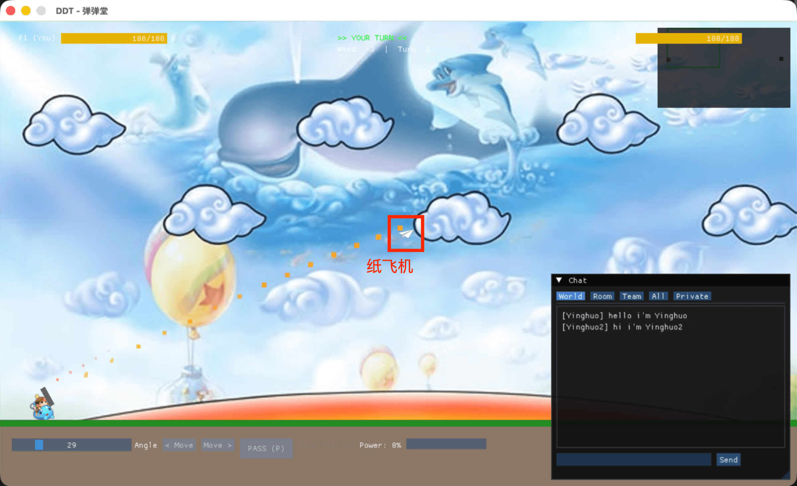

基于弹坑地形的优化

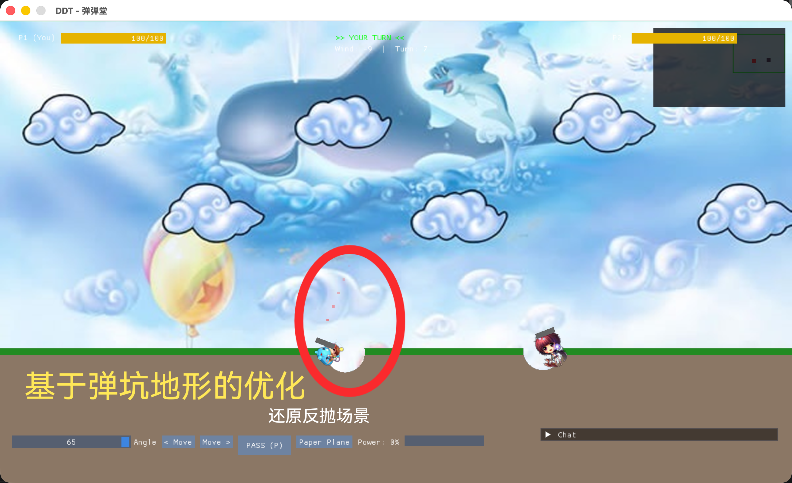

结算界面

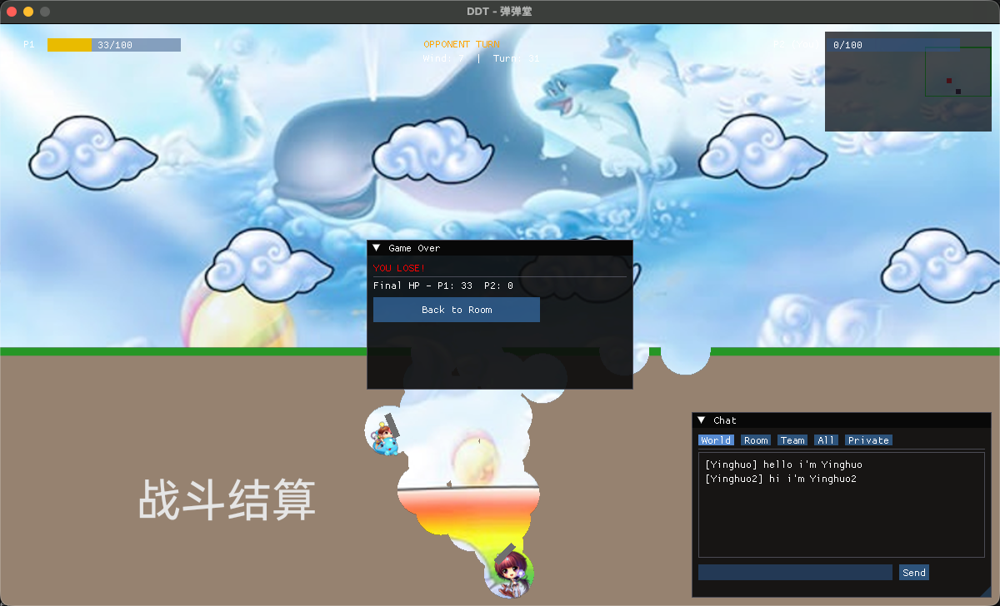

### v0.2
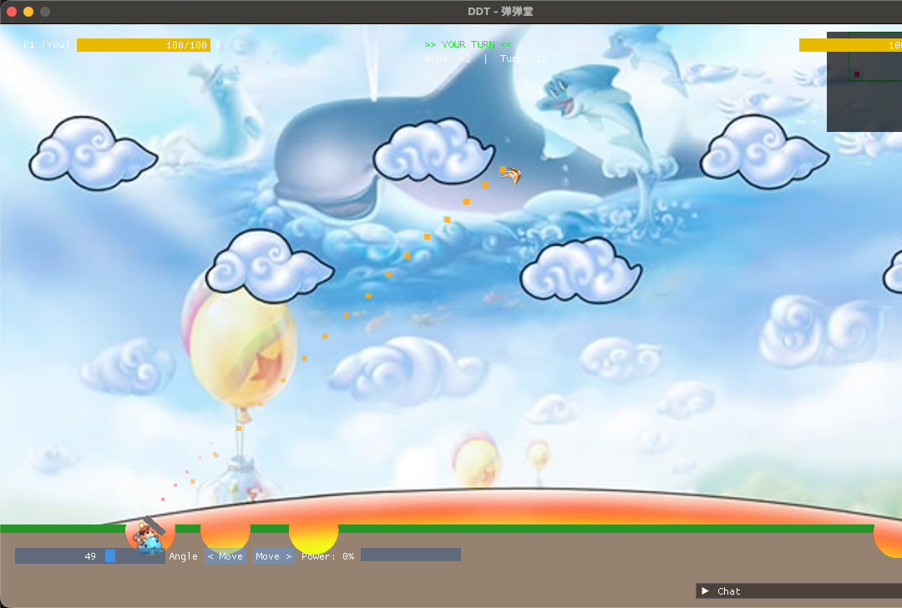

### v0.1
UI界面

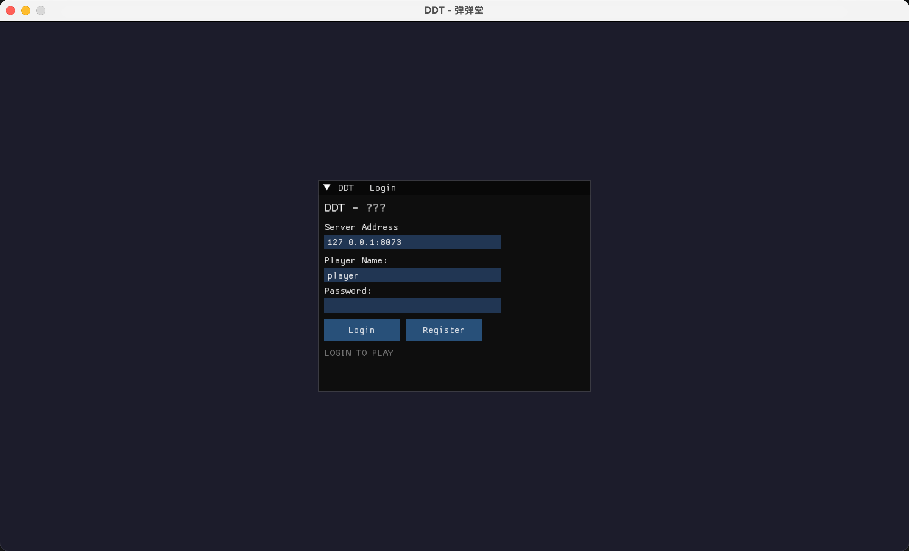

房间界面

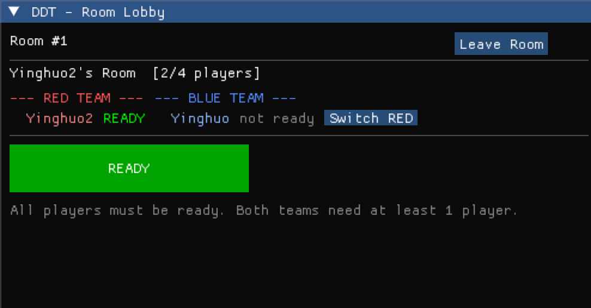

大厅界面

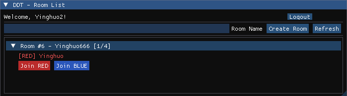

聊天界面

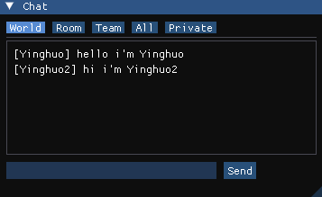

## 使用资源和鸣谢
1. [sylar](https://github.com/sylar-yin/sylar) 协程服务器框架
2. [Alpha](https://www.github.com/AlphaMinZ/Alpha) 基于sylar的RPC模块
3. [DDT](https://github.com/iwxyi/DDT) 弹弹堂素材和灵感
4. [浅析弹弹堂物理模型](https://www.52pojie.cn/thread-1132459-1-1.html) 抛物线物理参考
5. [C++ MySQL ORM：数据库操作，数据库增删改查](https://www.bilibili.com/video/BV1bd4y1777d/) C++ ORM参考
6. 鸣谢：[Claude Code] & [GLM Coding Plan] & [Gemini]

## 后记
能力有限，学习了sylar后，一边AI Coding一边学习，代码可能有很多问题，欢迎指正。

---

# DDT — 项目文档

各版本完整项目文档，记录每次 GitHub 推送时的项目状态与变更。

## 版本目录

| 版本 | 说明 | 文档 |
|------|------|------|
| **v1.2** | **长连接多路复用 + DB 双通道解耦 + 客户端动作队列** — AsyncSocketStream/RpcStream 长连接多路复用、DbWorkerPool 双通道、etcd PImpl 去除+C++17、PreparedStmt 修复、doRead busy-loop 根因修复、BattleActionQueue 串行动作队列、多项客户端时序/视觉修复 | [v1.2.md](docs/v1.2.md) |
| **v1.1** | **生产化与可观测性** — traceId 透传、DB 密码环境变量化、Redis 连接池、多人战绩落库、在线状态、世界聊天 Pub/Sub、全项目代码风格统一 | [v1.1.md](docs/v1.1.md) |
| v1.0 | 架构级重构 — 客户端重写为 Unity(C#)、服务端五服务微服务化（gate/login/lobby/battle/data）、ZooKeeper→etcd、WebSocket→TCP 长连接 | [v1.0.md](docs/v1.0.md) |
| v0.4 | ORM 模块 + 项目级目录重组 | [v0.4.md](docs/v0.4.md) |
| v0.3 | 架构重构 — Game 模块拆分、SessionManager、14 项架构问题修复、Bug 11-19 修复 | [v0.3.md](docs/v0.3.md) |
| v0.2 | Bug Fix & 体验优化 — 10 项稳定性修复 + 游戏体验改进 | [v0.2.md](docs/v0.2.md) |
| v0.1 | 初始版本 — OpenGL 客户端 + WebSocket 服务端 + RPC 框架 | [v0.1.md](docs/v0.1.md) |

---

# sylar 学习日志

sylar 协程框架的逐模块学习笔记（Version 1-17：日志/配置/线程/协程/调度器/IOManager/Hook/网络/HTTP/TcpServer/ByteArray/WebSocket/守护进程/Env/异步日志/UDP/聊天室）已移至独立文档：

👉 **[docs/sylar-learning-notes.md](docs/sylar-learning-notes.md)**

---

# DDT 弹弹堂 — 项目文档

## v1.2 摘要

v1.2 为**长连接多路复用 + DB 双通道解耦 + 客户端动作队列**版本：

### 框架层
- **AsyncSocketStream + RpcStream**：协程级异步 Socket 流 + RPC 请求-响应配对（request_id 匹配）
- **RpcChannel 多路复用**：长连接多路复用 + 短连接兼容双路径；RpcProvider 改长连接循环
- **etcd PImpl 去除 + C++17 统一**
- **PreparedStmt bind_param 修复**（登录 account not found 根因）
- **doRead busy-loop 根因修复**（服务端 CPU 100% + 客户端卡死根因）

### 服务端
- **DbWorkerPool 双通道**：execute(异步) + query(同步回调) 双通道解耦 DB 操作
- **Redis 操作移出 DB 线程**（hook EAGAIN 根因）
- **gate 全服务 RPC 池化 + KICK 同步发送**
- **battle urgent broadcast + 友军伤害 + 同归于尽**

### 客户端
- **BattleActionQueue**：串行动作队列替代布尔标志 + 协调协程
- **位置插值 + 开场简化 + 爆炸重写 + 高角度落点修正**
- **shotLocked 超时 + KICK 战斗订阅 + 重连状态清除**

> 完整架构、通信协议、服务端/客户端模块、RPC 框架、构建部署、实现细节与版本对比，详见 👉 **[docs/v1.2.md](docs/v1.2.md)**

---

## v1.1 摘要

v1.1 为**生产化与可观测性**版本，相对 v1.0 的主要变化：

### 可观测性
- **traceId 端到端透传**：gate 生成 → RpcHeader 字段透传 → callee 注入 controller → 入口日志关联
- **客户端诊断日志体系**：编译期 DDT_DBG 开关 + 状态机变化点覆盖

### 生产化能力
- **DB 密码环境变量化**：9 个环境变量覆盖 yml（DDT_DB_PASS 等）
- **Redis 连接池**：RedisPool + RedisGuard（RAII），替代单连接 + 全局 mutex
- **多人战绩端到端落库**：schema 拆主子表 + proto PlayerStat + data 事务批量插入 + battle damageDealt 累计 + checkGameOver 异步落库
- **gate 注册式分发**：21 个 switch-case → unordered_map 注册表

### Redis 新功能
- **在线状态（Set）**：SADD/SREM online:players + GetFriendList SMEMBERS 回填
- **世界聊天 Pub/Sub**：data PUBLISH chat:world + gate 独立线程 SUBSCRIBE

### 运维与修复
- **login 栈溢出修复**：fiber.stack_size 1MB→2MB
- **fleet.sh 修复**：按二进制名匹配所有路径形式 + SIGKILL 兜底
- **全项目代码风格统一**：60+ 文件注释优化 + K&R 重格式化

> 完整架构、通信协议、服务端/客户端模块、RPC 框架、构建部署、实现细节与版本对比，详见 👉 **[docs/v1.1.md](docs/v1.1.md)**

## 新分支git提交命令
~~~bash
# 普通提交
git checkout ddt
git add .
git commit -m "xxx"
git push origin ddt

# 撤销并重新提交
git reset --soft HEAD~
git add .
git commit -m "xxx"
git push origin ddt --force

~~~

---
