# TinyDDT 架构分析文档

> 本文档基于项目源码生成，所有结论引用实际目录、类、函数、文件路径与行号。不臆造模块。源码中不存在的功能均明确标注「未实现/未发现」。
>
| 项 | 内容 |
|----|------|
| 分析对象 | TinyDDT（仿弹弹堂，回合制弹道射击游戏） |
| 仓库根 | `/Users/yinghuo/OrbStack/ubuntu/home/yinghuo/code/proj/sylar` |
| 范围 | sylar 框架层 + `src/` 业务层（五服务微服务 + Unity 客户端） |
| 基线 | 反映 v1.2：AsyncSocketStream/RpcStream 长连接多路复用 + DbWorkerPool 双通道 + etcd PImpl 去除/C++17 + BattleActionQueue 客户端动作队列 + doRead busy-loop 根因修复后的状态 |

## 目录

- [第一章 项目概览](#第一章-项目概览)
- [第二章 架构设计](#第二章-架构设计)
- [第三章 网络通信](#第三章-网络通信)
- [第四章 业务系统](#第四章-业务系统)
- [第五章 数据与缓存](#第五章-数据与缓存)
- [第六章 客户端](#第六章-客户端)
- [第七章 性能与并发](#第七章-性能与并发)
- [第八章 重构建议](#第八章-重构建议)

---

# 第一章 项目概览

## 1.1 项目定位

**TinyDDT**（仿弹弹堂）是一款基于 C/S 架构的**实时多人回合制弹道射击游戏**。玩家在同一张地形图上轮流发射炮弹，考虑风向和角度，击中对手削减 HP，先将对方全部淘汰者获胜。

技术形态是**五服务微服务架构**（`src/server/`）+ **Unity/C# 客户端**（`src/client/`），服务端跑在 sylar C++ 协程框架（`sylar/`）之上，服务间经 etcd 注册发现、Protobuf RPC 互联，跨服务调用带 traceId 端到端透传。

> 注：仓库根 `CMakeLists.txt:2` `project(sylar)`——项目名沿用框架名，但业务是 TinyDDT。

## 1.2 技术栈

| 层 | 技术 | 源码证据 |
|----|------|---------|
| 框架 | sylar（ucontext 协程 + epoll） | `sylar/scheduler/{fiber,iomanager}.h` |
| 语言 | C++17（全局统一，v1.2 去 PImpl 后不再有例外） | `CMakeLists.txt` `-std=c++17` |
| 序列化 | Protobuf | `find_package(Protobuf REQUIRED)`（`CMakeLists.txt:91`） |
| 通信 | TCP 长连接（客户端↔gate）+ RPC 长连接多路复用（服务间，request_id 匹配） | `src/common/frame.h`、`sylar/rpc/rpc_stream.h`、`sylar/net/async_socket_stream.h` |
| 服务发现 | etcd v3（etcd-cpp-apiv3） | `sylar/rpc/etcd_client.h`、`thirdparty/etcd` |
| 数据库 | MySQL（ORM） | `sylar/orm/`、`libmysqlclient`（`src/CMakeLists.txt:76`） |
| 缓存 | Redis（token + 在线状态 + 世界聊天 Pub/Sub，**连接池 + 独立订阅线程**） | `src/server/data/redis_pool.h`、`-lhiredis`（`src/CMakeLists.txt:76`）；详见 §5.4-§5.6 |
| 配置 | YAML + 环境变量覆盖 | `yaml-cpp`、`src/server/conf/*.yml`、`service_base.cc:102-113` |
| 客户端 | Unity / C# | `src/client/*.cs`、`Google.Protobuf.dll` |

## 1.3 真实目录结构

```
sylar/                          # 仓库根（git, project(sylar)）
├── CMakeLists.txt              # 根构建：libsylar.so + 框架测试
├── sylar/                      # 框架库（core/scheduler/net/http/orm/rpc/util/examples）
├── src/                        # 业务代码
│   ├── proto/                  # common/gate/rpc.proto（package ddt）
│   ├── common/                 # frame/msg_id/routing/ddt_physics/terrain2d
│   ├── server/                 # 五服务 + service_base + schema.sql + conf/
│   │   ├── gate/ login/ lobby/ battle/ data/
│   │   ├── data/redis_pool.{h,cc}   # §10 Redis 连接池
│   │   ├── service_base.{h,cc} conf/*.yml schema.sql
│   └── client/                 # Unity C#（Network/Battle/Game/UI/Proto/Editor）
├── tests/                      # 框架测试 + rpc_test/ + 2 冒烟测试
├── scripts/                    # fleet.sh + etcd_close_preload.cc
├── thirdparty/                 # etcd/etcdctl/etcd-cpp-apiv3/cpprestsdk/include/
├── cmake/ docs/ assets/ bin/ lib/ build/
```

> 根下**无** `include/`、`server/`、`client/`、`game/`、`proto/`、`config/`——它们都在 `src/` 下（`config/` 实为 `src/server/conf/`）。

## 1.4 启动方式

### 构建（服务端）

```bash
cd build && cmake .. && make -j$(nproc) sylar ddt_gate ddt_login ddt_lobby ddt_battle ddt_data
```

产出 5 个服务可执行到 `bin/`（`src/CMakeLists.txt:83-121` 的 `ddt_add_service`）。公共链接库见 `src/CMakeLists.txt:71-76`（sylar + etcd-cpp-api + protobuf + mysqlclient + hiredis）。**客户端不经 CMake**——`src/client/` 是 Unity 项目，由 Unity Editor 构建。

### 运行（一键 fleet）

`scripts/fleet.sh`（`SERVS=(login gate lobby battle data)`，`fleet.sh:10`）：

| 命令 | 行为 |
|------|------|
| `fleet.sh start` | `kill_all_ddt` → `nohup env LD_PRELOAD=$PRE ... exec bin/ddt_$s -c conf/$s.yml`（`fleet.sh:38-49`） |
| `fleet.sh stop` | `kill_all_ddt`：SIGTERM 等 1s → 残留则 SIGKILL 兜底（`fleet.sh:18-26`） |
| `fleet.sh status` | `pgrep -af "$PATTERN"` + 端口监听（`fleet.sh:54-58`） |
| `fleet.sh etcd` | 列 etcd 注册键（base64 解码） |
| `fleet.sh logs <svc> <n>` | `tail /tmp/ddt_$s.log` |
| `fleet.sh restart` | 先 `rm` sylar `.o` 强制重编 + `start`（`fleet.sh:30-37`） |

> **`LD_PRELOAD` 垫片**（`scripts/etcd_close_preload.cc` → `lib/libetcd_close_fix.so`）是必须的：规避 sylar hook × gRPC 静态构造期的 `close()` 空指针崩溃（详见第八章）。

> **`fleet.sh` 进程匹配修复**（`fleet.sh:13-15`）：原 `"$BIN/ddt_"` 只匹配绝对路径，杀不掉用 `./ddt_xxx` 相对路径启动的幽灵进程（占端口致 bind 失败）。改为 `PATTERN="ddt_(login|gate|lobby|battle|data)[ ]"` 匹配所有路径形式。新增 `kill_all_ddt()`（`fleet.sh:18-26`）重试 2 次确保杀干净。

### 配置加载与覆盖优先级

`ServiceConfig::load()`（`service_base.cc:28-116`）读取 yml 后，末尾有**环境变量覆盖块**（`service_base.cc:102-113`）。优先级：

```
环境变量 > yml > 默认值
```

支持的环境变量（仅已设置时覆盖）：

| 环境变量 | 作用 |
|---------|------|
| `DDT_DB_HOST` / `DDT_DB_PORT` / `DDT_DB_USER` / `DDT_DB_PASS` / `DDT_DB_NAME` / `DDT_DB_POOL_SIZE` | MySQL 连接串（含密码） |
| `DDT_REDIS_HOST` / `DDT_REDIS_PORT` / `DDT_REDIS_POOL_SIZE` | Redis 连接串 + 池大小 |

> **设计目的**（注释 `service_base.cc:102-104`）：生产用环境变量注入敏感字段（如 `DDT_DB_PASS`），避免明文密码落 yml。libc `getenv` 在启动期主线程串行调用，线程安全（`setenv` 才非线程安全）。

## 1.5 运行流程

### 五服务端口（`*_main.cc` 中的默认值）

| 服务 | 默认端口 | 栈大小 | main 源码 |
|------|---------|--------|-----------|
| gate | 8100（TCP）+ 8101（PushService RPC） | 1MB | `gate_main.cc:16,42` |
| login | 8200（HTTP `/login`）+ 8201（RPC） | **2MB**（见 §7.7） | `login_main.cc:18,62` |
| lobby | 8300（RPC） | 1MB | `lobby_main.cc:18` |
| battle | 8400（RPC） | 1MB | `battle_main.cc:19` |
| data | 8500（RPC） | 1MB | `data_main.cc:17` |

### 服务统一启动骨架

每个 `*_main.cc` 都是同一套（以 gate 为例，`gate_main.cc:13-18`）：

```cpp
ddt::ServiceRunner runner("gate");           // service_base.h:96
if(!runner.init(argc, argv)) return 1;       // 解析 -c conf/gate.yml + 加载 sylar 配置
const auto& cfg = runner.config();
if(cfg.port == 0) const_cast<...>(cfg).port = 8100;
sylar::IOManager iom(4, true, "gate");       // 4 线程协程调度器
iom.schedule([&](){ /* 起 RpcProvider/TcpServer/HttpServer */ });
runner.installSignal();                       // SIGINT/SIGTERM 优雅停
```

`runner.init` 内同时加载 sylar 全局配置（`fiber.stack_size` 等，`service_base.cc:162-173`），必须在 `IOManager`（创建 fiber）之前调用，否则栈大小不生效。

### 数据流（端到端，含 traceId）

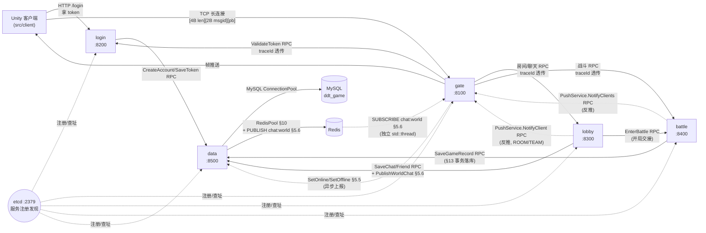
```mermaid
flowchart LR
    U["Unity 客户端<br/>(src/client)"] -- "HTTP /login<br/>拿 token" --> L["login<br/>:8200"]
    U -- "TCP 长连接<br/>[4B len][2B msgid][pb]" --> G["gate<br/>:8100"]
    G -- "ValidateToken RPC<br/>traceId 透传" --> L
    G -- "房间/聊天 RPC<br/>traceId 透传" --> LO["lobby<br/>:8300"]
    G -- "战斗 RPC<br/>traceId 透传" --> B["battle<br/>:8400"]
    LO -- "EnterBattle RPC<br/>(开局交接)" --> B
    L -- "CreateAccount/SaveToken RPC" --> D["data<br/>:8500"]
    LO -- "SaveChat/Friend RPC<br/>+ PublishWorldChat §5.6" --> D
    B -- "SaveGameRecord RPC<br/>(§13 事务落库)" --> D
    G -. "SetOnline/SetOffline §5.5<br/>(异步上报)" .-> D
    D -- "MySQL ConnectionPool" --> DB[("MySQL<br/>ddt_game")]
    D -- "RedisPool §10<br/>+ PUBLISH chat:world §5.6" --> RD[("Redis")]
    RD -. "SUBSCRIBE chat:world §5.6<br/>(独立 std::thread)" .-> G
    LO -. "PushService.NotifyClient RPC<br/>(反推, ROOM/TEAM)" .-> G
    B -. "PushService.NotifyClients RPC<br/>(反推)" .-> G
    G -- "帧推送" --> U
    E(("etcd :2379<br/>服务注册发现")) -.注册/查址.-> L & G & LO & B & D
```

**关键流向**：
1. 客户端先 HTTP `POST /login`（`login_main.cc:26` 的 `HttpServer`）拿 token；
2. 再 TCP 连 gate，首帧发 `LOGIN{token}`，gate 调 `login.ValidateToken` 校验（`gate_server.cc:300-371` `onLogin`）；onLogin 成功后 gate **异步**调 `data.SetOnline`（`gate_server.cc:397-413`，§5.5）；
3. 业务消息由 gate 按 `msg_id` 转发 lobby/battle，**每条出向 RPC 都带 traceId**（`gate_server.cc:32-42` `newCtrl`）；
4. lobby 凑齐开局条件后调 `battle.EnterBattle` 交接（`lobby_service.cc` `tryStart`）；
5. **lobby/battle 不持客户端连接**，需推送时反向调 gate 的 `PushService.NotifyClient(s)`（`gate_server.h:69-78`）；ROOM/TEAM 聊天仍走此反推路径；
6. 所有持久化经 `data` 服务，data 是唯一碰 MySQL/Redis 的进程；
7. battle `checkGameOver` 触发 `SaveGameRecord`（§13 事务+主子表，详见 §4.4/§5.2）；
8. **世界频道聊天走 Pub/Sub §5.6**：lobby.Chat(WORLD) → data.PublishWorldChat（持久化 + `PUBLISH chat:world`）→ 各 gate 订阅线程收到后 `sendToSession(MSG_CHAT_NOTIFY)`，替代原 `NotifyAllOnline` RPC；
9. **在线状态走 Redis Set §5.5**：gate 在 onLogin/delSession 异步调 data.SetOnline/SetOffline 维护 `online:players`，lobby.FriendList RPC 自动回填。

---

# 第二章 架构设计

## 2.1 模块划分

架构分三层：**框架层**（`sylar/`）、**共享层**（`src/common/` + `src/proto/`）、**服务层**（`src/server/` 五服务）+ **客户端**（`src/client/`）。

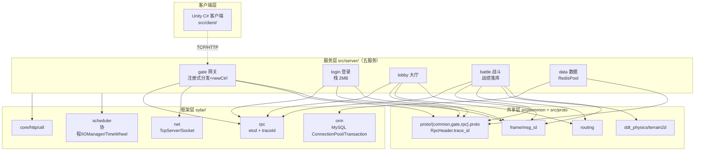
```mermaid
graph TB
    subgraph 客户端["客户端层"]
        UC["Unity C# 客户端<br/>src/client/"]
    end
    subgraph 服务层["服务层 src/server/（五服务）"]
        G["gate 网关<br/>注册式分发+newCtrl"]
        L["login 登录<br/>栈 2MB"]
        LO["lobby 大厅"]
        B["battle 战斗<br/>战绩落库"]
        D["data 数据<br/>RedisPool"]
    end
    subgraph 共享层["共享层 src/common + src/proto"]
        FR["frame/msg_id"]
        PH["ddt_physics/terrain2d"]
        RT["routing"]
        PR["proto/{common,gate,rpc}.proto<br/>RpcHeader.trace_id"]
    end
    subgraph 框架层["框架层 sylar/"]
        SCH["scheduler<br/>协程/IOManager/TimeWheel"]
        NET["net<br/>TcpServer/Socket"]
        ORM["orm<br/>MySQL ConnectionPool/Transaction"]
        RPC["rpc<br/>etcd + traceId"]
        CORE["core/http/util"]
    end
    UC -.TCP/HTTP.-> G
    G & L & LO & B --> FR
    B --> PH
    LO & B --> RT
    G & L & LO & B & D --> PR
    G --> NET
    D --> ORM
    G & L & LO & B --> RPC
    服务层 --> SCH
    服务层 --> CORE
```

### 服务职责（按真实目录）

| 服务 | 目录 | 职责（源码注释） |
|------|------|----------------|
| gate | `src/server/gate/` | 客户端 TCP 入口、帧解析、token 鉴权、**注册式分发 §15**、**newCtrl 生成 traceId §6**、实现 `PushService` 反推（`gate_server.h:44-50`） |
| login | `src/server/login/` | HTTP `/login`/`/register` + RPC `ValidateToken`/`Register`/`Login`，密码加盐哈希（`login_service.h:12-22`） |
| lobby | `src/server/lobby/` | 房间/匹配/好友/聊天，房间满员就绪后 `tryStart` 交接 battle（`lobby_service.h:39-42`） |
| battle | `src/server/battle/` | 权威物理、回合仲裁、地形破坏、伤害结算、**`saveGameRecordLocked` §13 战绩落库**（`battle_room.h:32-45`） |
| data | `src/server/data/` | **唯一持久层**，MySQL（账号/档案/战绩/好友/聊天）+ **Redis 连接池 §10**（`data_service.h:11-19`） |

## 2.2 依赖关系

### 服务间 RPC 依赖（实测）

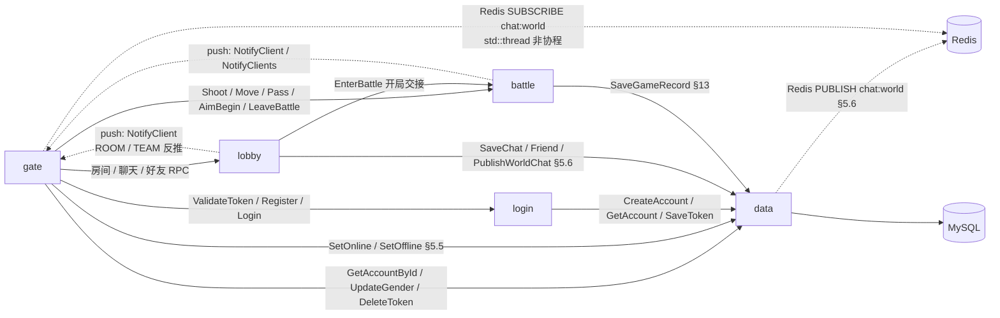
```mermaid
graph LR
    G["gate"] -->|"ValidateToken / Register / Login"| L["login"]
    G -->|"GetAccountById / UpdateGender / DeleteToken"| D["data"]
    G -->|"SetOnline / SetOffline §5.5"| D
    G -->|"房间 / 聊天 / 好友 RPC"| LO["lobby"]
    G -->|"Shoot / Move / Pass / AimBegin / LeaveBattle"| B["battle"]
    L -->|"CreateAccount / GetAccount / SaveToken"| D
    LO -->|"SaveChat / Friend / PublishWorldChat §5.6"| D
    LO -->|"EnterBattle 开局交接"| B
    B -->|"SaveGameRecord §13"| D
    LO -.->|"push: NotifyClient<br/>ROOM / TEAM 反推"| G
    B -.->|"push: NotifyClient / NotifyClients"| G
    D -.->|"Redis PUBLISH chat:world §5.6"| RD[("Redis")]
    G -.->|"Redis SUBSCRIBE chat:world<br/>std::thread 非协程"| RD
    D --> DB[("MySQL")]
```

| 调用方 → 被调方 | RPC 方法 | 源码证据 |
|---------------|---------|---------|
| gate → login | ValidateToken / Register / Login | `gate_server.cc:227` `loginChannel()` |
| gate → data | GetAccountById / UpdateGender / DeleteToken | `gate_server.cc:232` `dataChannel()` |
| gate → data | **SetOnline / SetOffline**（§5.5 异步上报） | `gate_server.cc:397-413`（onLogin）、`gate_server.cc:126-137`（delSession） |
| gate → lobby | RoomList / CreateRoom / Chat / ... | `gate_server.cc:217` `lobbyChannel()` |
| gate → battle | Shoot / Move / Pass / AimBegin / LeaveBattle | `gate_server.cc:222` `battleChannel()` |
| login → data | CreateAccount / GetAccountByName / SaveToken | `login_service.h:58` `dataChannel()` |
| lobby → data | SaveChat / FriendAdd / GetFriendList | `lobby_service.h:80` `dataChannel()` |
| lobby → data | **PublishWorldChat**（§5.6 世界频道） | `lobby_service.cc:555-573` |
| lobby → battle | EnterBattle（唯一，开局交接） | `lobby_service.h:81` `battleChannel()` |
| battle → data | **SaveGameRecord**（§13 事务落库，由 `BattleRoom::saveGameRecordLocked` 调） | `battle_room.cc:521-557`、`battle_main.cc:84` |
| lobby/battle → gate | PushService.NotifyClient(s) / NotifyAllOnline | `lobby_main.cc:31,53` / `battle_main.cc:36,61` |
| data → Redis | **PUBLISH chat:world**（§5.6 Pub/Sub） | `data_service.cc:711` |
| gate → Redis | **SUBSCRIBE chat:world**（§5.6 独立线程） | `gate_server.cc:921`、`redis_pool.h:71-92` |

**关键观察**：
- **data 是依赖图的底层**——它**没有任何出向 RPC channel**（`data_service.h` 无 `*Channel` 成员），纯被动响应，是唯一碰 MySQL/Redis 的进程。
- **gate 是唯一反向被调的服务**——lobby/battle 不持客户端连接，靠注入的 push 闭包反推消息回 gate（ROOM/TEAM 频道仍走此路径）。
- **battle → data 是 §13 新增的战绩落库链路**：`battle_main.cc:84` 注入 `dataChannel` 给 `BattleServiceImpl`/`BattleRoom`，`checkGameOver` 时异步 `SaveGameRecord`。
- **§5.6 世界聊天走 Redis Pub/Sub 不走 RPC**：lobby 调 `data.PublishWorldChat`（1 次 RPC）→ data `PUBLISH chat:world` → 各 gate SUBSCRIBE 收到后本地推；lobby 不再需要逐个 gate 调 `NotifyAllOnline`。

### 框架层依赖（自底向上）

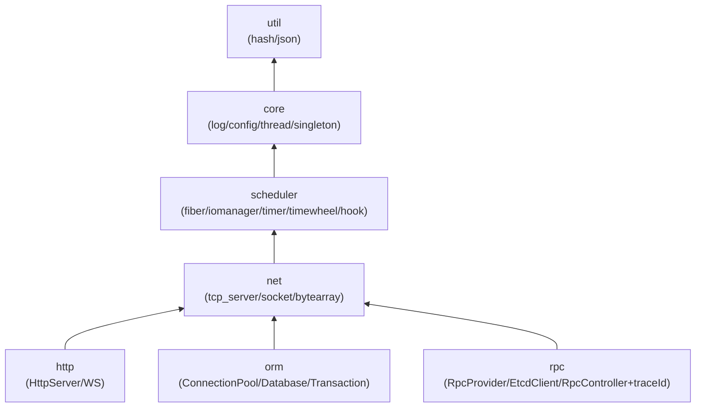
```mermaid
graph BT
    CORE["core<br/>(log/config/thread/singleton)"]
    UTIL["util<br/>(hash/json)"]
    SCH["scheduler<br/>(fiber/iomanager/timer/timewheel/hook)"]
    NET["net<br/>(tcp_server/socket/bytearray)"]
    HTTP["http<br/>(HttpServer/WS)"]
    ORM["orm<br/>(ConnectionPool/Database/Transaction)"]
    RPC["rpc<br/>(RpcProvider/EtcdClient/RpcController+traceId)"]
    SCH --> CORE
    NET --> SCH
    HTTP --> NET
    ORM --> NET
    RPC --> NET
    CORE --> UTIL
```

## 2.3 数据流

### 登录流（HTTP + TCP 双通道）

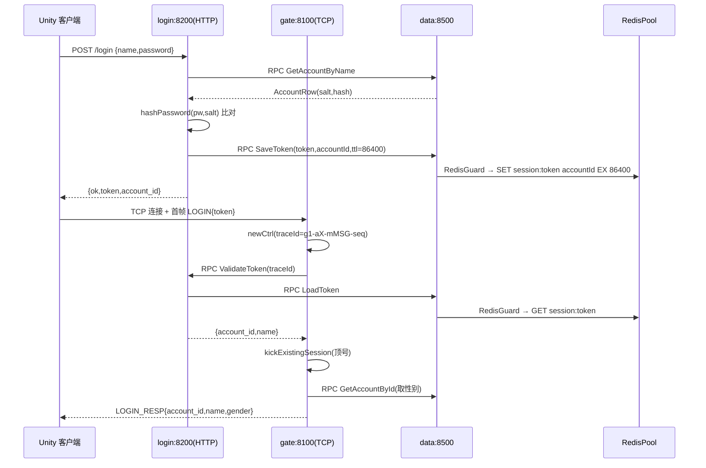
```mermaid
sequenceDiagram
    participant U as Unity 客户端
    participant L as login:8200(HTTP)
    participant G as gate:8100(TCP)
    participant D as data:8500
    participant RD as RedisPool
    U->>L: POST /login {name,password}
    L->>D: RPC GetAccountByName
    D-->>L: AccountRow(salt,hash)
    L->>L: hashPassword(pw,salt) 比对
    L->>D: RPC SaveToken(token,accountId,ttl=86400)
    D->>RD: RedisGuard → SET session:token accountId EX 86400
    L-->>U: {ok,token,account_id}
    U->>G: TCP 连接 + 首帧 LOGIN{token}
    G->>G: newCtrl(traceId=g1-aX-mMSG-seq)
    G->>L: RPC ValidateToken(traceId)
    L->>D: RPC LoadToken
    D->>RD: RedisGuard → GET session:token
    L-->>G: {account_id,name}
    G->>G: kickExistingSession(顶号)
    G->>D: RPC GetAccountById(取性别)
    G-->>U: LOGIN_RESP{account_id,name,gender}
```

### 战斗回合流（权威物理 + 反向推送 + 战绩落库 §13）

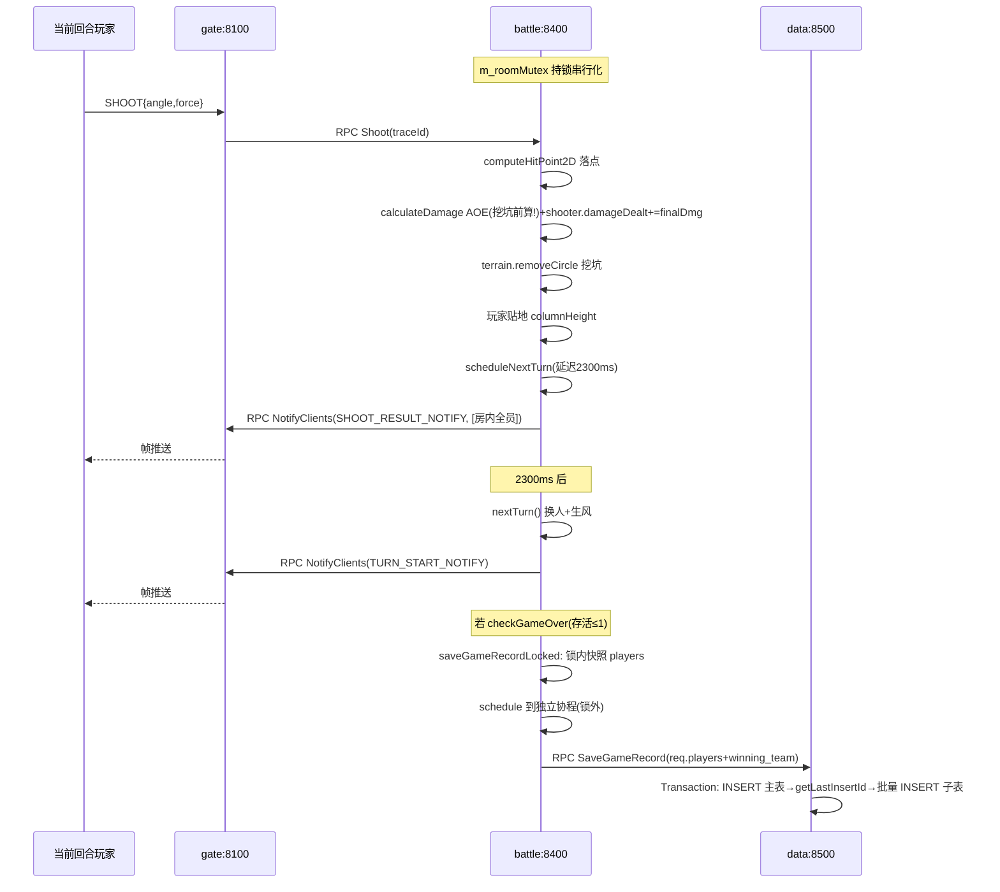
```mermaid
sequenceDiagram
    participant U as 当前回合玩家
    participant G as gate:8100
    participant B as battle:8400
    participant D as data:8500
    Note over B: m_roomMutex 持锁串行化
    U->>G: SHOOT{angle,force}
    G->>B: RPC Shoot(traceId)
    B->>B: computeHitPoint2D 落点
    B->>B: calculateDamage AOE(挖坑前算!)+shooter.damageDealt+=finalDmg
    B->>B: terrain.removeCircle 挖坑
    B->>B: 玩家贴地 columnHeight
    B->>B: scheduleNextTurn(延迟2300ms)
    B->>G: RPC NotifyClients(SHOOT_RESULT_NOTIFY, [房内全员])
    G-->>U: 帧推送
    Note over B: 2300ms 后
    B->>B: nextTurn() 换人+生风
    B->>G: RPC NotifyClients(TURN_START_NOTIFY)
    G-->>U: 帧推送
    Note over B: 若 checkGameOver(存活≤1)
    B->>B: saveGameRecordLocked: 锁内快照 players
    B->>B: schedule 到独立协程(锁外)
    B->>D: RPC SaveGameRecord(req.players+winning_team)
    D->>D: Transaction: INSERT 主表→getLastInsertId→批量 INSERT 子表
```

### 房间交接流（lobby → battle，锁内快照锁外 RPC）

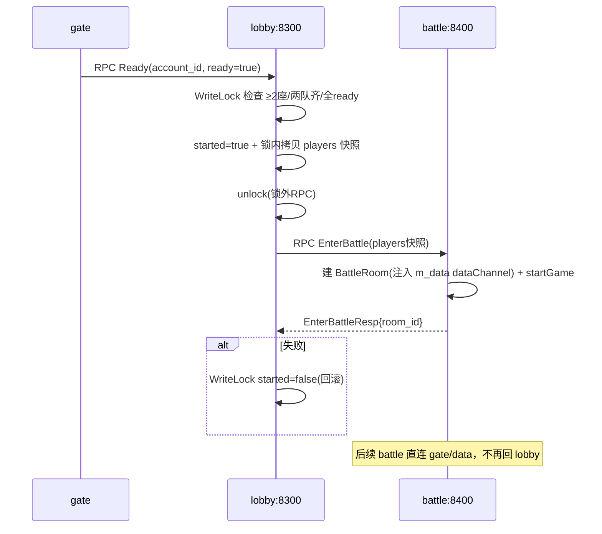
```mermaid
sequenceDiagram
    participant G as gate
    participant LO as lobby:8300
    participant B as battle:8400
    G->>LO: RPC Ready(account_id, ready=true)
    LO->>LO: WriteLock 检查 ≥2座/两队齐/全ready
    LO->>LO: started=true + 锁内拷贝 players 快照
    LO->>LO: unlock(锁外RPC)
    LO->>B: RPC EnterBattle(players快照)
    B->>B: 建 BattleRoom(注入 m_data dataChannel) + startGame
    B-->>LO: EnterBattleResp{room_id}
    alt 失败
        LO->>LO: WriteLock started=false(回滚)
    end
    Note over B: 后续 battle 直连 gate/data，不再回 lobby
```

## 2.4 架构图（部署视角）

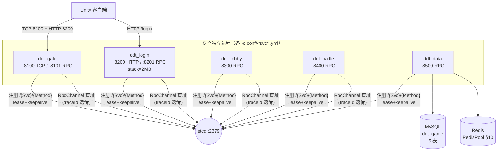
```mermaid
graph TB
    subgraph 进程["5 个独立进程（各 -c conf/&lt;svc&gt;.yml）"]
        G["ddt_gate<br/>:8100 TCP / :8101 RPC"]
        L["ddt_login<br/>:8200 HTTP / :8201 RPC<br/>stack=2MB"]
        LO["ddt_lobby<br/>:8300 RPC"]
        B["ddt_battle<br/>:8400 RPC"]
        D["ddt_data<br/>:8500 RPC"]
    end
    ETCD(("etcd :2379"))
    DB[("MySQL<br/>ddt_game<br/>5 表")]
    RD[("Redis<br/>RedisPool §10")]
    CLIENT["Unity 客户端"]
    G & L & LO & B & D -- "注册 /{Svc}/{Method}<br/>lease+keepalive" --> ETCD
    G & L & LO & B -- "RpcChannel 查址<br/>(traceId 透传)" --> ETCD
    D --> DB
    D --> RD
    CLIENT -- "TCP:8100 + HTTP:8200" --> G
    CLIENT -- "HTTP /login" --> L
```

### 架构特征（源码归纳）

1. **微服务 + etcd 注册发现**：每服务 `RpcProvider::run` 时把每个方法注册为 etcd 键 `/{Service}/{Method}` → `advertise_addr`（`rpc_provider.cc:67-76`），绑 lease+keepalive。
2. **网关聚合模式**：gate 是客户端唯一入口，内部 RPC 扇出到 login/lobby/battle/data。
3. **反向推送通道**：lobby/battle 不持连接，经 `PushService`（gate 实现）反推。
4. **单一持久层**：data 是唯一碰 DB 的进程。
5. **traceId 端到端透传 §6**：gate 生成，经 `RpcHeader.trace_id` 透传，全程日志可关联。
6. **短连接 vs 连接池并存**：gate/login 用缓存短连接，lobby/battle 用 `RpcChannelPool(etcd,8)`，Redis 用 `RedisPool §10`。

---

# 第三章 网络通信

## 3.1 通信通道（TCP + HTTP 双通道）

| 通道 | 用途 | 实现 | 端口 |
|------|------|------|------|
| **TCP 长连接** | 客户端 ↔ gate 全部业务通信 | `sylar::TcpServer`（`gate_server.h:54`） | gate 8100 |
| **HTTP** | 客户端首次登录拿 token | `sylar::http::HttpServer`（`login_main.cc:25`） | login 8200 |
| **RPC（TCP）** | 服务间通信 | `sylar::rpc::RpcProvider`/`RpcChannel` | 各服务端口 |
| **Redis（TCP）** | data → Redis（连接池） | `RedisPool`（`redis_pool.h:23`） | 6379 |

### 登录为何分两个通道

源码注释解释（`gate_server.h:46-53`）：首包 LOGIN 需校验 token，而 token 要先用账密换。密码只在 login 的 HTTP 入口处理（`login_service.h:16-17`「密码只在此」），避免明文密码走 TCP 长连接帧。

## 3.2 协议格式

### 客户端 ↔ gate 帧格式

`src/common/frame.h` 头注释定义，`frame.cc:28-49` 实现：

```
┌───────────┬───────────┬────────────────────┐
│ 4B length │ 2B msg_id │ protobuf payload   │   (length, msg_id 均大端序)
└───────────┴───────────┴────────────────────┘
length = sizeof(msg_id) + sizeof(payload) = 2 + payload.size()
```

**手写大端读写**，不用 `htonl`（跨平台，`frame.cc:8-26`）：

```cpp
static void writeBE32(char* p, uint32_t v) {
    p[0] = (v >> 24) & 0xFF; p[1] = (v >> 16) & 0xFF;
    p[2] = (v >> 8) & 0xFF;  p[3] = v & 0xFF;
}
```

gate 接收侧（`gate_server.cc:251-255`）有**长度上限保护**：`if(length < 2 || length > 16*1024*1024)` 拒绝（上限 16 MiB，防巨值 resize 崩溃）。

### 服务间 RPC 协议（含 traceId §6）

```
请求: [4B header_size 网络序][RpcHeader protobuf][args protobuf]
响应: [4B response_size 网络序][response protobuf]
RpcHeader { service_name(1), method_name(2), args_size(3), trace_id(4 §6) }
```

`rpcheader.proto:5-13`：

```protobuf
message RpcHeader {
    bytes  service_name = 1;
    bytes  method_name  = 2;
    uint32 args_size    = 3;
    string trace_id     = 4;   // §6 调用链追踪 ID
}
```

> 业务帧（gate）和 RPC 帧是**两套不同协议**。业务帧用 `msg_id` 外挂路由，RPC 帧用 `RpcHeader` 内嵌服务/方法名 + traceId。`trace_id` 是 proto3 scalar，空串=未启用，向后兼容旧 caller/callee。

## 3.3 traceId 端到端透传机制（§6）

### 数据流

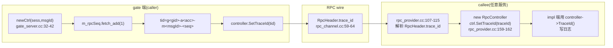
```mermaid
flowchart LR
    subgraph gate["gate 端(caller)"]
        NC["newCtrl(sess,msgId)<br/>gate_server.cc:32-42"]
        SEQ["m_rpcSeq.fetch_add(1)"]
        FMT["tid=g&lt;gid&gt;-a&lt;acc&gt;-m&lt;msgId&gt;-&lt;seq&gt;"]
        SC["controller.SetTraceId(tid)"]
    end
    subgraph wire["RPC wire"]
        RH["RpcHeader.trace_id<br/>rpc_channel.cc:59-64"]
    end
    subgraph callee["callee(任意服务)"]
        RP["rpc_provider.cc:107-115<br/>解析 RpcHeader.trace_id"]
        INJ["new RpcController<br/>ctrl.SetTraceId(traceId)<br/>rpc_provider.cc:159-162"]
        IMPL["impl 端用 controller-&gt;TraceId()<br/>写日志"]
    end
    NC --> SEQ --> FMT --> SC --> RH --> RP --> INJ --> IMPL
```

### 关键点

| 角色 | 位置 | 行为 |
|------|------|------|
| 生成 | `gate_server.cc:32-42` `newCtrl` | 格式 `g<gatewayId>-a<accountId>-m<msgId>-<seq>`，`m_rpcSeq` 自增保证唯一 |
| 注入 | gate 22 个 onXxx handler | `auto ctrl = newCtrl(s, MSG_X);` 统一入口，`stub.X(ctrl.get(), ...)` |
| 发送侧序列化 | `rpc_channel.cc:59-64` | `dynamic_cast<sylar::rpc::RpcController*>(controller)`，若 `TraceId()` 非空则 `rpcHeader.set_trace_id(...)` |
| 接收侧解析 | `rpc_provider.cc:107-115` | `traceId = rpcHeader.trace_id();`（旧版本此处传 nullptr） |
| 接收侧注入 | `rpc_provider.cc:159-162` | 从 `nullptr` 改为构造 `new RpcController()`；`if(!traceId.empty()) ctrl->SetTraceId(traceId);` |
| 使用 | 任意 impl（如 `gate_server.cc:365`） | `SYLAR_LOG_INFO(g_logger) << "[" << ctrl->TraceId() << "] ...";` |
| 控制器字段 | `rpc_controller.h:29-35` | `m_traceId` 字段 + `SetTraceId`/`TraceId` 方法（inline header） |

**为何 dynamic_cast**（注释 `rpc_channel.cc:60`）：protobuf 的 `CallMethod` 入参类型是 `google::protobuf::RpcController` 基类，sylar 的 traceId 在派生类 `sylar::rpc::RpcController`，需要向下转型读取。

**向后兼容**：旧 caller 不调 `SetTraceId` → `TraceId()` 返回空串 → `rpcHeader.trace_id()` 不 set → callee 端 `traceId.empty()` 走 DEBUG 日志（`rpc_provider.cc:117-123`）。

## 3.4 消息派发

### 服务端：gate 的注册式分发（§15）

`gate_server.cc:267-293`：21 个 msg_id 拆为两类：

```cpp
if(m_preAuthMsgs.count(msgId)) {
    // 预登录白名单(5 个, 无需鉴权): LOGIN/REGISTER/HEARTBEAT/LOGOUT/SET_GENDER
    static const std::unordered_map<uint16_t, Handler> kPreAuth = { ... };
    auto it = kPreAuth.find(msgId);
    if(it != kPreAuth.end()) it->second(sess, payload);
} else {
    // 其余要求 accountId != 0(16 个: 房间/社交/战斗)
    if(sess->accountId == 0) sendError(sess, 401, "not logged in");
    else {
        auto it = m_handlers.find(msgId);
        if(it != m_handlers.end()) it->second(sess, payload);
        else SYLAR_LOG_WARN(g_logger) << "gate: unknown msg_id=" << msgId;
    }
}
```

**注册式数据结构**（`gate_server.h:129-134`）：

```cpp
typedef std::function<void(ClientSession::ptr, const std::string&)> Handler;
void registerHandlers();
std::unordered_map<uint16_t, Handler> m_handlers;   // 16 个已登录 handler
std::unordered_set<uint16_t> m_preAuthMsgs = {
    MSG_LOGIN, MSG_REGISTER, MSG_HEARTBEAT, MSG_LOGOUT, MSG_SET_GENDER
};
```

- 构造函数调 `registerHandlers()`（`gate_server.cc:26`），16 个 lambda 注册到 `m_handlers`（`gate_server.cc:46-63`）；
- 预登录 5 个用 `static const` map（`gate_server.cc:271-277`），避免每次构造 lambda；
- **新增 msg 仅加一行注册**，不再修改 switch-case（§8.1 建议 1 ✅ 已完成）。

**两层鉴权**：预登录白名单（5 个 msg_id）+ 其余要求 `accountId != 0`。

### 客户端：注册式分发

客户端 `MessageDispatcher.cs`：`Dictionary<ushort, Action<byte[]>>` 注册式。

### MsgId 枚举

`src/common/msg_id.h` 手写 `enum MsgId : uint16_t`——帧层不依赖 proto 头。分块：登录(1-4)、房间(10-29)、战斗(30-39)、社交(40-48)、控制(90-92)。

## 3.5 Session 生命周期

`ClientSession`（`gate_server.h:26-45`）每 TCP 连接一个，双索引：`m_sockToSession`（Socket*→session）+ `m_accountToSession`（accountId→session）。

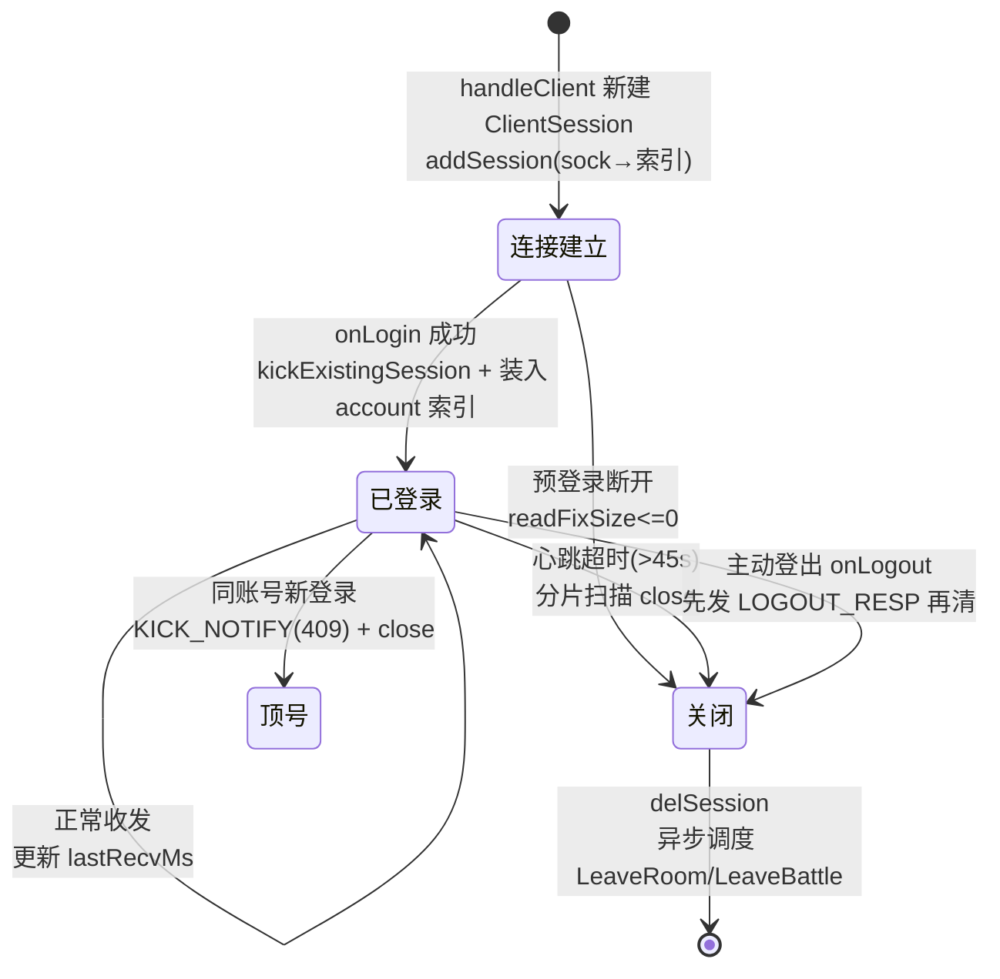
```mermaid
stateDiagram-v2
    [*] --> 连接建立: handleClient 新建 ClientSession<br/>addSession(sock→索引)
    连接建立 --> 已登录: onLogin 成功<br/>kickExistingSession + 装入 account 索引
    连接建立 --> 关闭: 预登录断开<br/>readFixSize<=0
    已登录 --> 已登录: 正常收发<br/>更新 lastRecvMs
    已登录 --> 顶号: 同账号新登录<br/>KICK_NOTIFY(409) + close
    已登录 --> 关闭: 心跳超时(>45s)<br/>分片扫描 close
    已登录 --> 关闭: 主动登出 onLogout<br/>先发 LOGOUT_RESP 再清
    关闭 --> [*]: delSession<br/>异步调度 LeaveRoom/LeaveBattle
```

**三个关键设计**：
1. **安全删除模式**（`ait->second == s` 判等才删，`gate_server.cc:84-89`）：防顶号竞态。
2. **异步 RPC 清理**（`gate_server.cc:95-125`）：`delSession` 把 LeaveRoom/LeaveBattle `schedule` 到独立协程（曾同步执行导致大规模断线 OOM）。
3. **分片心跳**（`SHARDS=4`，`gate_server.cc:793-814`）：每 tick 扫 1/4 会话，4×10s=40s < timeout 45s，读锁持有时间降 1/4。

## 3.6 发送并发控制（drainAndSend 模式）

问题根因（`gate_server.h:33-44` 注释）：handleClient 协程与 PushService RPC 协程并发向同一 sock send，触发 sylar `SYLAR_ASSERT(!(fd_ctx->events & event))`（`iomanager.cc:119`）→ abort。

**解法**：每会话发送队列 + 按需 drain 协程，串行化同 fd 发送。`sendBusy` 去重保证同一时刻最多一个协程在 do_io(WRITE)；drain 协程非常驻；send 在锁外（`gate_server.cc:161-204`）。

---

# 第四章 业务系统

## 4.1 Gate 网关

| 项 | 内容 |
|----|------|
| 职责 | 客户端 TCP 入口、帧解析、token 鉴权、**注册式分发 §15**、**traceId 生成 §6**、实现 `PushService` 反推、**Redis 订阅（世界聊天）§5.6**、**上报在线状态 §5.5** |
| 核心类 | `ddt::GateServer`（`public TcpServer, public PushService`）、`ddt::ClientSession` |
| 入口 | `gate_main.cc:13` → `ServiceRunner("gate")` + `IOManager(4,true,"gate")` |

21 个 handler（`gate_server.h:94-115`）：预登录 5 + 已登录 16（房间/社交/战斗）。gate **不持业务状态**（除 session），纯转发 + 实现 `PushService` 反推。22 个 RPC 调用点统一走 `newCtrl(s, msgId)` 生成带 traceId 的 controller（`gate_server.cc:32-42`）。

### §5.5/§5.6 新增的两条职责

| 职责 | 实现 | 源码 |
|------|------|------|
| 上报在线状态 | onLogin 末尾 `schedule` 异步调 `data.SetOnline`；delSession 异步闭包调 `data.SetOffline` | `gate_server.cc:397-413`（onLogin SetOnline）、`gate_server.cc:126-137`（delSession SetOffline） |
| 世界聊天订阅线程 | 启动时（`gate_main.cc:39`）`startWorldChatSubscriber()` 起独立 `std::thread`，订阅 `chat:world`，收到 payload 遍历本地 `m_accountToSession` 推 `MSG_CHAT_NOTIFY` | `gate_server.cc:910-944`、`gate_server.h:159-163` |

## 4.2 Login 登录服务

| 项 | 内容 |
|----|------|
| 职责 | 注册/登录/改密 + token 签发校验，密码只在此 |
| 核心类 | `ddt::LoginServiceImpl` |
| 入口 | `login_main.cc:15`，双暴露面：HTTP(8200) + RPC(8201) |
| 协程栈 | **2MB**（其他服务 1MB）—— 见 §7.7 栈溢出案例 |

**密码哈希**（诚实占位）：`login_service.cc:19-21` `hashPassword` 用 sha1 演示（sylar util 无 SHA256），注释「生产应换 OpenSSL EVP」。login **不直连 DB**，所有持久化经 `dataChannel()` RPC。

**ValidateToken 调用栈深**（§7.7 栈溢出根因，`login_service.cc:144-174`）：在主 RPC 协程上调 2 次同步 data RPC（`LoadToken` + `GetAccountById`），每次新建 `EtcdClient`（gRPC channel 重对象），1MB 栈在高并发登录时撑爆。

## 4.3 Lobby 大厅服务

| 项 | 内容 |
|----|------|
| 职责 | 房间/匹配/好友/聊天，满员就绪后 `tryStart` 交接 battle |
| 核心类 | `ddt::LobbyServiceImpl`、`ddt::LobbyRoom`（`kMaxSeats=8`） |
| 入口 | `lobby_main.cc:15`，注入 push 闭包 + `RpcChannelPool(etcd,8)` |

**tryStart**（`lobby_service.cc`，锁内快照锁外 RPC）：锁内检查 ≥2座/两队齐/全ready → `started=true` + 拷贝快照 → 锁外 `EnterBattle` RPC → 失败回滚 `started=false`。

**聊天多频道**：WORLD → `m_pushAll`；ROOM → 房内全员；TEAM → 同队；PrivateChat → 目标+自己。

## 4.4 Battle 战斗服务

| 项 | 内容 |
|----|------|
| 职责 | 权威物理、回合仲裁、地形破坏、伤害结算、**战绩落库 §13** |
| 核心类 | `ddt::BattleServiceImpl`、`ddt::BattleRoom`、`ddt::BattlePlayer` |
| 入口 | `battle_main.cc:16`，共享 `TimeWheel(100,10)` + `RpcChannelPool(etcd,8)` + **注入 dataChannel §13**（`battle_main.cc:84`） |

### 架构演进（重要注释，`battle_room.h:35-48`）

弃用 Actor/mailbox 模型——原模型把所有操作压在单协程栈上，叠加 RPC 推送链导致 **stack smashing**。现用**一房一 `m_roomMutex`**，RPC 入口持锁直接调 `onXxx`。`Mutex` 而非 `Spinlock`：onShoot 临界区含物理仿真（≈1500 次循环 + removeCircle 万级格子），持锁毫秒级。

### onShoot 调用链（`battle_room.cc:179-345`）

```
onShoot: 防作弊钳制 → computeHitPoint2D 落点
  → ★calculateDamage AOE(挖坑前算!) → shooter->damageDealt += finalDmg  (§13)
  → terrain.removeCircle 挖坑
  → 玩家贴地 columnHeight → broadcast → scheduleNextTurn(延迟2300ms)
```

**三个关键顺序**：
1. **「挖坑前算伤害」**（`battle_room.cc:277-299`）：用爆炸前脚位算距离；同时 `shooter->damageDealt += finalDmg` 累计伤害（§13）。
2. **`scheduleNextTurn` 延迟**（`battle_room.cc:442-456`，`SHOOT_RESULT_DELAY_MS=2300`）：保证 TurnStart 严格在 ShootResult 之后。
3. **战斗结束触发落库**（`battle_room.cc:484-515` `checkGameOver`）：存活≤1 时 `saveGameRecordLocked(winningTeam)`。

### §13 战绩端到端落库链路

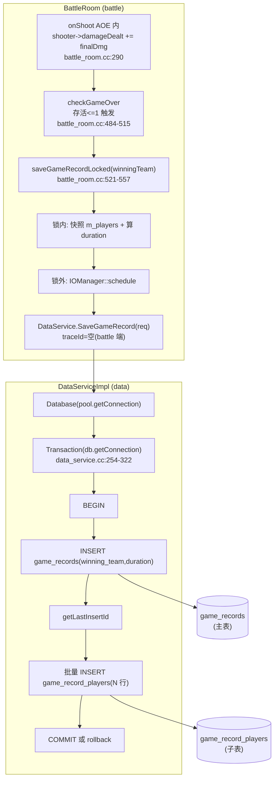
```mermaid
flowchart TB
    subgraph battle["BattleRoom (battle)"]
        SH["onShoot AOE 内<br/>shooter-&gt;damageDealt += finalDmg<br/>battle_room.cc:290"]
        CK["checkGameOver<br/>存活&lt;=1 触发<br/>battle_room.cc:484-515"]
        SV["saveGameRecordLocked(winningTeam)<br/>battle_room.cc:521-557"]
        S1["锁内: 快照 m_players + 算 duration"]
        S2["锁外: IOManager::schedule"]
        RPC["DataService.SaveGameRecord(req)<br/>traceId=空(battle 端)"]
    end
    subgraph data["DataServiceImpl (data)"]
        DB1["Database(pool.getConnection)"]
        TX["Transaction(db.getConnection)<br/>data_service.cc:254-322"]
        T1["BEGIN"]
        T2["INSERT game_records(winning_team,duration)"]
        T3["getLastInsertId"]
        T4["批量 INSERT game_record_players(N 行)"]
        T5["COMMIT 或 rollback"]
    end
    MT[("game_records<br/>(主表)")]
    ST[("game_record_players<br/>(子表)")]
    SH --> CK --> SV --> S1 --> S2 --> RPC
    RPC --> DB1 --> TX --> T1 --> T2 --> T3 --> T4 --> T5
    T2 --> MT
    T4 --> ST
```

**落库要点**：
1. **伤害累计**：`BattlePlayer.damageDealt`（`battle_room.h:32`）在 onShoot AOE 内 `+= finalDmg`（`battle_room.cc:290`），落库时填入 `PlayerStat.damage_dealt`（`battle_room.cc:536`）。
2. **锁内快照锁外 RPC**（`battle_room.cc:521-557`）：checkGameOver 已持 `m_roomMutex`，`saveGameRecordLocked` 在锁内构造 proto 快照（不持锁跨 RPC），然后 `IOManager::GetThis()->schedule([...]){ stub.SaveGameRecord(...) })` 投到独立协程。
3. **事务原子性**（`data_service.cc:254-322`）：`Transaction trx(db.getConnection())` → `BEGIN` → `INSERT` 主表 → `getLastInsertId` → 批量 `INSERT` 子表 → `COMMIT`，任一步失败 `rollback`，RAII 也保证 scope 退出回滚（`Transaction` 析构）。
4. **duration 计算**（`battle_room.cc:525`）：`m_startTimeMs` 在 `startGame` 时记（`battle_room.cc:57`），`checkGameOver` 时 `(nowMs - m_startTimeMs) / 1000`。
5. **失败不影响流程**：`saveGameRecordLocked` 失败仅 `SYLAR_LOG_WARN`（`battle_room.cc:546-548`），不影响对局已发的 GameOverNotify。
6. **dataChannel 未注入跳过**：`if(!m_data) return;`（`battle_room.cc:522`）——旧 `battle_main` 不传 dataChannel 时兼容。

### 战斗回合状态机

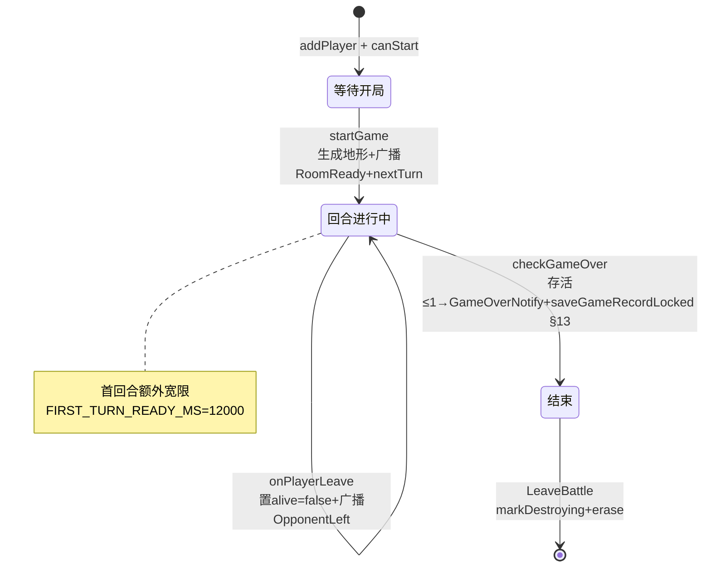
```mermaid
stateDiagram-v2
    [*] --> 等待开局: addPlayer + canStart
    等待开局 --> 回合进行中: startGame<br/>生成地形+广播RoomReady+nextTurn
    回合进行中 --> 回合进行中: onShoot/onMove/onPass<br/>cancelTurnTimer→scheduleNextTurn
    回合进行中 --> 回合进行中: onAimBegin 蓄力<br/>重置回合计时
    回合进行中 --> 回合进行中: onTurnTimeout 超时<br/>自动 nextTurn
    回合进行中 --> 回合进行中: onPlayerLeave<br/>置alive=false+广播OpponentLeft
    回合进行中 --> 结束: checkGameOver<br/>存活≤1→GameOverNotify+saveGameRecordLocked §13
    结束 --> [*]: LeaveBattle<br/>markDestroying+erase
    note right of 回合进行中
        首回合额外宽限
        FIRST_TURN_READY_MS=12000
    end note
```

**防泄漏**：`markDestroying`（`battle_room.h:87-90`）置 `m_destroying=true` + `cancelTurnTimer`，杜绝孤儿 timer 在 erase 后触发 `nextTurn→startTurnTimer` 形成「泄漏永动机」。首回合 `m_turnNumber==1` 时 `+= FIRST_TURN_READY_MS`（客户端降落+相机入场）。

## 4.5 Data 数据服务

| 项 | 内容 |
|----|------|
| 职责 | **唯一持久层**，MySQL + **Redis 连接池 §10** + **在线状态 Set §5.5** + **世界聊天 Pub/Sub §5.6** |
| 核心类 | `ddt::DataServiceImpl`、`ddt::RedisPool`、`ddt::RedisGuard`、`ddt::Subscriber`（`redis_pool.h:71`） |
| 入口 | `data_main.cc:11` → `init(db*, redis pool*)` + `RpcProvider` |

21 个 RPC 方法（全同步）：账号 5 / 资料 2 / Token 3 / 记录 1 / 好友 2 / 聊天 3 / **在线状态 2（SetOnline/SetOffline）§5.5** / **世界聊天 1（PublishWorldChat）§5.6**。用裸 SQL + `esc()` 转义（非 ORM DSL）。**SaveGameRecord §13 重写为事务+批量插入**（见 §5.2）；诚实捷径：UpdateGender 自动 ALTER TABLE 兼容老库；GetChatHistory DESC+反转成正序。

### §5.5/§5.6 新增 RPC 方法

| RPC 方法 | 入参 | 作用 | 源码 |
|---------|------|------|------|
| `SetOnline(IdReq)` | accountId | Redis `SADD online:players <accountId>`，玩家上线标记 | `rpc.proto:70`、`data_service.cc:625-649` |
| `SetOffline(IdReq)` | accountId | Redis `SREM online:players <accountId>`，玩家下线标记 | `rpc.proto:71`、`data_service.cc:651-675` |
| `PublishWorldChat(SaveChatReq)` | 频道/sender/message | MySQL 持久化 + 构造 ChatNotify + Redis `PUBLISH chat:world` | `rpc.proto:74`、`data_service.cc:679-714` |

> GetFriendList 在查询好友后，内部用 `SMEMBERS online:players` 一次性拿到全部在线 id，回填到每个 FriendInfo.online（`data_service.cc:523-548`）。

## 业务系统全景

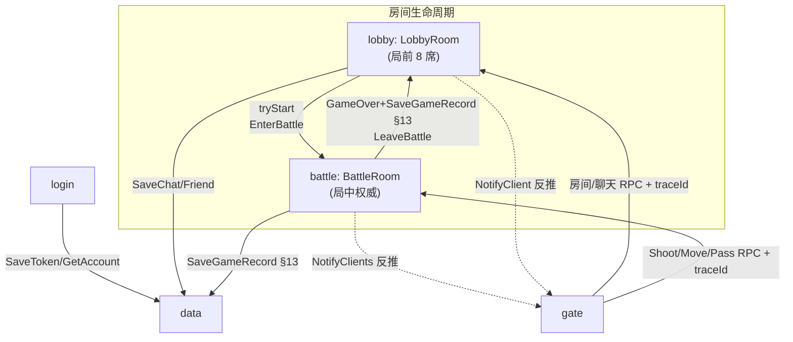
```mermaid
graph TB
    subgraph 生命周期["房间生命周期"]
        L1["lobby: LobbyRoom<br/>(局前 8 席)"] -- "tryStart<br/>EnterBattle" --> B1["battle: BattleRoom<br/>(局中权威)"]
        B1 -- "GameOver+SaveGameRecord §13<br/>LeaveBattle" --> L1
    end
    G["gate"] -- "房间/聊天 RPC + traceId" --> L1
    G -- "Shoot/Move/Pass RPC + traceId" --> B1
    L["login"] -- "SaveToken/GetAccount" --> D["data"]
    L1 -- "SaveChat/Friend" --> D
    B1 -- "SaveGameRecord §13" --> D
    B1 -. "NotifyClients 反推" .-> G
    L1 -. "NotifyClient 反推" .-> G
```

---

# 第五章 数据与缓存

## 5.1 数据库总览

| 项 | 内容 |
|----|------|
| 数据库 | `ddt_game`（`schema.sql:1-2`，utf8mb4_unicode_ci，InnoDB） |
| 表数量 | 5 张（accounts/player_profiles/chat_history/game_records+game_record_players/friends） |
| 访问方式 | 裸 SQL + `mysql_real_escape_string` 转义（`data_service.cc:17-23` `esc()`） |
| 连接 | `sylar::ConnectionPool`（`data_service.h:104`），`warmup`（`data_service.cc:43`） |
| 事务 | `sylar::Transaction`（§13 SaveGameRecord 用，`data_service.cc:266`） |
| 唯一访问点 | 仅 `ddt_data` 服务 |

## 5.2 表结构

### accounts — 账号凭证

```sql
CREATE TABLE accounts (
  id BIGINT UNSIGNED AUTO_INCREMENT PRIMARY KEY,
  name VARCHAR(32) NOT NULL UNIQUE,
  password_hash VARCHAR(64) NOT NULL,
  salt VARCHAR(32) NOT NULL,
  gender TINYINT DEFAULT 0,    -- 0未选/1男/2女
  created_at DATETIME DEFAULT CURRENT_TIMESTAMP
);
```

主键 `id` 即 accountId（全系统唯一）；name UNIQUE 查重；gender 用 `COALESCE(gender,0)` 读，UpdateGender 失败自动 ALTER TABLE 加列（`data_service.cc:170-174`）。

### player_profiles — 玩家资料（1:1 CASCADE）

```sql
CREATE TABLE player_profiles (
  account_id BIGINT UNSIGNED PRIMARY KEY,
  nickname VARCHAR(32), level INT DEFAULT 1, exp INT DEFAULT 0,
  wins INT DEFAULT 0, losses INT DEFAULT 0,
  FOREIGN KEY (account_id) REFERENCES accounts(id) ON DELETE CASCADE
);
```

CreateAccount 成功后立即插默认资料；UpdateWinLoss 按 win 选列 `+1`。

### chat_history — 聊天记录

```sql
CREATE TABLE chat_history (
  id BIGINT UNSIGNED AUTO_INCREMENT PRIMARY KEY,
  channel TINYINT NOT NULL, sender_id BIGINT UNSIGNED NOT NULL,
  sender_name VARCHAR(32), message TEXT, target_id BIGINT UNSIGNED DEFAULT 0,
  created_at DATETIME DEFAULT CURRENT_TIMESTAMP,
  INDEX idx_channel_time (channel, created_at),
  INDEX idx_private (sender_id, target_id, created_at)
);
```

两索引对应两类查询；私聊双向 `((sender=me AND target=them) OR ...)`；`ORDER BY id DESC LIMIT n` 后 rbegin/rend 反转正序。

### game_records + game_record_players — 对战记录（§13 拆主子表）

```sql
-- 主表: 一局对战记录
DROP TABLE IF EXISTS game_records;   -- 原 player1/player2 结构, 无读取者
CREATE TABLE game_records (
  id           BIGINT UNSIGNED AUTO_INCREMENT PRIMARY KEY,
  winning_team TINYINT,                -- proto TeamSide 数值(0=RED 1=BLUE); NULL=无胜方
  duration     INT,
  created_at   DATETIME DEFAULT CURRENT_TIMESTAMP
) ENGINE=InnoDB;

-- 子表: 该局每位参战玩家的明细
CREATE TABLE game_record_players (
  id           BIGINT UNSIGNED AUTO_INCREMENT PRIMARY KEY,
  record_id    BIGINT UNSIGNED NOT NULL,
  account_id   BIGINT UNSIGNED NOT NULL,
  team         TINYINT NOT NULL,
  is_winner    TINYINT(1) DEFAULT 0,
  damage_dealt INT DEFAULT 0,          -- §13 本局累计造成伤害
  created_at   DATETIME DEFAULT CURRENT_TIMESTAMP,
  INDEX idx_record (record_id),
  INDEX idx_account (account_id),
  FOREIGN KEY (record_id) REFERENCES game_records(id) ON DELETE CASCADE,
  FOREIGN KEY (account_id) REFERENCES accounts(id)
) ENGINE=InnoDB;
```

**改造动机**（注释 `schema.sql:37-39`）：原表 `player1_id/player2_id` 字段限制只能记 2 人，多人战斗（红蓝各 4 席）无法落库。拆主子表后支持任意人数 + 每位玩家明细（账号/队伍/是否胜者/累计伤害）。

**DROP 重建安全**（`schema.sql:40`）：原表无 FK 无读取者（Write-only），`DROP TABLE IF EXISTS game_records` 无数据损失风险。

### SaveGameRecord 事务落库（§13，`data_service.cc:254-322`）

```cpp
sylar::Transaction trx(db.getConnection());
trx.begin();
trx.execute("INSERT INTO game_records(winning_team,duration) VALUES(...)");
uint64_t rid = trx.getLastInsertId();
trx.execute("INSERT INTO game_record_players(...) VALUES(...),(...)");  // 批量
trx.commit();   // 失败任一步 rollback, RAII 析构也回滚
```

**双路径兼容**（`data_service.cc:259-309`）：
- 新路径：`req->players()` 非空 → 用主子表 + 事务（battle 端走此路径）；
- 旧路径：`req->players()` 空 → 兼容旧 caller，取 `player_ids` 前 2 + `winner_ids` 判胜负，映射到新表结构（红蓝各 1，damage=0）。

### friends — 好友关系（双向）

```sql
CREATE TABLE friends (
  account_id BIGINT UNSIGNED, friend_id BIGINT UNSIGNED,
  created_at DATETIME DEFAULT CURRENT_TIMESTAMP,
  PRIMARY KEY (account_id, friend_id),
  FOREIGN KEY (account_id) REFERENCES accounts(id),
  FOREIGN KEY (friend_id) REFERENCES accounts(id)
);
```

AddFriend 一条 SQL 插两行 `(a,f),(f,a)` + `INSERT IGNORE`；GetFriendList 三表 JOIN。

## 5.3 表关系图

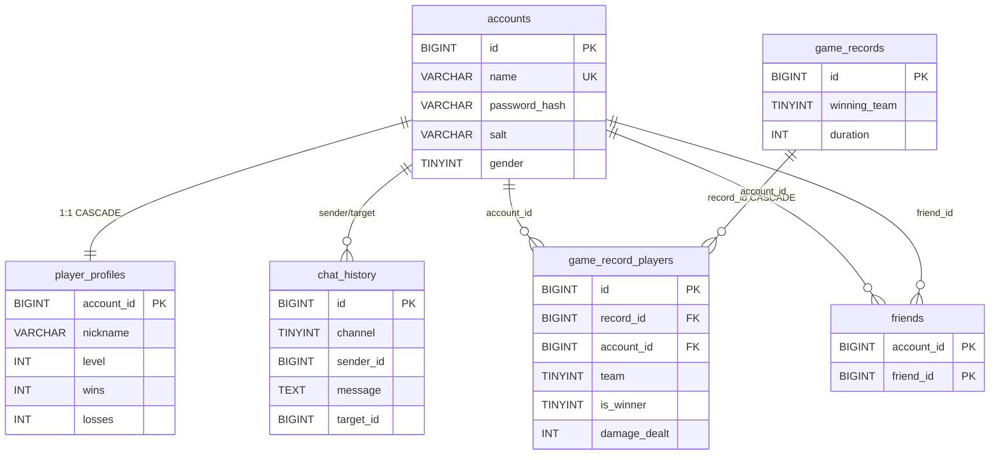
```mermaid
erDiagram
    accounts ||--|| player_profiles : "1:1 CASCADE"
    accounts ||--o{ chat_history : "sender/target"
    accounts ||--o{ game_record_players : "account_id"
    game_records ||--o{ game_record_players : "record_id CASCADE"
    accounts ||--o{ friends : "account_id"
    accounts ||--o{ friends : "friend_id"
    accounts {
        BIGINT id PK
        VARCHAR name UK
        VARCHAR password_hash
        VARCHAR salt
        TINYINT gender
    }
    player_profiles {
        BIGINT account_id PK
        VARCHAR nickname
        INT level
        INT wins
        INT losses
    }
    chat_history {
        BIGINT id PK
        TINYINT channel
        BIGINT sender_id
        TEXT message
        BIGINT target_id
    }
    game_records {
        BIGINT id PK
        TINYINT winning_team
        INT duration
    }
    game_record_players {
        BIGINT id PK
        BIGINT record_id FK
        BIGINT account_id FK
        TINYINT team
        TINYINT is_winner
        INT damage_dealt
    }
    friends {
        BIGINT account_id PK
        BIGINT friend_id PK
    }
```

## 5.4 缓存（Redis，连接池 §10）

> 本节讲 RedisPool 基础设施 + token 操作。Redis 还承担**在线状态（Set）§5.5** 和**世界聊天（Pub/Sub）§5.6** 两个新职责，分别在对应小节展开。

| 项 | 内容 |
|----|------|
| 后端 | hiredis `redisContext*` |
| 并发 | **`RedisPool`（mutex+condvar，默认 4 连接）**（`redis_pool.h:23`） |
| 配置 | `redis_pool_size`（`service_base.h:42`），经环境变量 `DDT_REDIS_POOL_SIZE` 覆盖 |
| 键格式 | `session:<token>` → `accountId`；`online:players`（Set，§5.5）；`chat:world`（Pub/Sub channel，§5.6） |
| TTL | 86400s（1 天，仅 token） |
| 订阅线程 | gate 进程独立 `std::thread` 持 `Subscriber`，不入 RedisPool（§5.6） |

### RedisPool 设计（§10，仿 sylar::ConnectionPool）

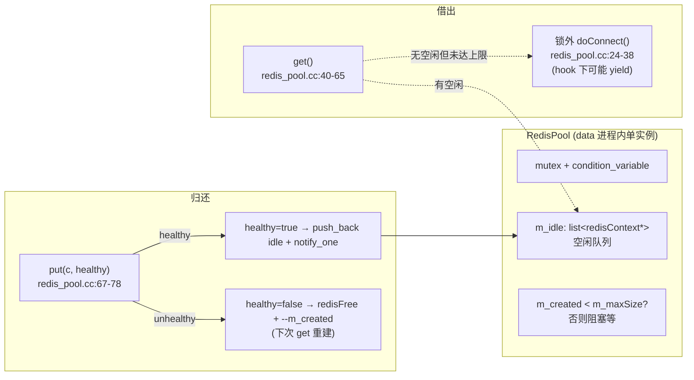
```mermaid
flowchart LR
    subgraph pool["RedisPool (data 进程内单实例)"]
        M["mutex + condition_variable"]
        IDLE["m_idle: list&lt;redisContext*&gt;<br/>空闲队列"]
        CR["m_created &lt; m_maxSize?<br/>否则阻塞等"]
    end
    subgraph borrow["借出"]
        G["get()<br/>redis_pool.cc:40-65"]
        CO["锁外 doConnect()<br/>redis_pool.cc:24-38<br/>(hook 下可能 yield)"]
    end
    subgraph ret["归还"]
        P["put(c, healthy)<br/>redis_pool.cc:67-78"]
        H["healthy=true → push_back idle + notify_one"]
        UN["healthy=false → redisFree + --m_created<br/>(下次 get 重建)"]
    end
    G -. 有空闲 .-> IDLE
    G -. 无空闲但未达上限 .-> CO
    P -- healthy --> H --> IDLE
    P -- unhealthy --> UN
```

**关键设计**（`redis_pool.h:14-22` 注释）：

| 项 | 实现 |
|----|------|
| 借还模式 | mutex + condition_variable；`get` 池空且未达上限则等（`redis_pool.cc:40-65`） |
| connect 锁外 | `doConnect()` 在锁外调用（sylar hook 下 connect 可能 yield，不能持锁），`redis_pool.cc:24-38` |
| 自愈 | `RedisGuard::markUnhealthy()` 标记坏连接，归还时 `redisFree` + `--m_created`，下次 get 自动新建（对称 sylar ConnectionPool 的 checkAndFix） |
| 超时 | `timeval{1.5s}` 同时作 connect 和命令超时（`redis_pool.cc:27-36`） |
| RAII | `RedisGuard` 析构自动 `put`（`redis_pool.cc:96-98`） |
| 不预热 | `create()` 仅记录参数，首次 `get` 才建连（冷启动延迟低，`redis_pool.cc:14-22`） |
| 关闭 | `close()` 标记关闭 + 释放所有空闲 + `notify_all`，后续 `get` 立即返回 nullptr（`redis_pool.cc:80-86`） |

### 三个 token 操作（`data_service.cc:211-245`）

经 `RedisGuard g(m_redisPool.get());` 借连接，命令失败时 `g.markUnhealthy()` 让池销毁坏连接。三操作：
- `SaveToken`（`SET %s %s EX %d`，`data_service.cc:65-71`）
- `LoadToken`（`GET %s`，`data_service.cc:72-79`）
- `DeleteToken`（`DEL %s`，`data_service.cc:80-86`）

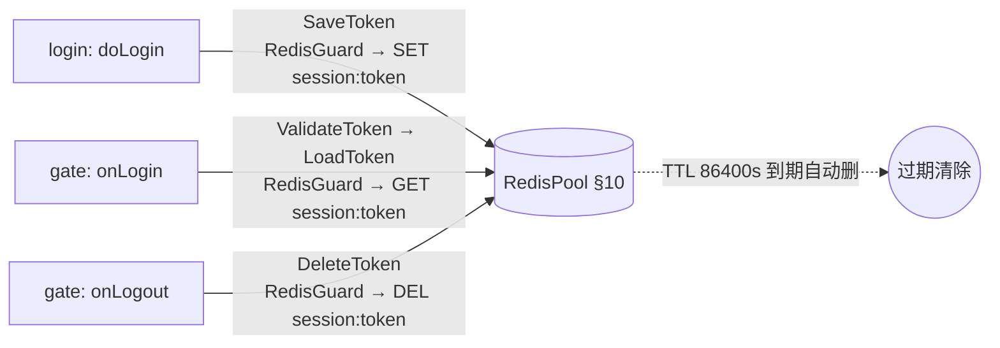
```mermaid
flowchart LR
    A["login: doLogin"] -->|"SaveToken<br/>RedisGuard → SET session:token"| R[("RedisPool §10")]
    G["gate: onLogin"] -->|"ValidateToken → LoadToken<br/>RedisGuard → GET session:token"| R
    G2["gate: onLogout"] -->|"DeleteToken<br/>RedisGuard → DEL session:token"| R
    R -. "TTL 86400s 到期自动删" .-> X((过期清除))
```

> **对比原方案**（已移除）：原 `data_service.h:104` 是 `void* m_redis + std::mutex m_redisMutex`（单连接 + 全局 mutex），token 操作串行化，高并发登录/重连成瓶颈。§10 改为 `shared_ptr<RedisPool>`（`data_service.h:107`）后，N 个 token 操作可并行（N≤pool_size）。

### Redis 未承担的职责（明确标注）

| 常见期望 | 实际情况 |
|---------|---------|
| 在线状态缓存 | **已实现（Redis Set）§5.5**。`SADD/SREM online:players`（`data_service.cc:625-675`），`GetFriendList` 用 `SMEMBERS` 回填（`data_service.cc:523-548`） |
| 世界聊天广播 | **已实现（Redis Pub/Sub）§5.6**。`PUBLISH chat:world`（`data_service.cc:711`），gate 启动时订阅（`gate_server.cc:910-944`） |
| 房间状态缓存 | **未实现**。全在内存 |
| 排行榜 | **未实现** |
| 会话续期 | **未实现**。固定 TTL |

## 5.5 在线状态（Redis Set）

### 设计动机

`FriendInfo.online` 字段长期恒 `false`（旧 `data_service.cc:351`）——架构分析 §8.3 建议 7 标注的功能缺陷。本轮用 Redis Set 补全：玩家上线/下线由 gate 异步上报到 data，data 用 `SADD/SREM online:players` 维护全局在线集合；`GetFriendList` 用一次 `SMEMBERS` 批量回填到每位好友的 `online` 字段。

### 实现

| 模块 | 位置 | 行为 |
|------|------|------|
| data SetOnline | `data_service.cc:625-649` | `SADD online:players <accountId>`，reply INTEGER 判成功；`g.markUnhealthy` 自愈 |
| data SetOffline | `data_service.cc:651-675` | `SREM online:players <accountId>`，同上 |
| data GetFriendList（在线回填） | `data_service.cc:523-548` | 一次 `SMEMBERS online:players` 拿全部在线 id 进 `std::set`，再 `onlineIds.count(fid) > 0` 填入 `FriendInfo.online` |
| proto | `rpc.proto:70-71` | `DataService` 加 `SetOnline(IdReq)` / `SetOffline(IdReq)` |
| gate 上报（登录） | `gate_server.cc:397-413` | onLogin 末尾 `IOManager::GetThis()->schedule([...]){ stub.SetOnline(...) }`，**异步、不阻塞 LOGIN_RESP**；失败仅 warn |
| gate 上报（断线） | `gate_server.cc:126-137` | delSession 异步清理闭包内调 `stub.SetOffline`，与 LeaveBattle/LeaveRoom 同批 |

### 数据流

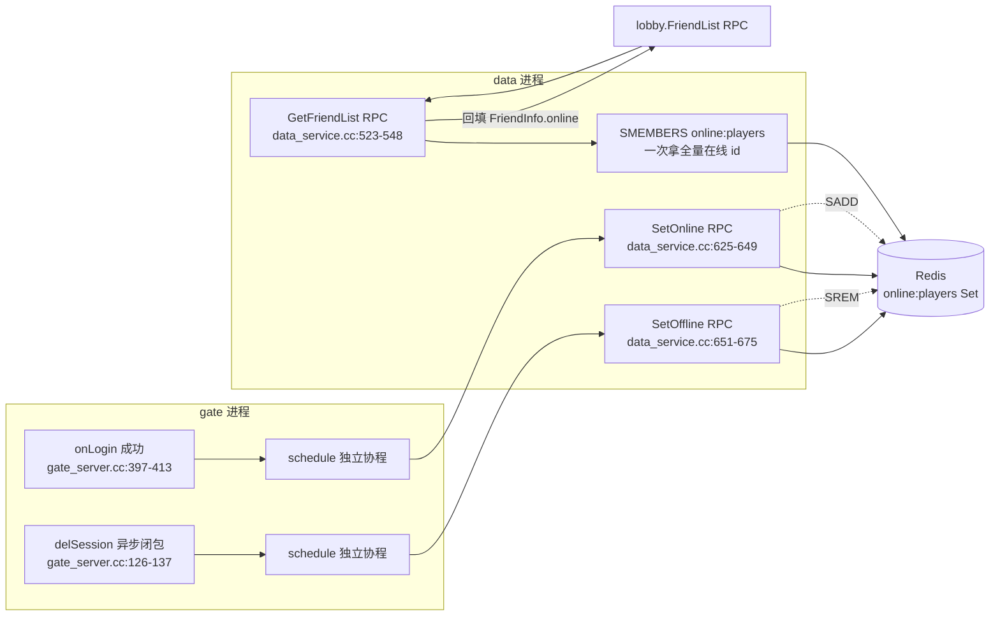
```mermaid
flowchart LR
    subgraph gate["gate 进程"]
        GL["onLogin 成功<br/>gate_server.cc:397-413"]
        GD["delSession 异步闭包<br/>gate_server.cc:126-137"]
        S1["schedule 独立协程"]
        S2["schedule 独立协程"]
    end
    subgraph data["data 进程"]
        SO["SetOnline RPC<br/>data_service.cc:625-649"]
        SF["SetOffline RPC<br/>data_service.cc:651-675"]
        GFL["GetFriendList RPC<br/>data_service.cc:523-548"]
        SM["SMEMBERS online:players<br/>一次拿全量在线 id"]
    end
    RD[("Redis<br/>online:players Set")]
    LO["lobby.FriendList RPC"]
    GL --> S1 --> SO --> RD
    GD --> S2 --> SF --> RD
    SO -. "SADD" .-> RD
    SF -. "SREM" .-> RD
    LO --> GFL --> SM --> RD
    GFL -- "回填 FriendInfo.online" --> LO
```

### 关键设计点

1. **Set 结构选型**：`SADD/SREM` 是 O(1) 写；读端用一次 `SMEMBERS` 拿全量，比每好友单独 `SISMEMBER` 少 N-1 次网络往返（注释 `data_service.cc:523-524`）。在线人数规模在万级以内时，`SMEMBERS` 的数组返回仍可控。
2. **gate 上报、data 集中存**：gate 是 session 生命周期事件源（onLogin/delSession），data 是唯一 Redis 入口。多 gate 实例天然共享同一个 `online:players` 集合，**无需跨 gate 同步**。
3. **异步上报不阻塞响应**：onLogin 末尾用 `IOManager::schedule` 投到独立协程（`gate_server.cc:401`），SetOnline 失败仅 `SYLAR_LOG_WARN` 不影响 LOGIN_RESP（注释 `gate_server.cc:397-398`）。
4. **delSession 与清理同批**：SetOffline 与 LeaveBattle/LeaveRoom 同在一个异步清理闭包里，复用同一次 `schedule`，不增加额外调度。
5. **修复 §8.3 建议 7**：补全了原 `data_service.cc:351` `online` 恒 false 的功能缺陷（见 §8.3）。

> **诚实局限**：未做会话续期/僵尸清理。若 gate 进程崩溃（来不及发 SetOffline），`online:players` 中会残留僵尸 id 直到下次部署清理。可选改进：data 侧给 Set 加 TTL（按 id 拆 key）或心跳探活。

## 5.6 世界聊天 Pub/Sub

### 设计动机

原世界聊天分发链路是 lobby → gate `PushService.NotifyAllOnline` RPC（`lobby_main.cc:53`）。多 gate 部署时存在两个问题：(1) lobby 需要按 gate 实例逐个 RPC 广播，调用次数随 gate 数线性增长；(2) lobby 需要知道"哪些 gate 在线"。本轮用 Redis Pub/Sub 替代：lobby 仅调一次 `data.PublishWorldChat`，data 内部 `PUBLISH chat:world`；每个 gate 启动时各自订阅，收到消息后只推本地 session。

### 链路（替代原 lobby → gate.NotifyAllOnline RPC）

| 步骤 | 模块 | 位置 | 行为 |
|------|------|------|------|
| 1 | gate（转发） | `gate_server.cc` Chat handler | 玩家发 `CHAT(WORLD)` → gate 转发 `lobby.Chat` |
| 2 | lobby | `lobby_service.cc:555-573` | `Chat` 检测 `CHANNEL_WORLD`，调 `data.PublishWorldChat`；**不走** `m_pushAll` |
| 3 | data | `data_service.cc:679-714` | MySQL 持久化 + 构造 `ChatNotify` payload + `redisPublish("chat:world", payload)` |
| 4 | gate（订阅启动） | `gate_main.cc:39` | `gate->startWorldChatSubscriber()` |
| 5 | gate（订阅线程） | `gate_server.cc:910-944` | 独立 `std::thread`：`Subscriber.subscribe("chat:world", cb)` + `loop()` 阻塞收 → cb 内 `sendToSession(MSG_CHAT_NOTIFY)` 遍历本地 `m_accountToSession` |
| 6 | gate（断线重连） | `gate_server.cc:920-941` | `loop()` 返回 false 时 `sleep(2)` 重试 `subscribe` |

### 数据流

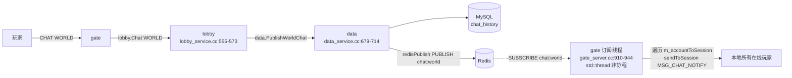
```mermaid
flowchart LR
    U["玩家"] -->|"CHAT WORLD"| G["gate"]
    G -->|"lobby.Chat WORLD"| LO["lobby<br/>lobby_service.cc:555-573"]
    LO -->|"data.PublishWorldChat"| D["data<br/>data_service.cc:679-714"]
    D --> DB[("MySQL<br/>chat_history")]
    D -->|"redisPublish PUBLISH chat:world"| RD[("Redis")]
    RD -. "SUBSCRIBE chat:world" .-> GS["gate 订阅线程<br/>gate_server.cc:910-944<br/>std::thread 非协程"]
    GS -->|"遍历 m_accountToSession<br/>sendToSession MSG_CHAT_NOTIFY"| GU["本地所有在线玩家"]
```

### 订阅线程设计（关键工程取舍）

| 项 | 实现 | 理由 |
|----|------|------|
| 独立 `std::thread` 而非协程 | `gate_server.cc:924` `m_subThread = std::make_shared<std::thread>(...)` | hiredis 的 `redisGetReply` 是**阻塞同步**调用，sylar hook 不感知它（hook 只 hook 了标准 socket API），放在协程里会**阻塞整个调度线程**。必须用裸 `std::thread` |
| 订阅连接不入 `RedisPool` | `Subscriber` 自持 `redisContext* ctx_`（`redis_pool.h:71-92`） | SUBSCRIBE 让 redisContext 进入"订阅模式"，无法复用做普通命令；连接池的 get/put 语义不适用 |
| 独立线程读写 `m_accountToSession` | cb 内 `RWMutex::ReadLock` + 拷 snapshot（`gate_server.cc:935-937`） | 订阅线程与 iom 工作线程并发访问 session 表，必须加读锁；拷 snapshot 后锁外遍历避免长时间持锁 |
| 线程 detach | `gate_server.cc:954` `m_subThread->detach()` | 进程生命周期订阅，无 join 需求 |
| 断线自动重连 | `gate_server.cc:925-952` `while(true) { subscribe + loop + sleep(2) }` | Redis 连接可能断，订阅必须自愈 |
| **订阅连接必须清除 command_timeout**（bugfix） | `redis_pool.cc:123-128` `redisSetTimeout(ctx_, {0,0})` | **实测坑**：`redisConnectWithTimeout(host, port, tv)` 会把传入的 `tv` **同时**设为 connect_timeout 与 command_timeout（hiredis 语义）。若不在连接成功后用 `{0,0}` 清除 command_timeout，`loop()` 内的 `redisGetReply` 受 1.5s 命令超时限制，无消息到达时 `rc != REDIS_OK` → break → 订阅 1.5s 后必然断（gate 日志反复 `subscription lost, reconnecting in 2s`，期间 PUBLISH 的消息全丢）。hiredis 中 `redisSetTimeout(ctx, {0,0})` 等价于传 NULL = 清除命令超时，让 `redisGetReply` 永久阻塞等消息 |
| **订阅线程必须捕获 iom 指针**（bugfix） | `gate_server.cc:922,924,929` `auto iom = IOManager::GetThis();` 后 `[self, iom]` 捕获进 lambda，cb 内 `iom->schedule(...)` | **实测坑**：订阅线程是裸 `std::thread`，不是 IOManager worker，其 thread-local `t_scheduler` 从未赋值。若在 cb 内直接调 `sendToSession`（内部 `IOManager::GetThis()->schedule(...)`）会拿到 nullptr → `Scheduler::schedule` 解引用 nullptr → SIGSEGV（gdb 栈见 §7.11）。必须**在 IOManager 上下文（`gate_main.cc:39` 调用栈上）捕获 `iom` 指针**传入线程，cb 内用 `iom->schedule(...)` 把 sendToSession 投递到 gate 的 IOManager 协程执行 |

### 关键设计点

1. **Pub/Sub 替代 RPC 广播**：lobby 调用次数从「N 个 gate × 1 次 RPC」降为「1 次 `PublishWorldChat` + 1 次 Redis PUBLISH」，gate 横向扩展不再增加 lobby 负担。
2. **多 gate 天然分发**：每个 gate 各自 SUBSCRIBE，Redis 自动按订阅者分发；不需要 lobby 维护 gate 列表。
3. **仅世界频道用 Pub/Sub**：ROOM/TEAM 频道**保留原 `m_push`**（`lobby_service.cc:577+`）。原因是 Pub/Sub 是 fire-and-forget（见下文局限），ROOM/TEAM 必须**不丢**（房间内成员是封闭集合，必须精确投递）。
4. **payload 复用 `ChatNotify` proto**：data 端构造的 `ChatNotify` 直接序列化为 payload PUBLISH，gate 端 `ParseFromString` 后再 `sendToSession(MSG_CHAT_NOTIFY, payload)`，避免重新设计消息格式。
5. **`redisPublish` 工具函数两种重载**（`redis_pool.h:95-96`）：池化版 `redisPublish(pool, channel, msg)`（走 `RedisGuard` 借连接）+ 短连接版 `redisPublish(host, port, channel, msg)`（一次性 connect+free）。data 端走池化版（`data_service.cc:711`）。
6. **订阅连接必须清除 command_timeout**（bugfix，`redis_pool.cc:123-128`）：hiredis 的 `redisConnectWithTimeout` 会把 `tv` 同时设为 connect_timeout 与 command_timeout，导致 `loop()` 内的 `redisGetReply` 受 1.5s 超时限制无消息即断。**连接成功后必须用 `redisSetTimeout(ctx_, {0,0})` 清除 command_timeout**（hiredis 语义：`{0,0}` = NULL = 无超时），让 `redisGetReply` 永久阻塞等消息。详见上表"订阅线程设计"。
7. **订阅线程必须捕获 iom 指针**（bugfix，`gate_server.cc:922,924,929`）：裸 `std::thread` 不是 IOManager worker，其 `t_scheduler` thread-local 从未赋值，cb 内若直接调 `sendToSession`（内部 `IOManager::GetThis()->schedule`）会拿到 nullptr → SIGSEGV。必须**在 IOManager 上下文（`gate_main.cc:39` 调用栈）捕获 `iom` 指针**，cb 内 `iom->schedule(...)` 把 sendToSession 投递到 gate 的 IOManager 协程执行。这是 sylar 协程模型与裸线程混用的隐藏陷阱，详见 §7.11 铁律。

### 诚实局限（fire-and-forget）

Redis Pub/Sub 是**非持久化**通道：

| 局限 | 影响 | 缓解 |
|------|------|------|
| gate 重启瞬间丢消息 | 订阅断开期间的世界聊天玩家收不到 | 世界频道对可靠性要求低（聊天可丢），可接受 |
| 玩家登录前 gate 还没订阅 | 同上 | gate 启动早于玩家登录，实际很少发生 |
| 无 ACK | gate 收到后 sendToSession 失败也无人知 | 与原 `NotifyAllOnline` 一致，未回退 |
| Redis 宕机 | 世界聊天全断 | 单点，需 Redis HA |
| `online:players` 不参与 | 本广播推**所有**本地 session，与在线 Set 无直接耦合 | 设计选择：让 gate 自决（本地 session 必然在线） |

> 若需要可靠投递（如系统公告），应改用 Redis Streams（XADD + XREADGROUP + ACK），代价是复杂度上升。

### redis_pool.h 新增 Subscriber 类（§5.6 依赖）

基于 `redis_pool.h:71-92`、`redis_pool.cc:100-205`：

| 成员 | 签名 | 作用 |
|------|------|------|
| 构造 | `Subscriber(host, port)` | 仅记参数，不建连（`redis_pool.cc:102-104`） |
| `subscribe` | `bool subscribe(channel, cb)` | 首次调时懒建 `redisContext* ctx_`，发 `SUBSCRIBE <channel>`；成功则把 cb 存入 `callbacks_[channel]`（`redis_pool.cc:111-133`） |
| `loop` | `bool loop()` | 阻塞循环 `redisGetReply`，解析 `["message", channel, payload]` 三元组，按 channel 查 cb 执行；连接断开返回 false（`redis_pool.cc:135-162`） |
| `stop` | `void stop()` | 设 `running_=false` + 发 `UNSUBSCRIBE` 让阻塞的 `redisGetReply` 立即返回（`redis_pool.cc:164-171`） |
| 析构 | `~Subscriber()` | `stop()` + `redisFree(ctx_)` |

辅助工具：
- `redisPublish(RedisPool& pool, channel, msg)` — 池化版（`redis_pool.cc:175-188`），用 `RedisGuard` 借连接 + `PUBLISH %s %b` 二进制安全 + markUnhealthy 自愈。
- `redisPublish(host, port, channel, msg)` — 短连接版（`redis_pool.cc:190-205`），独立 connect + free。

> **设计原则**：Subscriber 与 RedisPool 解耦——Subscriber 不向 RedisPool 借连接（订阅模式连接不可复用），PUBLISH 侧则走 RedisPool（普通命令可复用）。

## 5.7 数据访问模式

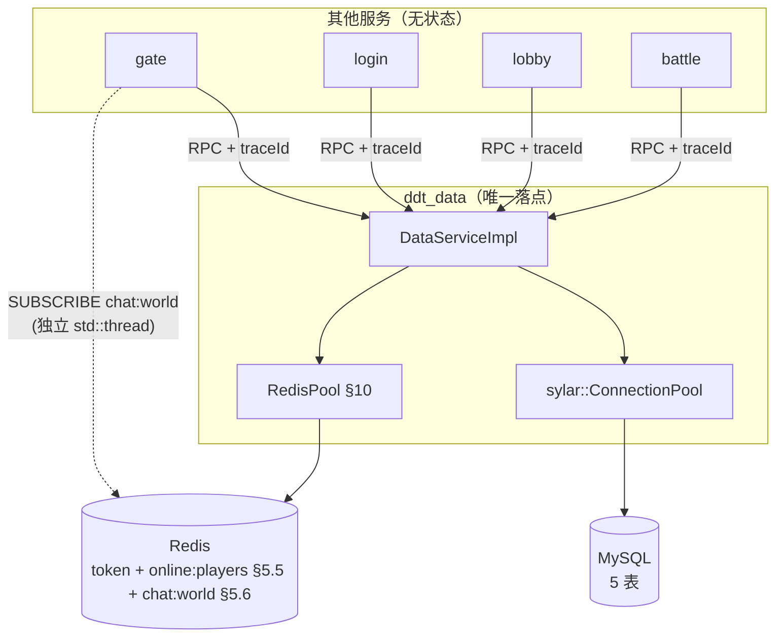
```mermaid
flowchart TB
    subgraph 调用方["其他服务（无状态）"]
        G[gate] & L[login] & LO[lobby] & B[battle]
    end
    subgraph 持久层["ddt_data（唯一落点）"]
        DS["DataServiceImpl"]
        CP["sylar::ConnectionPool"]
        RP["RedisPool §10"]
    end
    DB[("MySQL<br/>5 表")]
    RD[("Redis<br/>token + online:players §5.5 + chat:world §5.6")]
    G & L & LO & B -- "RPC + traceId" --> DS
    DS --> CP --> DB
    DS --> RP --> RD
    G -. "SUBSCRIBE chat:world<br/>(独立 std::thread)" .-> RD
```

---

# 第六章 客户端

## 6.1 整体结构

`src/client/` 是 Unity 工程，namespace `Ddt.*`。三大场景：`LoginScene → LobbyScene → BattleScene`。

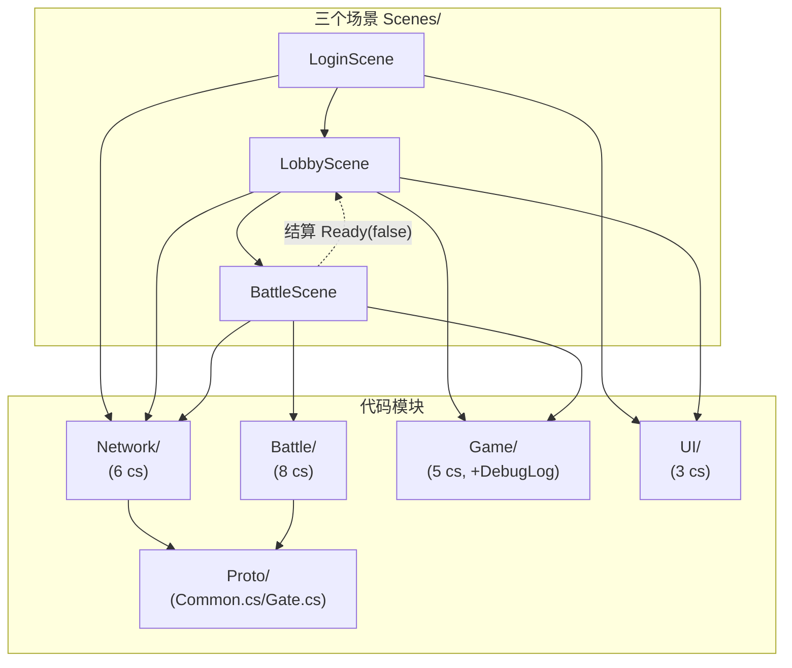
```mermaid
graph TB
    subgraph 场景["三个场景 Scenes/"]
        LS["LoginScene"] --> LB["LobbyScene"]
        LB --> BS["BattleScene"]
        BS -. 结算 Ready(false) .-> LB
    end
    subgraph 模块["代码模块"]
        N["Network/<br/>(6 cs)"]
        B["Battle/<br/>(8 cs)"]
        G["Game/<br/>(5 cs, +DebugLog)"]
        U["UI/<br/>(3 cs)"]
        P["Proto/<br/>(Common.cs/Gate.cs)"]
    end
    LS --> U & N
    LB --> U & G & N
    BS --> B & G & N
    N --> P
    B --> P
```

| 目录 | cs 数 | 行数 | 职责 |
|------|-------|------|------|
| `Network/` | 6 | ~860 | TCP 长连接、帧编解码、消息分发、HTTP 登录 |
| `Battle/` | 8 | ~2440 | 战斗主控、物理复算、地形渲染、玩家/弹丸/小地图 |
| `Game/` | 5 | ~335 | 跨场景状态、外发门面、聊天、日志、**诊断日志 DebugLog §6-客户端** |
| `UI/` | 3 | ~1630 | 登录/大厅/聊天界面 |
| `Proto/` | 2 | ~14090 | protoc 生成的 Common.cs/Gate.cs |
| `Editor/` | 1 | 30 | 构建后处理（禁 App Nap） |

> Proto 仅生成 common+gate（`generate_proto.sh` 排除 rpc.proto）。Plugins 含 `Google.Protobuf.dll`。Resources 17 张贴图。

## 6.2 网络层（Network/）

**NetClient.cs**（`NetClient.cs:19`，331 行）：TCP 长连接 + 指数退避自动重连（1/2/4/8/15s）+ `needRelogin_` 重放登录。收发后台线程化（`ConcurrentQueue` + `AutoResetEvent`），主线程不阻塞。TCP NoDelay + KeepAlive。**全阶段加 `Debug.Log` 日志**：连接/重连/收发各阶段（如 `NetClient.cs:62,72,79,86,168,237,255,263,268,276,286,290`）。

**NetworkManager.cs**（`NetworkManager.cs:17`，203 行）：单例 MonoBehaviour（`DontDestroyOnLoad`）。`Send<T>`/`SendRaw`/`SendHeartbeat`；`StartTransition/EndTransition` 场景切换包缓冲（`LoadScene` 期间防丢包）。**加 `Debug.Log` 日志**（`NetworkManager.cs:63,102,135,149,152,161,168`）。

**FrameCodec/MessageDispatcher/MsgId**：帧编解码（与服务端字节一致）；`Dictionary<ushort,Action>` 注册式分发；msg_id 常量（与服务端对齐）。

**LoginClient.cs**：`UnityWebRequest` 协程发 HTTP `/login`，返回 `{ok,token,account_id}`。

### OnApplicationFocus 撤回（诚实标注）

NetworkManager 当前用 `OnApplicationPause`（`NetworkManager.cs:120-141`）+ `CheckAndRecover` 温和恢复方案：
- 暂停时仅记 `wasPaused_ = true`；
- 恢复时清空 `queuedPackets_`，检测 TCP 半死：活着继续用（零延迟恢复），半死才触发重连。

**已撤回**：曾尝试用 `OnApplicationFocus` 强制断线重连，但短时最小化（连接还活着）会误断，故改用上述温和方案。代码中无 `OnApplicationFocus`（grep 证实）。

## 6.3 跨场景层（Game/）

**Session.cs**（`Session.cs:6`）：静态跨场景状态（`MyAccountId/MyName/Token/Gender/MyWeaponId` + `PendingRoomReady/PendingTurnStart` 缓存场景切换重放 + `InRoom/RoomId`）。

**GameFacade.cs**：外发门面，16 个 `SendXxx`（`GameFacade.cs:11-65`），业务层不碰网络。

**ChatManager/ClientLogger**：5 标签环形缓冲（200 上限）；分级日志（500 条环形缓冲）。

**DebugLog.cs**（§6 客户端诊断日志，`DebugLog.cs:22-53`）：编译期开关的诊断日志工具，见下节。

## 6.4 客户端诊断日志体系（§6 客户端）

| 项 | 内容 |
|----|------|
| 文件 | `src/client/Game/DebugLog.cs`（53 行） |
| 启用方法 | Unity Player Settings → Scripting Define Symbols 加 `DDT_DBG` |
| 关闭行为 | 不定义 `DDT_DBG` 时所有调用**编译期消除**（`[Conditional("DDT_DBG")]`），零运行时开销，适合发布包 |
| 与 ClientLogger 关系 | ClientLogger 服务大厅 UI 面板，DebugLog 服务 `Player.log` 排错 |

### 四个 API

```csharp
[Conditional("DDT_DBG")] public static void DBGLog(string msg);        // 普通
[Conditional("DDT_DBG")] public static void DBGLogT(string tag, string msg);  // 带分类前缀
[Conditional("DDT_DBG")] public static void DBGWarn(string msg);       // 警告(黄)
[Conditional("DDT_DBG")] public static void DBGErr(string msg);        // 错误(红)
```

输出格式：`[DBG] msg` 或 `[DBG][tag] msg`。

### 使用点（grep 实测）

| 文件 | 用途 | 示例（行号） |
|------|------|-------------|
| `BattleController.cs` | 状态变化、生命周期、协程 start/done | `:92 Start`、`:111,118 缓存重放`、`:123 Start DONE`、`:134 OnDestroy`、`:241 OnTurnStart`、`:262 ApplyTurnStart`、`:283,290,294,299,302 DelayedApplyTurnStart`、`:309,316 DelayedTurnStartPlayerUpdate`、`:371 OnShootResult` |
| `BattleField.cs` | 相机/动画生命周期、busy 计数 | `:30,33 KeepBusy ±1`、`:112 Init START`、`:169,208 PlayLanding`、`:215,225,236,241 PlayIntro`、`:330 Projectile START`、`:338,343 FollowProjectile`、`:410,413 Explosion` |
| `LoginUI.cs` | 登录各阶段（HTTP→连 gate→发 LOGIN） | `:265 DoLogin START`、`:272 空 token 警告`、`:275 HTTP ok`、`:281 连 gate 超时`、`:284 发 LOGIN frame` |
| `LobbyUI.cs` | 场景切换、缓存渡场景 | `:116 ROOM_READY 缓存+LoadScene`、`:131 TURN_START 缓存` |
| `NetClient.cs` / `NetworkManager.cs` | **总是输出**（不用 DDT_DBG，`Debug.Log`） | 连接/重连/收发各阶段，见 §6.2 |

**设计原则**（注释 `DebugLog.cs:15-17`）：
- 仅状态变化/生命周期/收发事件/协程 start-complete 才打，**不在 Update 里每帧打**；
- 调用零开销：关闭时 `[Conditional]` 不产生方法体；
- 与 ClientLogger 不冲突。

## 6.5 战斗层（Battle/）

**BattleController.cs**（`BattleController.cs:21`，953 行）：订阅 7 个消息（`:92-98`）；输入 A/D 移动（节流 15px，陡坡阻挡）、W/S 角度、Space 蓄力、P 跳过、F 纸飞机；本地 10s 倒计时；`TURN_SWITCH_DELAY=1.5f` 缓冲 TurnStart 等弹丸动画播完。

**PhysicsSim.cs**（`PhysicsSim.cs:14`，120 行）：**精确复刻服务端** `ddt_physics.cc` 的 `computeTrajectory2D`。文件头注释：

```csharp
// C# 物理引擎, 精确复刻服务端 src/common/ddt_physics.cc 的 computeTrajectory2D
// HP/命中/伤害一律用服务端权威字段, 本地轨迹仅用于动画, 即使有微小偏差也不影响逻辑。
```

`PhysicsParams{airFactor,windFactor,gravityFactor}` + `interface ITerrain{IsSolid,ColumnHeight}` + `ComputeTrajectory`/`BaseAngleToPhysics`/`GetSlopeAngle`。

**TerrainRenderer.cs**（`TerrainRenderer.cs:20`，127 行）：`PhysicsSim.ITerrain` 实现；`Build(bitmap,w,h)` 解析服务端 `terrain_bitmap` → `Texture2D`（RGBA32, Point filter）；`RemoveCircle` 挖圆坑保留平台。

**其余**：BattleField（相机状态机 Intro/PanFollow/FollowProj/Manual）、PlayerEntity（坡度旋转+HP 条）、ProjectilePlayer（O(1) 游标插值+零 GC 拖尾）、Minimap、SpriteFactory。

## 6.6 UI 层（UI/）

**LoginUI.cs**（`LoginUI.cs:15`，370 行）：HTTP `/login` → token → 连 gate 发 LOGIN → 成功进大厅。Gender==0 弹角色选择，选完 `SendSetGender`。AUTH_FAIL 停重连。

**LobbyUI.cs**（876 行）：双状态机（LOBBY↔IN_ROOM）。大厅态 ROOM_LIST_NOTIFY 驱动列表；房内态 4红+4蓝座位。缓存 ROOM_READY + 首个 TURN_START 渡场景切换。

**UIChat.cs**：5 频道标签；私聊 `targetID message` 语法。

## 6.7 Editor 构建后处理

**MacAppNapDisabler.cs**（`:21-29`）：macOS 最小化 App Nap 挂起进程 → 心跳停 → 被踢。`OnPostprocessBuild` 固化 `PlayerSettings.runInBackground=true`（不依赖运行时 Awake 赋值）。

## 6.8 客户端架构特征

```mermaid
flowchart LR
    subgraph 主线程["Unity 主线程"]
        U["UI/逻辑<br/>(MonoBehaviour.Update)"]
        NM["NetworkManager.Update<br/>排空队列≤200/帧 + 心跳"]
        BC["BattleController.Update<br/>输入+倒计时"]
        BF["BattleField.LateUpdate<br/>相机状态机"]
    end
    subgraph 后台["后台线程"]
        NR["NetClient 收线程<br/>→ ConcurrentQueue + Debug.Log"]
        NS["NetClient 发线程<br/>← ConcurrentQueue + AutoResetEvent"]
    end
    NET[("gate TCP:8100")]
    NR -- 帧解码 --> NR
    NR -- 入队 --> NM
    NM -- 回调 --> U & BC
    NS -- TCP --> NET
    U & BC -- GameFacade.Send --> NS
```

**五个关键设计**：主线程无阻塞、场景切换缓冲、权威分离、门面模式、跨平台健壮性。

---

# 第七章 性能与并发

## 7.1 并发模型：协程（M:N）+ 多线程

五个服务统一 `IOManager iom(4, true, "name")`（4 线程 + 主线程参与调度）。**栈大小按服务差异化**：

| 服务 | 栈大小 | 配置源 |
|------|--------|--------|
| gate / lobby / battle / data | 1MB（`fiber.stack_size: 1048576`） | `gate.yml:26` / `battle.yml:39` / `lobby.yml:10` / `data.yml:22` |
| login | **2MB**（`fiber.stack_size: 2097152`） | `login.yml:20`（见 §7.7） |

底层 N 线程跑 M 协程，每 TCP 连接一协程。

### 协程栈大小的全局影响

```mermaid
flowchart TD
    A["协程栈 1MB(默认)"] --> B["RPC 调用链深<br/>(etcd+TCP+protobuf)"]
    A --> C["物理仿真<br/>(computeHitPoint2D ~1500步)"]
    A --> L["login ValidateToken<br/>主 RPC 协程上调 2 次同步 data RPC<br/>每次新建 EtcdClient(gRPC 重对象)"]
    B --> D["若在逻辑协程上直接 RPC<br/>→ 撑爆栈 stack smashing"]
    C --> E["若存 1500 点轨迹到栈<br/>→ 栈溢出"]
    L --> LL["§7.7 解法: login 栈 2MB"]
    D --> F["解法1: schedule 到独立协程"]
    E --> G["解法2: computeHitPoint2D 轻量版<br/>不存轨迹"]
```

**结论**：1MB 栈决定了「一切深操作必须 `IOManager::schedule` 到独立协程」这条铁律；login 因调用栈特别深，单独加到 2MB。

## 7.2 IO 模型

- **epoll**（`IOManager : Scheduler, TimerManager`）；
- **Hook**：`hook.cc` 把阻塞 IO 改写成 epoll 协程让出；
- **每连接一协程**；
- **已知坑**：hook × gRPC `close()` 崩溃，需 `LD_PRELOAD` 垫片；
- **已知坑**：RpcChannelPool × sylar hook 在高频推送下出现 stack smashing，fd 复用竞态（gate 转发层已回退为短连接，仅推送闭包用池，`battle_main.cc:31-33` 注释）。

## 7.3 定时器（两套并存）

| 用途 | 实现 | 配置 | 源码 |
|------|------|------|------|
| gate 心跳超时 | TimeWheel | `init(1000, 60)` | `gate_main.cc:23` |
| battle 回合超时 | TimeWheel | `init(100, 10)` | `battle_main.cc:26` |
| TimeWheel 自驱 | 最小堆 Timer | 周期调 `tick()` | `timewheel.cc` |

最小堆 O(log n) 精确取消；时间轮 O(1) 高频短定时器。时间轮用最小堆 Timer 周期驱动 tick。

## 7.4 锁策略（按场景精细化）

| 锁类型 | 用途 | 选型理由 | 源码 |
|--------|------|---------|------|
| `sylar::RWMutex` | gate/lobby/battle 的表 | 读多写少 | `gate_server.h:147`、`lobby_service.h:88`、`battle_service.h:48` |
| `sylar::Mutex` | battle `m_roomMutex` | 临界区毫秒级，futex 睡眠不烧 CPU | `battle_room.h:97-98` |
| `sylar::Spinlock` | gate 发送队列 | 锁内纯内存，极短，不 yield | `gate_server.h:42` |
| `std::mutex` | channel 缓存、**RedisPool** | 简单互斥 | `gate_server.h:153`、`redis_pool.h:44` |

BattleRoom 用 Mutex 而非 Spinlock（`battle_room.h:92-96`）：onShoot 临界区毫秒级，Spinlock 烧 CPU。代价：pthread_mutex 非协程感知，锁内不可 yield（broadcast/saveGameRecordLocked 已异步化，锁内无 yield）。

## 7.5 异步推送派发（schedule 模式）

9 处 `IOManager::schedule` 调用点（gate 断线清理/发送协程、lobby 单推/全推、battle 批量推/逐人推、**battle §13 战绩落库**）。逻辑协程持锁做纯内存操作，推送/落库 `schedule` 到独立协程跑深 RPC 链。

```mermaid
flowchart LR
    A["逻辑协程<br/>(onShoot/checkGameOver 等)"] -- "持锁 + 纯内存操作" --> B["broadcast 收集 / saveGameRecordLocked 快照"]
    B -- "schedule 到新协程" --> C["推送/落库协程<br/>(独立栈)"]
    C -- "etcd+TCP+protobuf<br/>深调用链" --> G["gate PushService / data SaveGameRecord"]
```

## 7.6 批量广播优化

`BroadcastPushFn` + `NotifyClients`：N 人房广播从 N 个 fiber 降为 1 个（`battle_main.cc:61`，`battle_room.cc:150-158` 优先用 `m_bpush`）。

## 7.7 login 服栈溢出案例与修复（重要实战经验）

### 现象

高并发登录时，`ddt_login` 进程触发 `stack smashing`，core dump，`SIGABRT`，`__stack_chk_fail` at `Fiber::swapOut`。

### 根因（注释 `login.yml:16-19`）

`login.ValidateToken`（`login_service.cc:144-174`）在主 RPC 协程上做 2 次同步 data RPC：
1. `LoadToken`（`login_service.cc:152`）—— 内部 `EtcdClient cli(m_etcdEndpoint)` 新建 gRPC channel（重对象）；
2. `GetAccountById`（`login_service.cc:169`）—— 又一个 `EtcdClient`（虽然 channel 缓存，但调用栈深）。

每次 RPC 的调用链：`ValidateToken → dataStub.LoadToken → RpcChannel::CallMethod → EtcdClient::get → gRPC → protobuf → ...` 深度极大。1MB 栈在高并发时使用接近极限，触发 canary 检测失败。

### 修复

`login.yml:20`：`fiber.stack_size: 2097152`（1MB → 2MB），其他服务保持 1MB。

### 为什么不全局改 2MB

- login 调用栈特别深（2 次同步 RPC + 每次新建 EtcdClient），单独加大；
- 其他服务（gate/battle/data）的深操作已 `schedule` 到独立协程（§7.5），主协程栈使用低，1MB 足够；
- 全局 2MB 会在高频短连接 RPC 场景下 OOM（gate.yml/battle.yml/data.yml 注释原话）。

### 备选方案（未采纳）

- 把 ValidateToken 内的 2 次 RPC `schedule` 到独立协程：改动大，且 ValidateToken 本身就是同步语义（gate 等 token 校验结果）；
- EtcdClient 复用（connection pool）：gRPC channel 创建重，需独立改造，ROI 低。

## 7.8 连接策略

| 服务 | 策略 | 理由 | 源码 |
|------|------|------|------|
| gate / login | 缓存短连接 | 连接池曾因 fd 复用竞态回滚 | `gate_server.cc:215-236`、`login_service.cc:41-47` |
| lobby / battle | `RpcChannelPool(etcd, 8)` | 高频推送，复用 TCP + 发现缓存 | `lobby_main.cc:26`、`battle_main.cc:33` |
| battle → data（§13） | 短连接（`RpcChannel(etcd)`） | 战绩落库低频（一局一次），不值得用池 | `battle_main.cc:84` |
| data → Redis（§10） | `RedisPool`（默认 4） | token 操作并行化 | `data_service.h:107` |
| data → MySQL | `sylar::ConnectionPool`（默认 4-8） | 高并发查询 | `data_service.h:104` |

> **诚实标注**：gate 转发层未接入 `RpcChannelPool`（曾因 fd 竞态回退，`gate_main.cc:28-29` 注释）；battle 注入给 BattleRoom 的 dataChannel 是短连接（`battle_main.cc:84`），因落库低频不值得用池。

## 7.9 性能瓶颈分析（更新）

1. ~~**Redis 单连接 + 全局 mutex**~~：**已修复 §10**，改为 `RedisPool`（默认 4 连接），token 操作并行化。
2. **battle `m_roomMutex` 同房串行**：回合制场景非问题，扩展实时高频受限。
3. **MySQL 单 data 进程**：持久化单点，`db_pool_size=4-8`，高并发池等待。
4. **gate 注册式分发后**（§15 ✅）：实际转发轻，瓶颈在下游 RPC。
5. **battle → data 战绩落库是短连接**：一局一次 RPC + 连接建立，低频可接受；若改为高频统计需接 RpcChannelPool。

## 7.10 并发安全要点（铁律）

```mermaid
mindmap
  root((并发铁律))
    锁内不阻塞/yield
      TimeWheel 锁内只收集回调
      gate sendMutex 锁内纯内存
      BattleRoom broadcast 异步化
      BattleRoom saveGameRecordLocked 锁内仅快照
    锁内快照锁外RPC
      lobby tryStart
      battle §13 saveGameRecordLocked
    重调度规避栈溢出
      9 处 schedule 调用点
    安全删除防竞态
      顶号 ait->second==s 判等
    防泄漏
      battle markDestroying
      TimeWheel 析构 cancel driver
    栈大小按服务差异化
      login 2MB(栈深)
      其他 1MB
    裸线程不调 GetThis §7.11
      std::thread 不属 IOManager
      t_scheduler 未赋值→nullptr
      必须捕获 iom 指针传入
```

## 7.11 裸 std::thread 不可调 IOManager::GetThis()/Fiber::GetThis()（铁律，实战 bugfix）

### 现象

gate 启动后世界频道订阅能跑通，但**一发消息 gate 立刻 `Segmentation fault (core dumped)`**。订阅断开问题（§5.6 修复 A）修好后立刻暴露这个崩溃。

### 根因（gdb 栈帧实测）

```
#0  ___pthread_mutex_lock (mutex=0x8)              ← 解引用 nullptr+8
#3  sylar::Scheduler::schedule (this=0x0)          ← this 是 nullptr
#4  GateServer::sendToSession (gate_server.cc:194) ← 内部 IOManager::GetThis()->schedule(...)
#5  startWorldChatSubscriber lambda                ← 订阅回调
#10 Subscriber::loop
#11 std::thread::_M_run                           ← 裸 std::thread
```

sylar 的 `IOManager::GetThis()` / `Fiber::GetThis()` 依赖 **thread-local** 变量 `t_scheduler` / `t_fiber`。这两个 TLS **只在 IOManager worker 线程的入口被赋值**（`IOManager::run()` 内调 `Scheduler::setThis()`）。任何 **不在 IOManager 调度池里**的线程（裸 `std::thread` / `pthread_create` / `std::async` 起的）都拿不到值：

```cpp
// sylar/scheduler/scheduler.h 简化
static Scheduler* GetThis() { return t_scheduler; }   // worker 才非空
```

hiredis 的 `redisGetReply` 是阻塞同步调用，sylar hook 不感知它（hook 只 hook 标准 socket API）。如果把它放在协程里会**阻塞整个调度线程**，所以 §5.6 订阅线程**被迫**用裸 `std::thread`（`gate_server.cc:924`）。但订阅回调 lambda 里若直接调 `sendToSession`（内部 `IOManager::GetThis()->schedule(...)`，`gate_server.cc:194`）：

```
裸线程的 t_scheduler 从未被赋值
  → IOManager::GetThis() 返回 nullptr
  → schedule(this=nullptr) 解引用 nullptr
  → SIGSEGV
```

### 修复（`gate_server.cc:922-944`）

**在 IOManager 上下文（gate_main 的 iom.schedule 调用栈）捕获 iom 指针**，传入裸线程的 lambda，回调内用捕获的 `iom` 指针而非 `IOManager::GetThis()`：

```cpp
void GateServer::startWorldChatSubscriber() {
    ...
    auto iom = sylar::IOManager::GetThis();          // ← 在 iom 上下文里抓指针
    auto self = std::static_pointer_cast<GateServer>(shared_from_this());
    m_subThread = std::make_shared<std::thread>([self, iom]() {  // ← 值捕获 iom
        while(true) {
            if(!self->m_subscriber->subscribe("chat:world",
                [self, iom](const std::string& payload) {
                    // ← 不在裸线程里跑 sendToSession！
                    iom->schedule([self, payload]() {            // ← 投递到 iom 协程
                        // sendToSession 在协程里跑, GetThis() 此时有值
                        ...
                        self->sendToSession(kv.second, MSG_CHAT_NOTIFY, payload);
                    });
                })) {
                sleep(2);
                continue;
            }
            self->m_subscriber->loop();
            sleep(2);
        }
    });
    m_subThread->detach();
}
```

### 铁律（推广到所有"裸线程 + sylar"场景）

| 规则 | 细则 |
|------|------|
| **裸 `std::thread` 内禁止调 `IOManager::GetThis()` / `Fiber::GetThis()`** | TLS `t_scheduler` / `t_fiber` 仅 IOManager worker 线程入口赋值，裸线程返回 nullptr |
| **裸线程内禁止直接调用"内部用 GetThis 的"sylar API** | 包括但不限于 `IOManager::schedule`、`Fiber::Create/Yield`、定时器 `IOManager::AddTimer`、`gate_server.cc:194 sendToSession`（间接）、所有 hook 后的阻塞 IO（read/write/connect）。这些 API 假设自己在协程上下文里 |
| **跨线程与 sylar 协程交互的唯一正确姿势**：捕获 iom 指针 + `iom->schedule(lambda)` 投递 | lambda 内运行在 IOManager worker 线程上，`GetThis()` 有效 |
| **若必须在裸线程里发任务**：用 `iom->schedule(...)` 或 `iom->async(...)`，绝不在裸线程直接执行 sylar API | 闭包捕获的 shared_ptr 保证对象生命周期（见 `gate_server.cc:923` `shared_from_this`） |
| **同理适用于 `pthread_create` / `std::async` / C 库自起的线程** | hiredis / gRPC / MySQL client / Unity 收发线程等都属于此类，凡是它们要回调到 sylar 代码都必须经 `iom->schedule` 中转 |

> **与 §7.5 schedule 模式的区别**：§7.5 是"IOManager worker 协程 A 把工作 schedule 到协程 B"以避免深调用栈爆栈；§7.11 是"裸线程把工作 schedule 到 IOManager 协程"以避免 GetThis 返回 nullptr。两者都是 `schedule`，但动机不同，前者规避栈溢出，后者规避 nullptr 解引用。


---

# 第八章 重构建议

> 本章更新：**已完成的建议标记 ✅**，未做的保留并调整优先级。

## 8.1 解耦

### 建议 1：gate 的 switch-case 分发改注册式分发 ✅ 已完成（§15）

**原现状**：`gate_server.cc` 集中 21 个 case。
**新现状**：`registerHandlers()` + `m_handlers`（16 已登录）+ `m_preAuthMsgs`（5 预登录，static map）。新增 msg 仅加一行注册（`gate_server.h:129-134`、`gate_server.cc:46-63,267-293`）。

### 建议 2：data 的裸 SQL 收敛到 Repository（未做）

**现状**：`data_service.cc` 有 11+ 处裸 SQL（grep 实测）。**建议**：按表抽 Repository（`AccountRepository`/`ChatRepository`/`GameRecordRepository`...），隔离 SQL 细节。

### 建议 3：password 哈希落地真正的 SHA256（未做）

**现状**：`login_service.cc:19-21` 用 sha1 占位（注释明确「生产应换 OpenSSL EVP」）。**建议**：引入 OpenSSL EVP SHA256（项目已 `find_package(OpenSSL REQUIRED)`，`CMakeLists.txt:11`，零新依赖）。

## 8.2 目录重组

### 建议 4：消除「sylar 框架 vs 仓库名」歧义（保持现状）

保持现状但在 Readme 显式说明。重命名成本高收益低。

### 建议 5：src/server/conf/ 改名 config/（未做）

`conf/` → `config/`，同步改 `fleet.sh` 的 `CONF=`（`fleet.sh:7`）与各 main 回退查找路径（`service_base.cc:144-150`）。

## 8.3 生命周期管理

### 建议 6：Redis 单连接改连接池 ✅ 已完成（§10）

**原现状**：`void* m_redis + std::mutex m_redisMutex`（单连接串行）。
**新现状**：`RedisPool`（mutex+condvar，默认 4 连接）+ `RedisGuard` RAII，自愈（`markUnhealthy`）。token 操作并行化（`redis_pool.h/cc`、`data_service.h:107`、`data_service.cc:46-47`）。

### 建议 7：补全在线状态查询 ✅ 已完成（§5.5）

**原现状**：`data_service.cc:351` `online` 恒 false（无人查）。
**新现状**：Redis Set `online:players` 全局在线集合。
- data 端新增 `SetOnline`（`SADD`，`data_service.cc:625-649`）/ `SetOffline`（`SREM`，`data_service.cc:651-675`）两个 RPC（`rpc.proto:70-71`）。
- gate 端 onLogin 末尾 `schedule` 异步调 `SetOnline`（`gate_server.cc:397-413`）；delSession 异步清理闭包调 `SetOffline`（`gate_server.cc:126-137`）。
- `GetFriendList` 内部一次 `SMEMBERS online:players` 拿全量在线 id，批量回填到每位好友的 `online` 字段（`data_service.cc:523-548`）。
- 多 gate 天然共享同一 Set，全局一致；异步上报不阻塞 LOGIN_RESP。详见 §5.5。

### 建议 8：game_records 表结构对齐多人 ✅ 已完成（§13）

**原现状**：仅 `player1/player2`（两玩家）。
**新现状**：拆主子表 `game_records(id, winning_team, duration)` + `game_record_players(record_id FK, account_id FK, team, is_winner, damage_dealt)`，支持任意人数 + 每位玩家明细（`schema.sql:41-60`）。proto 端 `GameRecordReq` 加 `repeated PlayerStat players` + `TeamSide winning_team`，旧字段保留兼容（`rpc.proto:83-99`）。data 端 `SaveGameRecord` 重写为事务+批量插入（`data_service.cc:254-322`）。battle 端 `BattlePlayer.damageDealt` 累计 + `saveGameRecordLocked` 锁内快照锁外异步 RPC（`battle_room.cc:521-557`）。

### 建议 8.5：世界聊天 Pub/Sub 替代 RPC 广播 ✅ 已完成（§5.6）

**原现状**：lobby 世界聊天走 `PushService.NotifyAllOnline` RPC（`lobby_main.cc:53`），多 gate 时 lobby 需逐 gate 广播。
**新现状**：Redis Pub/Sub 替代——lobby 调 1 次 `data.PublishWorldChat`，data 内 `PUBLISH chat:world`（`data_service.cc:679-714`），每个 gate 启动时各自 `SUBSCRIBE chat:world`（`gate_server.cc:910-944`）。订阅用独立 `std::thread`（hiredis `redisGetReply` 阻塞，sylar hook 不感知）；订阅连接不入 `RedisPool`（订阅模式不可复用）。ROOM/TEAM 频道保留原 `m_push`（不丢原则）。诚实局限：Pub/Sub fire-and-forget，gate 重启瞬间会丢消息（详见 §5.6）。

## 8.4 网络层抽象

### 建议 9：gate RPC channel 改连接池（待 fd 竞态根治后，未做）

**现状**：`gate_server.cc:215-236` 短连接。**建议**：fd 复用竞态根治后接入 `RpcChannelPool`。当前 lobby/battle 推送闭包已用池。

### 建议 10：统一两套帧协议的边界保护（未做）

**现状**：业务帧 16MiB（`gate_server.cc:255`）+ RPC 帧 64MiB（`rpc_channel.cc:151`）各自硬编码。**建议**：抽公共常量。

## 8.5 配置管理

### 建议 11：硬编码默认值集中校验（部分完成）

**现状**：`service_base.h` 多处硬编码（端口/物理参数等）。**已完成**：DB/Redis 敏感字段支持环境变量覆盖（§2，`service_base.cc:102-113`）。**建议**：端口入 `ServiceConfig`（已部分入），物理参数独立 `physics.yml`（已存在于 `battle.yml` 的 physics 段）。

### 建议 12：ServiceConfig 单例改依赖注入（低优先级，未做）

**现状**：`Singleton<ServiceConfig>`（`service_base.h:17`）。**建议**：构造注入（`BattleServiceImpl(cfg,...)` 已这么做，推广全部）。

### 建议 12.5：全项目注释重格式化 + K&R 风格统一 ✅ 已完成（工程实践）

**动机**：项目历史沉淀了大量「大段顶部注释块 + Allman 大括号 + 制表符混 4 空格」的不一致风格，降低可读性。本轮做一次**零逻辑改动**的格式化收口。

**改造范围**：60+ 文件（sylar 框架层 + `src/` 业务层），8 个构建目标（`sylar` + `ddt_gate/login/lobby/battle/data` + 2 测试）全部重编通过。

**原则**：

| 项 | 改造前 | 改造后 |
|----|--------|--------|
| 顶部注释块 | 大段（含版本/作者/历史等多行 banner） | 删除或收敛为 1-3 行用途说明 |
| 函数注释 | 模糊、缺参数说明 | 保留 + 精简（"做什么 + 关键参数 + 注意事项"） |
| 行内注释 | 散乱 | **保留"为什么"**（如 `idx++ % SHARDS`、`ait->second == s` 判等理由），删冗余"是什么" |
| 大括号风格 | Allman（`{` 单独成行）混 K&R | **统一 K&R**（`{` 同行） |
| 缩进 | 制表符 + 4 空格混用 | **统一 4 空格** |
| 长行 | 单行塞满 | 单行拆多行（如 `registerHandlers()` 内 lambda 注册、SQL 字符串拼接） |
| 代码逻辑 | — | **零改动**（diff 仅注释与空白） |

**验证**：8 个目标全部 `make -j` 通过；行为无差异。

**涉及文件示例**（非全量）：`sylar/scheduler/{fiber,iomanager,timewheel}.cc/h`、`sylar/rpc/{rpc_channel,rpc_provider,etcd_client}.cc/h`、`src/server/{gate,login,lobby,battle,data}/*.{cc,h}`、`src/server/data/redis_pool.{h,cc}`、`src/common/*.{cc,h}`。

> **诚实标注**：仅是格式化收口，不引入新抽象、不改 API、不改算法。真正的解耦建议（如 §8.1 建议 2 Repository 拆分）仍待做。建议 12.5 仅作为工程卫生记录。

## 8.6 日志与监控

### 建议 13：引入结构化指标（metrics）（未做）

**现状**：全项目零 metrics（grep 仅命中框架 http parser 词法）。**建议**：在线数/房间数/RPC QPS/延迟/错误率，`/metrics` 端点，接 Prometheus + Grafana。

### 建议 14：日志按服务分文件 + traceId ✅ 已完成 traceId（§6）

**原现状**：跨服务调用无关联 ID。
**新现状**：
- **traceId 端到端透传 ✅**（§6）：gate `newCtrl` 生成 `g<gid>-a<acc>-m<msgId>-<seq>`，经 `RpcHeader.trace_id`（`rpcheader.proto:12`）透传，`rpc_provider.cc:159-162` 注入到 callee controller，全程日志可关联（如 `gate_server.cc:365`）。
- **日志按服务分文件**（未做）：当前 5 服务统一输出到 `/tmp/ddt_$s.log`（`fleet.sh:44` 重定向），已天然按服务分文件，无需额外改造。

## 8.7 重构优先级矩阵（更新）

```mermaid
quadrantChart
    title 重构优先级（收益 vs 成本）— 更新版
    x-axis "低成本" --> "高成本"
    y-axis "低收益" --> "高收益"
    quadrant-1 "优先做"
    quadrant-2 "择机做"
    quadrant-3 "暂缓"
    quadrant-4 "快速赢"
    "SHA256哈希": [0.2, 0.7]
    "conf改config": [0.15, 0.25]
    "✅在线状态补全": [0.4, 0.75]
    "✅世界聊天Pub/Sub": [0.55, 0.7]
    "✅game_records多人": [0.45, 0.6]
    "✅gate注册式分发": [0.5, 0.65]
    "data Repository拆分": [0.7, 0.7]
    "✅Redis连接池": [0.6, 0.55]
    "metrics监控": [0.65, 0.85]
    "✅traceId透传": [0.6, 0.6]
    "端口默认入Config": [0.25, 0.3]
    "gate RPC连接池": [0.8, 0.4]
    "ServiceConfig去单例": [0.7, 0.3]
    "✅DB密码环境变量化": [0.3, 0.5]
    "✅注释K&R格式化": [0.2, 0.4]
```

### 推荐路径（按 ROI 排序，更新）

| 优先级 | 建议 | 状态 | 理由 |
|--------|------|------|------|
| 🔴 P0 | metrics 监控（#13） | 未做 | 线上可观测性从 0 到 1 |
| 🔴 P0 | SHA256（#3） | 未做 | 安全 + 名实一致，零新依赖 |
| ✅ 已完成 | gate 注册式分发（#1） | ✅ §15 | 可维护性 |
| ✅ 已完成 | Redis 连接池（#6） | ✅ §10 | 解耦/瓶颈 |
| ✅ 已完成 | 在线状态补全（#7） | ✅ §5.5 | 功能缺陷修复 |
| ✅ 已完成 | game_records 多人（#8） | ✅ §13 | 功能对齐多人战斗 |
| ✅ 已完成 | 世界聊天 Pub/Sub（#8.5） | ✅ §5.6 | 替代 RPC 广播，支持多 gate 横向扩展 |
| ✅ 已完成 | traceId 透传（#14 部分） | ✅ §6 | 跨服务日志关联 |
| ✅ 已完成 | DB 密码环境变量化（#11 部分） | ✅ §2 | 生产安全 |
| ✅ 已完成 | 注释 K&R 格式化（#12.5） | ✅ §8.5.5 | 工程卫生 |
| 🟢 P2 | data Repository（#2） | 未做 | 解耦 |
| ⚪ P3 | conf→config（#5） | 未做 | 锦上添花 |

## 8.8 本轮改造完成清单

| 改造 | 章节 | 涉及文件 |
|------|------|---------|
| DB 密码环境变量化 | §2 | `service_base.cc:102-113`、`service_base.h`（无新字段，复用现有） |
| traceId 端到端透传 | §6 | `rpcheader.proto:12`、`rpc_controller.h:29-35`、`rpc_channel.cc:59-64`、`rpc_provider.cc:107-115,159-162`、`gate_server.{h:88-92,cc:32-42,267-293}` |
| Redis 连接池 | §10 | `redis_pool.{h,cc}`（新文件）、`data_service.{h:107,cc:46-47,211-245}`、`data_main.cc:24-26`、`service_base.h:42` |
| 战绩端到端落库（拆主子表） | §13 | `schema.sql:37-60`、`rpc.proto:83-99`、`data_service.cc:254-322`、`battle_room.{h:32,107,cc:290,521-557}`、`battle_service.{h:46,cc:11-17,38}`、`battle_main.cc:84` |
| gate 注册式分发 | §15 | `gate_server.{h:129-134,cc:26,46-63,267-293}` |
| login 服栈溢出修复 | §7.7 | `login.yml:20` |
| fleet.sh 脚本修复 | §1.4 | `scripts/fleet.sh:13-26` |
| 客户端诊断日志体系 | §6.4 | `DebugLog.cs`（新文件）、`BattleController.cs`、`BattleField.cs`、`LoginUI.cs`、`LobbyUI.cs`、`NetClient.cs`、`NetworkManager.cs` |
| Redis 在线状态 + 世界聊天 Pub/Sub | §5.5/§5.6 | `rpc.proto:70-74`（SetOnline/SetOffline/PublishWorldChat）、`data_service.{cc:523-548,625-714}`、`redis_pool.{h:71-96,cc:100-205}`（Subscriber + redisPublish）、`gate_server.{h:159-163,cc:126-137,397-413,910-944}`、`gate_main.cc:39`、`lobby_service.cc:555-573` |
| 全项目注释重格式化（K&R + 4 空格） | §8.5.5 | 60+ 文件（sylar/* + src/server/* + src/common/*），8 目标全部重编通过，零逻辑改动 |
| **bugfix A：Subscriber redisSetTimeout 致订阅 1.5s 断** | §5.6 | `redis_pool.cc:123-128`（`redisConnectWithTimeout` 后追加 `redisSetTimeout(ctx_, {0,0})` 清除 command_timeout）。根因：hiredis 把连接超时同时设为命令超时，`redisGetReply` 受 1.5s 限制无消息即 break |
| **bugfix B：裸 std::thread 调 GetThis() → nullptr → SIGSEGV** | §7.11 | `gate_server.cc:922,924,929`（在 iom 上下文捕获 `iom` 指针 + `[self, iom]` 值捕获入 lambda + cb 内 `iom->schedule(...)` 投递 sendToSession）。根因：裸线程的 `t_scheduler` 从未赋值，`IOManager::GetThis()` 返回 nullptr |

## 8.9 不建议改的部分

| 项 | 理由 |
|----|------|
| 目录统一小写 + snake_case | 沿用约定，一致性好 |
| battle 一房一 Mutex | 注释明确 Actor 模型曾爆栈（`battle_room.h:35-48`） |
| lobby 锁内快照锁外 RPC | 范式正确，§13 saveGameRecordLocked 也沿用此范式 |
| data 单一持久层 | 架构清晰，便于扩展 |
| 两套定时器并存 | 各取所长 |
| traceId 仅 gate 端生成 | 单点生成保证唯一性，中间服务透传即可，无需各自生成 |
| RedisPool 不预热 | 冷启动延迟低，注释明确（`redis_pool.h:28-29`） |
| game_records DROP 重建 | 原表 Write-only 无读取者，无数据损失（`schema.sql:37-40`） |

---

> **文档说明**：本文档全部结论基于项目实际源码（`src/server/`、`src/common/`、`src/proto/`、`src/client/`、`sylar/`、`schema.sql`、`CMakeLists.txt`、`fleet.sh`、`*.yml`），引用真实文件路径与行号。源码中不存在的功能均明确标注「未实现/未发现」。已完成的重构以 ✅ 标记并附章节号与文件路径。Mermaid 图均基于实际模块、调用关系与数据流绘制。
